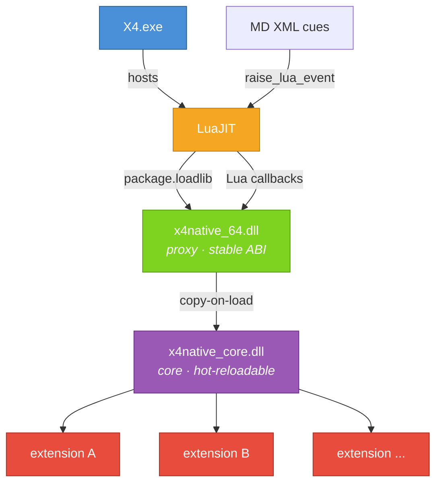

# Contributing to X4Native

## Prerequisites

- **Visual Studio 2022 Build Tools** (MSVC, C++23)
- **CMake 3.20+** (bundled with VS2022 BuildTools)
- X4: Foundations installed via Steam

## Building

```powershell
# Add CMake to PATH (bundled with VS2022, not on PATH by default)
$env:PATH = "C:\Program Files (x86)\Microsoft Visual Studio\2022\BuildTools\Common7\IDE\CommonExtensions\Microsoft\CMake\CMake\bin;" + $env:PATH

# Configure + build
cmake --preset default
cmake --build build --config Debug
```

Output: `native/x4native_64.dll` + `native/x4native_core.dll`

## Deploy to Game

CMake auto-detects the X4 game directory via the Steam registry. Override with `-DX4_GAME_DIR=<path>`.

```powershell
cmake --build build --target deploy
```

This copies DLLs, SDK headers, and the extension payload to `<game>/extensions/x4native/`.

The core DLL is hot-reloadable — run `/reloadui` in-game to pick up changes without restarting.

### Release Builds

SDK headers are installed by default (for development). For a **Steam Workshop** release that only ships the player-facing mod, disable them:

```powershell
cmake --preset default -DINSTALL_SDK=OFF
cmake --build build --target deploy --config Release
```

For **GitHub Releases**, create a zip that includes the SDK headers so extension developers can download them separately.

## Building Examples

Each example has its own CMake project:

```powershell
cd examples/hello
cmake -B build -G "Visual Studio 17 2022" -A x64
cmake --build build --config Debug
```

Deploy example DLLs to `<game>/extensions/x4native_<name>/native/`.

## Architecture

Two-DLL design: a thin **proxy** (`x4native_64.dll`) locked by LuaJIT, and a **core** (`x4native_core.dll`) that is copy-on-load hot-reloadable.



Game lifecycle flows: **MD XML cues → Lua events → proxy → core → extensions**

See [docs/ARCHITECTURE.md](docs/ARCHITECTURE.md) for the full design.

## Project Layout

| Directory | What lives there |
|-----------|-----------------|
| `src/proxy/` | Thin proxy DLL — Lua entry point, rarely changes |
| `src/core/` | Hot-reloadable core — logger, events, hooks, extension manager |
| `src/common/` | Shared types between proxy and core |
| `sdk/` | Public SDK headers shipped to extension developers |
| `extension/` | X4 extension payload (content.xml, Lua, MD cues) |
| `scripts/` | Game file extraction and header generation tooling |
| `reference/` | Extracted game data (committed for diffing across patches) |

## Code Style

- C++23, MSVC only
- No exceptions in exported functions — return codes + SEH
- C-compatible ABI at DLL boundaries (`extern "C"`, no STL in signatures)
- Shared proxy↔core types in `src/common/`
- All logging via the `Logger` class — never raw printf/OutputDebugString
- Keep the proxy minimal — complexity belongs in core

## Dependencies

| Library | Version | Purpose |
|---------|---------|---------|
| [nlohmann/json](https://github.com/nlohmann/json) | 3.11.3 | Config parsing (fetched by CMake) |
| [MinHook](https://github.com/TsudaKageworthy/minhook) | 1.3.3 | Function hooking (fetched by CMake) |
| lua51_64.dll | LuaJIT 2.1.0-beta3 | Runtime Lua bridge (ships with game) |

## Updating Game References

After a game patch:

```powershell
.\scripts\update_references.ps1
git diff reference/
```

This extracts game files, PE exports, and FFI declarations. Commit the diff with `reference: update to v<version>`.
