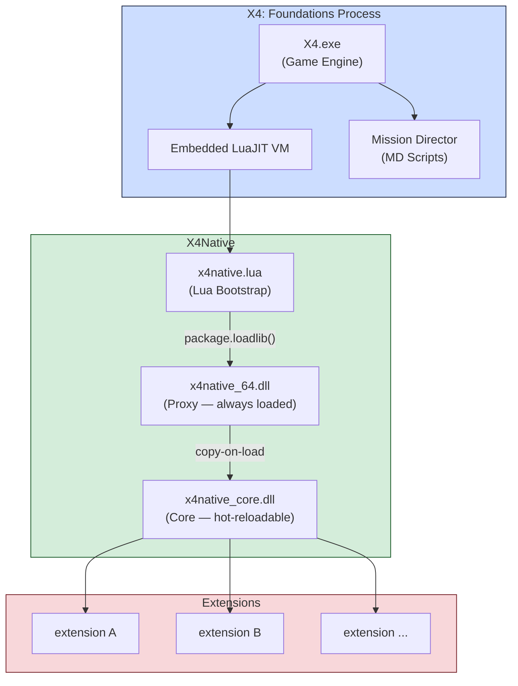
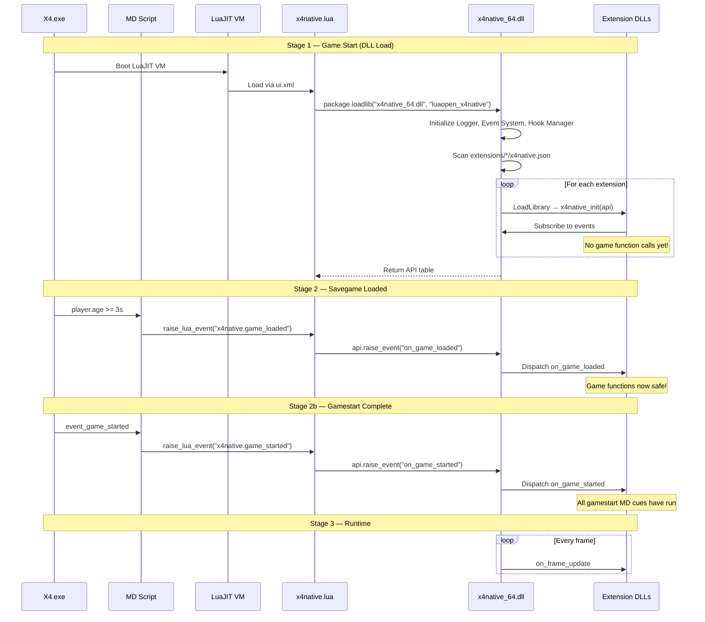
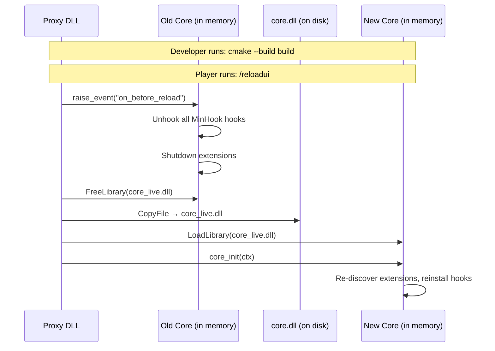

# X4Native — Architecture

## Two-DLL Design

X4Native uses a **proxy + core** two-DLL architecture to enable hot-reloading native code without restarting the game.

**Why two DLLs?** `package.loadlib()` calls `LoadLibrary()`, which locks the DLL file on disk. A single-DLL design would require a game restart for every code change.

| DLL | Purpose | Locked? | Changes often? |
|-----|---------|---------|----------------|
| `x4native_64.dll` (proxy) | Stable entry point, loads/unloads core, owns dispatch table + stash | Yes | Almost never |
| `x4native_core.dll` (core) | All framework logic: events, extensions, hooks, logger | No (copy-on-load) | Frequently |

**Copy-on-load:** The proxy copies `x4native_core.dll` to `x4native_core_live.dll` and loads the copy. The original is never locked — builds can overwrite it freely.

## Initialization Sequence

The game bridge is: **MD XML cues → Lua events → DLL entry points**. Game lifecycle events flow from Mission Director scripts through `raise_lua_event` into the DLL layer.

## DLL Pinning

The proxy pins itself in `DllMain(DLL_PROCESS_ATTACH)` using `GET_MODULE_HANDLE_EX_FLAG_PIN`. This prevents LuaJIT's `FreeLibrary` (during `lua_close` on save load) from unloading the proxy.

Without pinning, LuaJIT unloads the proxy on save load, destroying all static state and orphaning the locked `core_live.dll`. With pinning, `FreeLibrary` is a no-op — all state survives across Lua state destruction, including the in-memory stash.

Pinning also enables hot-reload: the `core_needs_reload()` check only works when `g_initialized=true` persists across Lua rebuilds.

## Save-Load Lifecycle

When the player loads a savegame, X4 performs a **full Lua state teardown and rebuild**:

1. `lua_close()` — old Lua state destroyed, `FreeLibrary(proxy)` is a no-op (pinned)
2. Fresh Lua state created, `x4native.lua` re-executes
3. `luaopen_x4native`: proxy updates `lua_State*`, extensions re-discovered and re-initialized
4. Stash remains intact — extensions can restore prior state during `x4native_init()`
5. Frame poll begins (`GetPlayerID` check each frame)
6. Game world loads → `GetPlayerID() != 0` → `on_game_loaded` fires
7. MD cue arrives later → guarded, no duplicate
8. Gamestart MD cues complete → `event_game_started` → `on_game_started` fires

### Extension Re-Discovery

On Lua state rebuild, `ExtensionManager::discover()` performs a full shutdown cycle:

1. Calls `x4native_shutdown()` on each extension (reverse priority order)
2. `FreeLibrary` each extension DLL, clears all event subscriptions and hooks
3. Re-scans the extensions directory
4. Re-loads and re-initializes each extension

> **Stash survives this cycle.** In-memory state set via `x4n::stash` persists in the proxy. Extensions can read it back during `x4native_init()` to restore state without disk I/O.

### Dual Game-Loaded Detection

| Mechanism | How | Timing |
|-----------|-----|--------|
| Frame poll | `SetScript("onUpdate")` polls `GetPlayerID()` each frame | ~10-15s |
| MD cue | `event_game_loaded` in `x4native_main.xml` | ~30-45s |

A Lua-side guard ensures only the first to fire triggers `on_game_loaded`. The poll typically wins.

### Game-Started Event

A separate `on_game_started` event fires when `event_game_started` arrives via MD. This signals that all gamestart MD cues have completed (known sector flags set, factions initialized, scripted entities placed). Unlike `on_game_loaded`, this has no dual-detection mechanism — it fires once from the MD cue only.

## Hot-Reload

| File type | Hot-reload via `/reloadui`? | Needs restart? |
|-----------|---------------------------|----------------|
| Lua scripts | Yes | No |
| MD scripts | Yes (on new game/load) | No |
| Core DLL | **Yes** — copy-on-load | No |
| Proxy DLL | No — file locked | Yes (rarely changes) |
| Stash data | **Persists** across reload | No |

## Proxy DLL

The proxy is intentionally minimal (~200 lines). Its responsibilities:

- `luaopen_x4native(L)` — entry point called by LuaJIT
- Copy-on-load the core DLL
- Own the stable `CoreDispatch` function pointer table
- Own the in-memory **stash** (key-value store surviving reloads)
- Forward Lua API calls to core
- DLL pinning and lifecycle management

All `proxy_*` functions forward to the core via the dispatch table. When the core is reloaded, the table is re-filled — extensions and Lua never hold direct pointers into core memory.

## Core DLL

Exports `core_init()` and `core_shutdown()`. Contains all subsystems:

| Subsystem | Responsibility |
|-----------|---------------|
| Logger | Win32 file sink (framework log + per-extension logs) + `OutputDebugStringA`, crash-safe flush |
| Event System | Thread-safe pub/sub bus |
| Game API | `GetProcAddress`-based resolver for 2,051 game functions |
| Extension Manager | Discovery, loading, lifecycle, API filling |
| Hook Manager | MinHook integration, callback chains, SEH isolation |
| Version | Game version detection from `version.dat` |

### CoreDispatch / CoreInitContext

The proxy and core communicate through two structs defined in `src/common/x4native_defs.h`:

- **CoreInitContext** — proxy → core: `lua_State*`, mod root path, dispatch table pointer, callback functions, stash function pointers
- **CoreDispatch** — core fills this with function pointers the proxy forwards to Lua

This indirection allows the core to be swapped at runtime without breaking the proxy's Lua-facing API.
