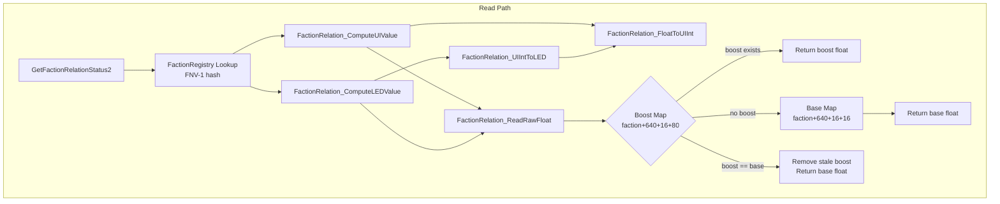
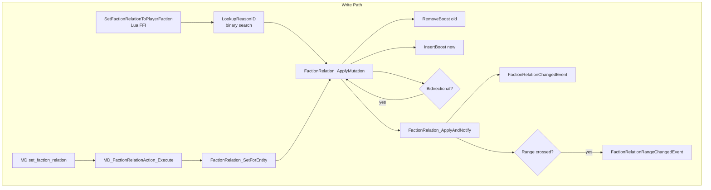

# Faction Relation System -- Binary Internals

> Deep reverse engineering of X4.exe v9.00 faction relation read/write paths.
> All addresses relative to imagebase `0x140000000`. 
> NOTE: All code below is pseudocode

---

## 1. Overview

The faction relation system stores floating-point values in `[-1.0, +1.0]` between every pair of factions. A **base map** holds the default relation, and a **boost map** layers temporary or permanent adjustments on top. The UI displays an integer in `[-30, +30]` derived via logarithmic interpolation, and a simplified LED color index in `[-4, +4]`.

### System Architecture




---

## 2. Read Path

### 2.1 GetFactionRelationStatus2

**Address:** `0x140AB9160`
**Signature:** `RelationDetails GetFactionRelationStatus2(const char* factionid)`
**PE Export:** Yes (index in `x4_exports.txt`)

Returns a `RelationDetails` struct:

```c
typedef struct {
    int relationStatus;   // +0: enum 0-6
    int relationValue;    // +4: UI integer [-30, +30]
    int relationLEDValue; // +8: LED index [-4, +4]
    bool isBoostedValue;  // +12: always false (not populated)
} RelationDetails;
```

**Pseudocode:**

```c
RelationDetails GetFactionRelationStatus2(const char* factionid) {
    RelationDetails result = { -1, 0, -1, false };

    if (!factionid || !*factionid) {
        LogError("...null/empty...");
        return result;
    }

    // FNV-1 hash of faction string
    uint64_t hash = fnv1a(factionid);

    // Binary tree lookup in g_FactionRegistry
    FactionClass* faction = FactionRegistry_Find(g_FactionRegistry, hash);
    if (!faction) {
        LogError("faction '%s' not found", factionid);
        return result;
    }

    // Determine player faction context
    FactionClass* player_faction = GetPlayerFaction();

    // Determine relation status enum.
    // UI names confirmed from monitors.lua:3529-3541 (game v9.00).
    int status = 6;  // default: unknown (no range matched)
    if (faction == g_PlayerFactionContext) {
        status = 5;  // Owned (player's own faction)
    } else if (IsSameAlliance(faction, player_faction)) {
        status = 4;  // Allied
    } else if (CheckInRange(faction, player_faction, RANGE_DOCK /*7*/)) {
        status = 3;  // Friendly (dock-friendly range)
    } else if (CheckInRange(faction, player_faction, RANGE_ENEMY /*4*/)) {
        status = 2;  // Neutral (above enemy threshold)
    } else if (CheckInRange(faction, player_faction, RANGE_NEMESIS /*9*/)) {
        status = 1;  // Enemy (above nemesis, below enemy)
    } else {
        if (CheckInRange(faction, player_faction, RANGE_FRIEND /*3*/))
            status = 0;  // Hostile (below friend threshold)
        // else status = 6 (unknown)
    }

    result.relationStatus  = status;
    result.relationValue   = ComputeUIValue(faction);
    result.relationLEDValue = ComputeLEDValue(faction);
    return result;
}
```

**Relation Status Enum** (confirmed from game UI `monitors.lua:3529-3541`):

| Value | UI Name | Meaning | Range Check |
|-------|---------|---------|-------------|
| 0 | Hostile | Below friend threshold (worst) | `CheckInRange(friend)` fallback |
| 1 | Enemy | Above nemesis, below enemy range | `CheckInRange(nemesis, 9)` |
| 2 | Neutral | Above enemy threshold | `CheckInRange(enemy, 4)` |
| 3 | Friendly | Dock-friendly range | `CheckInRange(dock, 7)` |
| 4 | Allied | Same alliance | `IsSameAlliance()` |
| 5 | Owned | Player's own faction | `faction == g_PlayerFactionContext` |
| 6 | Unknown | No range matched (default) | Default fallback |

### 2.2 FactionRelation_GetFloat

**Address:** `0x14030E6B0`
**Signature:** `double FactionRelation_GetFloat(FactionClass* a, FactionClass* b)`

```c
double FactionRelation_GetFloat(FactionClass* a, FactionClass* b) {
    if (a == b)
        return 1.0f;  // self-relation
    return FactionRelation_ReadRawFloat(*(a + 640) + 16, b);
}
```

**Key offset:** Each `FactionClass` has a pointer at **+640** to its `RelationData` structure. The relation maps begin at `RelationData + 16`.

### 2.3 FactionRelation_ReadRawFloat

**Address:** `0x1404353A0`
**Signature:** `float FactionRelation_ReadRawFloat(RelationDataBase* base, FactionClass* target)`

This is the core float reader. It implements a two-layer lookup:

```c
float FactionRelation_ReadRawFloat(RelationDataBase* base, FactionClass* target) {
    if (!target) return -2.0f;  // sentinel: no data

    // 1. Search boost map (base + 80, keyed by faction pointer)
    BoostNode* boost = boost_map_find(base + 80, target);
    if (boost) {
        float boost_val = boost->read_value();       // via vtable+40
        float base_val  = boost->read_base_value();   // via vtable+8
        if (fabs(boost_val - base_val) < 0.000001f) {
            // Boost equals base -- stale, remove it
            FactionRelation_RemoveBoost(base, target);
        } else if (boost_val != -2.0f) {
            return boost_val;
        }
    }

    // 2. Fall through to base map (base + 16, keyed by faction pointer)
    BaseNode* node = base_map_find(base + 16, target);
    if (!node) return 0.0f;  // no entry = neutral
    return node->value;       // at node + 40 (0x28)
}
```

**Data layout of RelationDataBase (at faction+640+16):**

| Offset | Type | Description |
|--------|------|-------------|
| +0 | - | Red-black tree header |
| +16 | RBTree | Base relation map (keyed by FactionClass*) |
| +80 | RBTree | Boost relation map (keyed by FactionClass*) |

**Base map node layout:** Key at `node+32`, float value at `node+40`.
**Boost map node layout:** Key at `node+32`, value via vtable virtual call.

### 2.4 FactionRelation_FloatToUIInt

**Address:** `0x14099E540`
**Signature:** `int FactionRelation_FloatToUIInt(FactionManager* mgr, int unused)`

Converts the most recently read raw float (carried in `xmm1`) to a UI integer in `[-30, +30]`. Walks a BST of threshold nodes (at `mgr+0x60`) to find the bracketing pair, then dispatches to one of three piecewise interpolation branches:

- **Positive log** (both thresholds > 0): `LogInterpolate` @ `0x141487290`, adds `+1e-5` before `cvttss2si`
- **Negative log** (both thresholds < 0): negates values, calls `LogInterpolate`, subtracts `1e-5` before `cvttss2si`
- **Zero-crossing linear** (lower <= 0, upper >= 0): `LinearInterpolate` @ `0x1414871C0` with epsilon `1e-4`, bare `cvttss2si`

See Section 4.1 for the exact formulas and threshold table.

### 2.5 FactionRelation_ComputeUIValue

**Address:** `0x140881870`
**Signature:** `int FactionRelation_ComputeUIValue(FactionClass* faction)`

Orchestrator for read path:

```c
int FactionRelation_ComputeUIValue(FactionClass* faction) {
    FactionClass* player = ResolvePlayerFaction();
    if (!faction || !player) return 0;

    if (player != faction) {
        // Reads raw float, stores in FactionRegistry internal state
        FactionRelation_ReadRawFloat(*(faction + 640) + 16, player);
    }
    // Convert cached float to UI int
    return FactionRelation_FloatToUIInt(g_FactionRegistry, 0);
}
```

### 2.6 FactionRelation_ComputeLEDValue

**Address:** `0x140881660`
**Signature:** `int FactionRelation_ComputeLEDValue(FactionClass* faction)`

Same read-then-convert pattern, but maps through `UIIntToLED`:

```c
int FactionRelation_ComputeLEDValue(FactionClass* faction) {
    FactionClass* player = ResolvePlayerFaction();
    if (!faction || !player) return 0;

    if (player != faction)
        FactionRelation_ReadRawFloat(*(player + 640) + 16, faction);

    return FactionRelation_UIIntToLED(g_FactionRegistry, 0);
}
```

### 2.7 FactionRelation_UIIntToLED

**Address:** `0x140881B80`
**Signature:** `int FactionRelation_UIIntToLED(int ui_int)`

Maps UI integer to LED color index:

| UI Value Range | LED Value | Color Meaning |
|----------------|-----------|---------------|
| <= -30 | -4 | Hostile (deep) |
| -29 to -20 | -3 | Hostile |
| -19 to -10 | -2 | Enemy |
| -9 to -1 | -1 | Enemy (slight) |
| 0 | 0 | Neutral |
| 1 to 9 | 1 | Neutral (positive) |
| 10 to 19 | 2 | Friendly |
| 20 to 29 | 3 | Allied |
| >= 30 | 4 | Allied (deep) |

---

## 3. Write Path

### 3.1 SetFactionRelationToPlayerFaction

**Address:** `0x14017E950`
**Signature:** `void SetFactionRelationToPlayerFaction(const char* factionid, const char* reasonid, float boostvalue)`
**PE Export:** Yes | **Lua FFI:** Yes

This is the primary API for Lua/FFI callers.

```c
void SetFactionRelationToPlayerFaction(
    const char* factionid,
    const char* reasonid,
    float boostvalue    // passed via xmm2, additive boost
) {
    if (!factionid) { LogError("...nullptr"); return; }

    // FNV-1 lookup in FactionRegistry
    FactionClass* faction = FactionRegistry_Find(g_FactionRegistry, fnv1a(factionid));
    if (!faction) { LogError("...not found '%s'", factionid); return; }

    if (!reasonid) { LogError("...nullptr"); return; }

    // Binary search for reason string -> integer ID
    int reason_id = FactionRelation_LookupReasonID(0, string_view(reasonid));
    if (!reason_id) {
        LogError("Failed to retrieve reason with ID '%s'", reasonid);
        return;
    }

    // Apply the mutation (bidirectional = 1)
    FactionRelation_ApplyMutation(
        faction,
        g_PlayerFactionContext,
        boostvalue,            // xmm2
        reason_id,             // r9d
        /*bidirectional=*/ 1   // stack
    );
}
```

**Important:** The `boostvalue` is an **additive** float in `~[-1.0, +1.0]` range. The mutation is always bidirectional (faction->player AND player->faction).

### 3.2 FactionRelation_LookupReasonID

**Address:** `0x1402CAE60`
**Signature:** `int FactionRelation_LookupReasonID(void* unused, string_view* reason_str)`

Performs binary search in a sorted array at `0x143C9A530` (BSS, populated at startup by `FactionRelation_InitReasonTable`).

Each entry is 24 bytes: `{char* str_ptr, uint64_t str_len, int32_t reason_id}`.

Returns the integer reason ID, or `dword_143C9A840` (default = 0) if not found.

### 3.3 FactionRelation_ApplyMutation

**Address:** `0x1409940E0`
**Signature:** `void FactionRelation_ApplyMutation(FactionClass* from, FactionClass* to, float boost /*xmm2*/, int reason_id /*r9d*/, bool bidirectional /*stack*/)`

This is the **core mutation function**. All relation changes flow through it.

```c
void FactionRelation_ApplyMutation(
    FactionClass* from,
    FactionClass* to,
    float boost,           // xmm2: the new absolute boost value
    int reason_id,         // r9d
    bool bidirectional     // stack byte
) {
    // Guard checks
    if (!to || to == from) return;
    if (*(*(from + 640) + 746))  return;  // from is relation-locked
    if (*(*(to   + 640) + 746))  return;  // to is relation-locked

    // Read old relation float
    float old_float = FactionRelation_GetFloat(from, to);

    // Get relation data pointer
    RelationData* rd = *(from + 640);

    // Get current timestamp from TLS
    uint64_t timestamp = get_tls_timestamp();

    // Remove old boost, insert new one
    FactionRelation_InsertBoost(
        rd + 16,          // relation data base
        from, to,         // source/target
        0, 0,             // clear old value
        timestamp
    );

    // If bidirectional, recurse for reverse direction (with bidirectional=false)
    if (bidirectional)
        FactionRelation_ApplyMutation(to, from, boost, reason_id, false);

    // Notify subsystems
    FactionRelation_ApplyAndNotify(from, to, old_float, new_float, reason_id);

    // Read new float to check if it actually changed
    float new_float = FactionRelation_GetFloat(from, to);

    // If changed beyond epsilon, fire game events
    if (fabs(old_float - new_float) >= 0.000001f) {
        // Allocate and dispatch FactionRelationChangedEvent (0x38 bytes)
        // Fields: old_float, new_float, from_faction, to_faction, reason_id
        auto* evt = new FactionRelationChangedEvent();
        evt->old_value  = old_float;
        evt->new_value  = new_float;
        evt->faction_a  = from;
        evt->faction_b  = to;
        evt->reason     = reason_id;
        EventDispatch_PriorityQueue(game_event_queue, evt, timestamp, 1);

        // Check if relation crossed a range boundary
        if (FactionRelation_CheckRangeChanged(g_FactionRegistry)) {
            auto* rev = new FactionRelationRangeChangedEvent();
            rev->faction_a = from;
            rev->faction_b = to;
            EventDispatch_PriorityQueue(game_event_queue, rev, timestamp, 1);
        }
    }
}
```

**Key observations:**
- **Relation-locked flag** at `*(faction+640)+746` -- if set, no mutations are allowed
- **Bidirectional recursion** -- when `bidirectional=true`, calls itself with reversed factions and `bidirectional=false` to prevent infinite recursion
- **Two event types fired:** `FactionRelationChangedEvent` (always) and `FactionRelationRangeChangedEvent` (only on range boundary crossing)

### 3.4 FactionRelation_InsertBoost

**Address:** `0x140A07A50`
**Signature:** `void FactionRelation_InsertBoost(RelationDataBase* base, FactionClass* source, FactionClass* target, float value, int param, uint64_t timestamp)`

Creates a `RelationBoostSource<FactionClass*, FactionClass*, float>` object (40 bytes):

| Offset | Type | Field |
|--------|------|-------|
| +0 | void* | vtable (RelationBoostSource) |
| +8 | FactionClass* | source faction |
| +16 | float | boost value |
| +20 | int | parameter |
| +24 | uint64_t | timestamp |
| +32 | FactionClass* | target faction |

Always calls `FactionRelation_RemoveBoost` first to clear any existing boost for the same target.

### 3.5 FactionRelation_SetForEntity

**Address (build 900-602526):** `0x140996170` (RVA `0x00996170`)
**Size:** `0x83` bytes
**Signature:** `void FactionRelation_SetForEntity(FactionClass* from, FactionClass* to, float delta /*xmm2*/, int reason_id /*r9d*/)`

This is the function that MD's `set_faction_relation` calls. Despite the name "set", it is **additive**: it reads the current relation float, adds the incoming delta, and passes the sum as the new absolute boost to `ApplyMutation`.

```c
void FactionRelation_SetForEntity(
    FactionClass* from,   // rcx
    FactionClass* to,     // rdx
    float delta,          // xmm2: additive delta
    int reason_id         // r9d
) {
    if (!to) return;
    if (to == from) return;

    // Read current relation float (from -> to)
    float current = FactionRelation_ReadRawFloat(*(from + 640) + 16, to);

    // New boost = current + delta
    float new_boost = current + delta;

    // Apply as absolute boost, bidirectional
    FactionRelation_ApplyMutation(from, to, new_boost /*xmm2*/, reason_id /*r9d*/, 1 /*stack*/);
}
```

**Key insight:** The `xmm2` parameter here is a **delta** that gets added to the current float. The result becomes the absolute boost value in `ApplyMutation`. This differs from `ApplyMutation` which takes an **absolute** boost target.

### 3.6 MD_FactionRelationAction_Execute

**Address (build 900-602526):** `0x140B94C40` (RVA `0x00B94C40`)
**Size:** `0x1BA` bytes

The MD action handler dispatches two different MD commands based on the action type ID at `action+8`:

| Action ID | Hex | MD Command | Target Function |
|-----------|-----|------------|-----------------|
| 1652 | 0x674 | `set_faction_relation` | `FactionRelation_SetForEntity` (additive) |
| 2192 | 0x890 | `add_faction_relation` | `FactionRelation_ApplyMutation` (absolute boost) |

```c
void MD_FactionRelationAction_Execute(MDAction* action, void* a2, void* a3) {
    FactionClass* faction_a = ResolveEntityParam(action + 40, a3);  // 'faction' attr
    FactionClass* faction_b = ResolveEntityParam(action + 56, a3);  // 'otherfaction' attr
    if (!faction_a || !faction_b) return;

    float value = EvalExpression(action + 72, a3);  // 'value' attr -> xmm6
    int reason_id = ResolveReasonParam(action + 88, a3); // 'reason' attr -> int

    int action_type = *(int*)(action + 8);

    if (action_type == 0x674) {
        // set_faction_relation: additive via SetForEntity
        FactionRelation_SetForEntity(faction_a, faction_b, value /*xmm2*/, reason_id /*r9d*/);
    } else if (action_type == 0x890) {
        // add_faction_relation: absolute boost via ApplyMutation
        FactionRelation_ApplyMutation(faction_a, faction_b, value /*xmm2*/, reason_id /*r9d*/, 1 /*bidirectional*/);
    }
}
```

**Important semantic difference:**
- `set_faction_relation value="X"` passes `X` to `SetForEntity`, which computes `current + X` as the new absolute boost. So `value` is a delta.
- `add_faction_relation value="X"` passes `X` directly to `ApplyMutation` as the absolute new boost target (clamped to [-1.0, 1.0]).

Both support NPC-to-NPC factions (not player-only). The only player-specific function is the exported `SetFactionRelationToPlayerFaction`.

### 3.7 FactionRelation_ApplyAndNotify

**Address (build 900-602526):** `0x140995B80` (RVA `0x00995B80`)
**Size:** `0x31E` bytes
**Signature:** `void FactionRelation_ApplyAndNotify(FactionClass* from, FactionClass* to, float old_value /*xmm2*/, float new_value /*xmm3*/, int reason_id /*stack*/)`

Fires `RelationChangedEvent` and `RelationRangeChangedEvent` specifically for the **player faction** context. Only fires if `to == g_PlayerFaction`.

### 3.8 Other Write Path Functions (Updated Addresses)

| Function | Address (build 900-602526) | RVA | Size |
|----------|---------------------------|-----|------|
| `FactionRelation_InsertBoost` | `0x140A098C0` | `0x00A098C0` | `0xB5` |
| `FactionRelation_RemoveBoost` | `0x140428670` | `0x00428670` | - |
| `FactionRelation_CheckRangeChanged` | `0x14099DF20` | `0x0099DF20` | - |
| `FactionRelation_LookupReasonID` | `0x1402CBF00` | `0x002CBF00` | `0x160` |

---

## 5. Faction Registry Lookup (String to FactionClass*)

### 5.1 Pattern

All exported functions that accept a `const char* factionid` use the same inline pattern to resolve it to a `FactionClass*`:

1. **FNV-1 hash** the string (NOT FNV-1a -- XOR-before-multiply):
   ```c
   uint64_t hash = 2166136261ULL; // 0x811C9DC5
   for (size_t i = 0; i < len; i++)
       hash = (hash * 16777619ULL) ^ (uint64_t)(uint8_t)factionid[i]; // FNV-1: multiply then XOR
   ```
   Note: Despite code comments in the existing doc saying FNV-1a, the disassembly at `0x14017F87A` shows `v11 = v13 ^ (16777619 * v11)` which is multiply-first (FNV-1), not XOR-first (FNV-1a).

2. **BST lookup** in `g_FactionManager`:
   ```c
   // g_FactionManager is at global 0x146C7A398 (RVA 0x06C7A398)
   void* sentinel = g_FactionManager + 16;
   void* node = *(void**)(g_FactionManager + 24);  // root
   void* result = sentinel;
   while (node) {
       if (*(uint64_t*)(node + 32) < hash)   // key at node+32
           node = *(void**)(node + 16);        // right child
       else {
           result = node;
           node = *(void**)(node + 8);          // left child
       }
   }
   if (result == sentinel || hash < *(uint64_t*)(result + 32))
       return NULL; // not found
   return (FactionClass*)(result + 48);  // FactionClass* at node+48
   ```

3. **g_PlayerFaction** is a direct global at `0x14387E708` (RVA `0x0387E708`) — holds the player's FactionClass* directly.

### 5.2 Global Addresses

| Global | Address (build 900-602526) | RVA | Type |
|--------|---------------------------|-----|------|
| `g_FactionManager` | `0x146C7A398` | `0x06C7A398` | `void*` (FactionManager singleton) |
| `g_PlayerFaction` | `0x14387E708` | `0x0387E708` | `FactionClass*` |

### 5.3 Calling NPC-NPC Relations from Native Code

To set relations between two NPC factions from native C++ code:

```c
// Step 1: Resolve faction strings to FactionClass pointers
// (inline the FNV-1 + BST pattern from Section 5.1, or call
//  a helper that wraps it)
FactionClass* faction_a = FactionRegistry_Find("faction_argon");
FactionClass* faction_b = FactionRegistry_Find("faction_paranid");

// Step 2: Look up reason ID
int reason_id = FactionRelation_LookupReasonID(faction_node_ptr, &reason_sv);
// Or use a known reason_id constant (e.g., 5 is commonly used)

// Step 3: Call ApplyMutation directly for absolute boost
// rcx = from, rdx = to, xmm2 = boost float, r9d = reason_id, [rsp+20h] = bidirectional
FactionRelation_ApplyMutation(faction_a, faction_b, 0.5f, reason_id, 1);
```

**Recommended approach for X4Strategos**: Call `FactionRelation_ApplyMutation` directly rather than `SetForEntity`. ApplyMutation takes an **absolute** boost value (clamped to [-1.0, 1.0]), which is simpler to reason about. SetForEntity adds a delta which requires knowing the current value first.

**Calling convention note**: The float parameter is in **xmm2** (third register slot), not passed on the stack. This requires the C++ function pointer to be declared with a float in the third parameter position, or use inline assembly / intrinsics to ensure the float lands in xmm2.

---

## 4. Conversion Formulas

### 4.1 Float to UI Integer

**Address:** `FactionRelation_FloatToUIInt` @ `0x14099E540`

The internal float `[-1.0, +1.0]` maps to UI integer `[-30, +30]` using a **threshold BST** stored in `g_FactionManager`. Each tree node stores a float threshold (`+0x1C`) and an int32 UI value (`+0x20`). The function performs a lower-bound search, then **piecewise interpolates** between the bracketing pair of nodes.

**Threshold table** (from `libraries/factions.xml` comment, loaded into BST at runtime):

| Float | UI | Float | UI |
|-------|-----|-------|-----|
| -1.0 | -30 | +0.0032 | +5 |
| -0.5 | -27 | +0.01 | +10 |
| -0.32 | -25 | +0.032 | +15 |
| -0.1 | -20 | +0.1 | +20 |
| -0.032 | -15 | +0.32 | +25 |
| -0.01 | -10 | +0.5 | +27 |
| -0.0032 | -5 | +1.0 | +30 |

**Three interpolation branches** (determined by the sign of the bracketing thresholds):

| Condition | Method | Epsilon | Helper |
|-----------|--------|---------|--------|
| Both thresholds negative | Log interpolation (negated values) | Subtract 1e-5 | `LogInterpolate` @ `0x141487290` |
| Both thresholds positive | Log interpolation (direct) | Add 1e-5 | `LogInterpolate` @ `0x141487290` |
| Straddles zero (lower <= 0, upper >= 0) | Linear interpolation | None | `LinearInterpolate` @ `0x1414871C0` |

All branches end with `cvttss2si` (truncate toward zero).

**Log interpolation formula** (`LogInterpolate` @ `0x141487290`):

```
result = lower_ui + (upper_ui - lower_ui) * logf(input / lower_thresh) / logf(upper_thresh / lower_thresh)
```

Guards: returns `lower_ui` if `input <= lower_thresh` or `lower_thresh <= 0`; returns `upper_ui` if `input >= upper_thresh`.

**Linear interpolation formula** (`LinearInterpolate` @ `0x1414871C0`):

```
result = lower_ui + (input - lower_thresh) * (upper_ui - lower_ui) / (upper_thresh - lower_thresh)
```

For the zero-crossing region `[-0.0032, +0.0032]`, this simplifies to: `ui = input / 0.00064`. One UI step = 0.00064 float change.

**Approximate single formula** (from factions.xml comment, accurate to +/-1 UI step):

```
ui ~ 10 * log10(|float| * 1000) * sign(float)
```

This approximation breaks down in the linear region (|float| < 0.0032, |UI| < 5) where the log function goes to negative infinity but the binary uses linear interpolation through zero.

### 4.2 Inverse: UI Integer to Float (Piecewise)

The inverse is **piecewise** -- two different formulas for the two interpolation regions:

```
Log region (|ui| >= 5):    float = sign(ui) * 10^((|ui| + 0.5) / 10) / 1000
Linear region (|ui| < 5):  float = sign(ui) * (|ui| + 0.5) * 0.00064
```

The `+0.5` targets the midpoint of each integer bucket, avoiding threshold rounding errors when the forward conversion truncates via `cvttss2si`.

**WARNING:** A single formula `float = 10^((|ui|+0.5)/10) / 1000` (without the linear branch) produces **wrong results for UI values 0 and 1**. At UI=0, it gives float 0.00112 which the binary converts back to UI 1 (not 0). At UI=1, it gives float 0.00141 which converts back to UI 2 (not 1). All values |UI| >= 2 roundtrip correctly even with the single formula, but the piecewise version is the correct one.

**Roundtrip verification** (piecewise inverse -> binary forward, all 30 positive values): PASS.

### 4.3 UI Integer to LED

```c
int UIIntToLED(int ui) {
    if (ui <= -30) return -4;
    if (ui <= -20) return -3;
    if (ui <= -10) return -2;
    if (ui <    0) return -1;
    if (ui ==   0) return  0;
    if (ui <   10) return  1;
    if (ui <   20) return  2;
    if (ui <   30) return  3;
    return  4;
}
```

### 4.4 Float-to-UI Reference Table

| Float Threshold | UI Value | LED | Relation (UI bracket) |
|-----------------|----------|-----|----------------------|
| -1.0 | -30 | -4 | Hostile (deep) |
| -0.5 | -27 | -3 | Hostile |
| -0.32 | -25 | -3 | Hostile |
| -0.1 | -20 | -2 | Enemy |
| -0.032 | -15 | -2 | Enemy |
| -0.01 | -10 | -1 | Enemy (near neutral) |
| -0.0032 | -5 | -1 | Enemy (slight) |
| 0 | 0 | 0 | Neutral |
| +0.0032 | +5 | +1 | Neutral (slight positive) |
| +0.01 | +10 | +1 | Friendly |
| +0.032 | +15 | +2 | Friendly |
| +0.1 | +20 | +2 | Friendly |
| +0.32 | +25 | +3 | Allied |
| +0.5 | +27 | +3 | Allied |
| +1.0 | +30 | +4 | Allied (deep) |

> Source: `libraries/factions.xml` header comment. These are the exact thresholds loaded into the BST at runtime. Between thresholds, piecewise log interpolation (or linear in the zero-crossing band) produces intermediate integer values.

---

## 5. Struct Layouts

### 5.1 FactionClass (partial)

| Offset | Type | Description |
|--------|------|-------------|
| +0 | void* | vtable |
| +560 | int | faction_index (used in notification hashing) |
| +640 | RelationData* | Pointer to faction's relation data structure |

### 5.2 RelationData (at *faction+640)

| Offset | Type | Description |
|--------|------|-------------|
| +0 | ... | Internal header |
| +16 | RelationDataBase | Start of relation maps |
| +746 | bool | relation_locked flag (prevents all mutations) |

### 5.3 RelationDataBase (at RelationData+16)

| Offset | Type | Description |
|--------|------|-------------|
| +0 | RBTree header | ... |
| +16 | RBTree | Base relation map (permanent values) |
| +80 | RBTree | Boost relation map (temporary/additive overrides) |

### 5.4 Base Map Node

| Offset | Type | Description |
|--------|------|-------------|
| +0 | void* | parent pointer |
| +8 | void* | left child |
| +16 | void* | right child |
| +28 | int | range enum (for range tree) |
| +32 | FactionClass* | key (target faction) |
| +36 | float | min threshold |
| +40 | float | base relation value |

### 5.5 FactionRelationChangedEvent (0x38 bytes)

| Offset | Type | Description |
|--------|------|-------------|
| +0 | void* | vtable (`FactionRelationChangedEvent`) |
| +8 | int | flags (0) |
| +16 | void* | reserved (0) |
| +24 | FactionClass* | faction_a (initiator) |
| +32 | FactionClass* | faction_b (target) |
| +40 | float | old_value |
| +44 | float | new_value |
| +48 | int | reason_id |

### 5.6 FactionRelationRangeChangedEvent (0x28 bytes)

| Offset | Type | Description |
|--------|------|-------------|
| +0 | void* | vtable (`FactionRelationRangeChangedEvent`) |
| +8 | int | flags (0) |
| +16 | void* | reserved (0) |
| +24 | FactionClass* | faction_a |
| +32 | FactionClass* | faction_b |

### 5.7 RelationBoostSource (0x28 bytes)

| Offset | Type | Description |
|--------|------|-------------|
| +0 | void* | vtable |
| +8 | FactionClass* | source faction |
| +16 | float | boost value |
| +20 | int | parameter |
| +24 | uint64_t | timestamp |
| +32 | FactionClass* | target faction |

---

## 6. Reason ID System

### 6.1 Initialization

`FactionRelation_InitReasonTable` at `0x1409FE7D0` populates three parallel BSS tables from a static source array at `0x142538310`.

| BSS Address | Contents |
|-------------|----------|
| `0x143C9A3A8` | Unsorted reason entries (16 entries, 24 bytes each) |
| `0x143C9A530` | Sorted reason entries (for binary search by `LookupReasonID`) |
| `0x143C9A6B8` | Third copy (purpose: reverse lookup or display) |
| `0x143C9A6B0` | Count of entries in sorted table |
| `0x143C9A840` | Default reason ID for "not found" (= 0) |

### 6.2 Valid Reason Strings

The source table at `0x142538310` contains 16 entries in two groups of 8. Each entry is `{char* string, int32_t id}`:

| ID | String | Description |
|----|--------|-------------|
| 0 | *(empty)* | Default / unspecified |
| 1 | `missioncompleted` | Mission completed successfully |
| 2 | `destroyedfactionenemy` | Destroyed an enemy of the faction |
| 3 | `smalltalkreward` | Smalltalk / conversation reward |
| 4 | `attackedobject` | Attacked a faction's object |
| 5 | `boardedobject` | Boarded a faction's object |
| 6 | `killedobject` | Killed/destroyed a faction's object |
| 7 | `hackingdiscovered` | Hacking was discovered |
| 8 | `scanningdiscovered` | Illegal scanning was discovered |
| 9 | `illegalcargo` | Caught with illegal cargo |
| 10 | `missionfailed` | Mission failed |
| 11 | `ownerchanged` | Object ownership changed |
| 12 | `tradecompleted` | Trade completed successfully |
| 13 | `illegalplot` | Illegal plot action |
| 14 | `markedashostile` | Manually marked as hostile |
| 15 | `wardeclaration` | War declaration |
| 16 | *(empty -- second group start)* | Group 2 separator |

**Second group** (IDs 0-2, different table):

| ID | String | Description |
|----|--------|-------------|
| 0 | `sectortravel` | Sector travel activity |
| 1 | `sectoractivity` | Sector activity tracking |
| 2 | `objectactivity` | Object interaction activity |

### 6.3 MD-Accessible Reason Strings

The `common.xsd` schema defines the subset available to Mission Director scripts via `relationchangereasonlookup`:

```
missioncompleted, destroyedfactionenemy, smalltalkreward,
attackedobject, boardedobject, killedobject,
hackingdiscovered, scanningdiscovered, illegalcargo,
missionfailed, tradecompleted, illegalplot
```

Note: `ownerchanged`, `markedashostile`, and `wardeclaration` are NOT in the MD schema -- they are engine-internal-only reasons. The second group (`sectortravel`, `sectoractivity`, `objectactivity`) is also engine-internal.

### 6.4 Lookup Mechanics

`FactionRelation_LookupReasonID` uses standard binary search (`memcmp`-based) on the sorted table. The input is a `string_view` (pointer + length). Returns 0 on failure, which is the empty/default reason.

---

## 7. Faction Discovery System

Three independent "known" concepts control faction visibility:

| Concept | API | Effect |
|---------|-----|--------|
| `set_faction_known` (MD) | `<set_faction_known faction="..." known="true"/>` | Sets `IsFactionKnown()` flag |
| `AddKnownItem` (Lua) | `AddKnownItem("factions", faction_id)` | Adds to `GetLibrary("factions")`, drives diplomacy UI |
| `IsKnownItemRead` (C FFI) | `C.IsKnownItemRead("factions", id)` | Checks if player has READ the encyclopedia entry |

`GetLibrary("factions")` returns only factions added via `AddKnownItem` -- NOT all factions in the game. `IsFactionKnown()` tracks a separate flag set by MD `set_faction_known`. Both must be called for a faction to appear correctly in the diplomacy tab.

---

## 8. Global Variables

| Address | Name | Type | Description |
|---------|------|------|-------------|
| `0x146C7A398` | `g_FactionManager` | FactionManager* | Master faction registry (RB tree + threshold trees) |
| `0x14387E708` | `g_PlayerFaction` | FactionClass* | Current player's faction object |
| `0x143CA6D68` | `g_GameUniverse` | GameUniverse* | Game universe root (event queues at +552, +560) |
| `0x143CA1840` | *(unnamed)* | ReasonEntry[16] | Sorted reason lookup table (BSS) |
| `0x143CA19C0` | *(unnamed)* | int64_t | Reason table entry count |
| `0x143CA1B50` | *(unnamed)* | int32_t | Default reason ID (0) |

---

## 9. FNV-1 Hash (Faction String Lookup)

The faction registry uses **FNV-1** (multiply-then-XOR) to hash faction ID strings. This is a non-standard variant: 32-bit offset basis in a 64-bit register.

> **Correction (2026-03-28):** Previously labeled "FNV-1a". Disassembly at two independent call sites confirms `imul` (multiply) BEFORE `xor` — this is FNV-1, not FNV-1a. Same constants, different operation order, different output values.

```c
uint64_t fnv1_hash(const char* str) {
    uint64_t hash = 2166136261;      // 0x811C9DC5 (32-bit offset basis, zero-extended)
    size_t len = strlen(str);
    for (size_t i = 0; i < len; i++) {
        hash = hash * 16777619;       // 0x01000193 — multiply FIRST
        hash = hash ^ (uint64_t)str[i]; // XOR SECOND
    }
    return hash;
}
```

**Assembly confirmation** (from `GetFactionRelationStatus2` at `0x140ABB330`):
```asm
imul    r9, 1000193h             ; hash *= FNV_PRIME  (MULTIPLY FIRST)
xor     r9, rcx                  ; hash ^= char       (XOR SECOND)
```

The registry at `g_FactionManager + 16` is an Egosoft custom red-black tree keyed by this hash. Node layout: key at `node + 0x20`, faction data at `node + 0x30` (see SUBSYSTEMS.md §2 for `EgoRBTreeNode` layout).

---

## 10. Alliance / Coalition System

### 10.1 Overview

X4 has **two distinct "alliance" systems** that share some code paths:

1. **Faction Coalition System** -- a data-driven grouping defined in `coalitions.xml` where factions share a coalition ID. This is the system that `IsSameAlliance()` checks first.
2. **Ventures Online Coalition** -- a multiplayer-specific guild system for the Ventures DLC (`ego_dlc_ventures`). Uses `OnlineJoinCoalition()`, `OnlineGetCurrentCoalition()`. Completely separate from faction relations.

In the **base game and all current DLCs**, `coalitions.xml` is empty:
```xml
<!-- empty on purpose - imported through the ego_dlc_ventures extension -->
<coalitions />
```

The Ventures extension populates this at runtime for online play only. **No DLC populates it for single-player faction alliances.** The "Allied" relation status (status=4) is therefore **never triggered by coalition membership** in normal gameplay -- it exists as infrastructure that could be used but currently is not.

### 10.2 IsSameAlliance Internal Logic

**Address:** `0x140999560` (size 0x5E)
**Signature:** `bool IsSameAlliance(FactionClass* a, FactionClass* b, uint8_t use_true_owner)`

```c
bool IsSameAlliance(FactionClass* a, FactionClass* b, uint8_t use_true_owner) {
    return b && (CheckCoalitionAlly(a, b, use_true_owner)
              || CheckAllianceByVtable(b, a, use_true_owner));
}
```

**Path 1 -- Coalition-based (`CheckCoalitionAlly` @ `0x140999320`):**
1. Gets coalition container from faction_b via vtable+6048
2. If container exists and has type flag 35 (coalition type):
   - Reads coalition IDs for both factions via vtable+5608/5624 (depending on `use_true_owner`)
   - Calls `CheckCoalitionRange(faction_a, coalition_id_a, relation_float, range=5)` where range 5 = "ally" (0.5 to 1.0)
   - If ally range fails, checks range 6 = "member" (0.1 to 1.0) AND verifies the entity is an online Venture object
3. If no coalition container, falls back to reading faction IDs directly and checking ally range

**Path 2 -- Vtable-based (`CheckAllianceByVtable` @ `0x1403ACD20`):**
- Uses vtable+5888 to get alliance membership info
- Checks against range 5 (ally) via `CheckCoalitionRange`
- This path handles game-universe-level alliance checks (e.g., player faction context)

### 10.3 Coalition ID Storage

Each faction stores a coalition ID at:
```
FactionClass + 640 (RelationData pointer) -> +620 (int32 coalition_id)
```

**`GetCoalitionID` @ `0x140997800`:**
- Returns 0 if coalition_id <= 0
- Returns 0 if coalition_id not found in coalition registry BST
- Returns -1 for special sentinel case (coalition_id == -1)
- Coalition registry is a BST at `g_CoalitionRegistry` (`0x146C7A4B8`)

### 10.4 Coalition Registry (`0x146C7A4B8`)

This global is a red-black tree keyed by integer coalition ID. Each node stores:
- `node+32`: int32 coalition ID (key)
- `node+40`: pointer to coalition data (member tree, alliance/enemy flags)

The same global (`0x146C7A4B8`) is also referenced by FightRule functions, suggesting coalitions and fight rules share a registry or are adjacent in the same manager object.

### 10.5 Script Properties

From `scriptproperties.xml`, factions expose these coalition properties:

| Property | Type | Description |
|----------|------|-------------|
| `faction.coalition` | integer | Coalition ID (null if not in a coalition) |
| `faction.iscoalitionally.{$faction}` | boolean | Both factions have AND share the same coalition |
| `faction.iscoalitionenemy.{$faction}` | boolean | Both factions have coalitions but different ones |

### 10.6 Game Script Usage

The `iscoalitionally` property is used in base game scripts:
- `aiscripts/fight.attack.object.station.xml` -- checks if station owner is coalition-ally of player
- `aiscripts/interrupt.attacked.xml` -- checks if attacker's true owner is coalition-ally
- `md/notifications.xml` -- checks coalition-ally for notification filtering
- `md/rml_escort_ambiguous.xml`, `md/rml_repairobject.xml` -- coalition-ally checks for missions

All these scripts use `iscoalitionally.{faction.player}` -- they would activate if coalitions were populated but currently return false since no coalitions exist in single-player.

### 10.7 Relation Ranges (Complete Table)

From `factions.xml` header, confirmed by `FactionRelation_IsInRelationRange` @ `0x140118C20`:

| Range Name | Float Min | Float Max | Used By |
|------------|-----------|-----------|---------|
| self | 1.0 | 1.0 | `GetFactionRelationStatus2` (status=5 is separate check) |
| ally | 0.5 | 1.0 | `IsSameAlliance` range 5 check |
| member | 0.1 | 1.0 | `IsSameAlliance` range 6 check (online only) |
| friend | 0.01 | 1.0 | Used for "Friendly" docking etc. |
| neutral | -0.01 | 0.01 | Zero band |
| dock | (composite) | (composite) | `GetFactionRelationStatus2` range 7 |
| enemy | -1.0 | -0.01 | `GetFactionRelationStatus2` range 4 |
| killmilitary | -1.0 | -0.1 | Military engagement threshold |
| kill | -1.0 | -0.32 | Kill-on-sight threshold |
| nemesis | -1.0 | -1.0 | `GetFactionRelationStatus2` range 9 |

---

## 11. Address Table

> Addresses updated to build 900 (2026-03-28). All behavioral descriptions verified by decompilation.

| Address | Name | Size | Description |
|---------|------|------|-------------|
| `0x140ABB2A0` | `GetFactionRelationStatus2` | 0x21F | Read faction-player relation status |
| `0x14017F820` | `SetFactionRelationToPlayerFaction` | 0x180 | Write faction-player relation (Lua FFI) |
| `0x14099E540` | `FactionRelation_FloatToUIInt` | 0x1C4 | Float [-1,+1] to UI int [-30,+30] |
| `0x14030F5C0` | `FactionRelation_GetFloat` | 0x3C | Read float between two factions |
| `0x140995EA0` | `FactionRelation_ApplyMutation` | 0x2CE | Core mutation (boost insert + events) |
| `0x140436260` | `FactionRelation_ReadRawFloat` | 0x113 | Two-layer float read (boost/base maps) |
| `0x1402CBF00` | `FactionRelation_LookupReasonID` | 0x160 | Binary search reason string -> int |
| `0x1408831E0` | `FactionRelation_ComputeUIValue` | 0x23B | Orchestrate: read float -> UI int |
| `0x140882FD0` | `FactionRelation_ComputeLEDValue` | 0xBD | Orchestrate: read float -> LED value |
| `0x1408834F0` | `FactionRelation_UIIntToLED` | 0x87 | UI int -> LED color index [-4,+4] |
| `0x1409963E0` | `FactionRelation_CheckInRange` | 0x79 | Check if relation is in named range |
| `0x140999560` | `FactionRelation_IsSameAlliance` | 0x5E | Check alliance membership (two-path: coalition + vtable) |
| `0x140999320` | `FactionRelation_CheckCoalitionAlly` | 0x1A6 | Coalition-based alliance check (range 5 ally, range 6 member+online) |
| `0x1403ACD20` | `FactionRelation_CheckAllianceByVtable` | 0x82 | Vtable-based alliance check (vtable+5888, range 5) |
| `0x140997800` | `FactionRelation_GetCoalitionID` | 0x72 | Read coalition ID from RelationData+620 |
| `0x140999140` | `FactionRelation_CheckCoalitionRange` | 0x184 | Check coalition membership + relation range |
| `0x140118C20` | `FactionRelation_IsInRelationRange` | 0x9C | Check if float is within named relation range |
| `0x1404E8310` | `FactionRelation_IsOnlineVentureEntity` | 0x92 | Check if entity is Ventures/online object |
| `0x1402939F0` | `Lua_OnlineJoinCoalition` | 0xD7 | Lua handler for Ventures coalition join (int32 ID) |
| `0x14099DF20` | `FactionRelation_CheckRangeChanged` | 0x14E | Detect range boundary crossing |
| `0x140A098C0` | `FactionRelation_InsertBoost` | 0xB5 | Insert boost into boost map |
| `0x140428670` | `FactionRelation_RemoveBoost` | 0xF9 | Remove boost from boost map |
| `0x140995B80` | `FactionRelation_ApplyAndNotify` | 0x31E | Fire change events for player faction |
| `0x140A00640` | `FactionRelation_InitReasonTable` | 0x6EB | Initialize reason string lookup table |
| `0x140996170` | `FactionRelation_SetForEntity` | 0x83 | Entity-level relation setter |
| `0x140B94C40` | `MD_FactionRelationAction_Execute` | 0x1BA | MD script action handler |
| `0x141487290` | `FactionRelation_LogInterpolate` | 0xB2 | Log interpolation for float->UI |
| `0x1414871C0` | `FactionRelation_LinearInterpolate` | 0x55 | Linear interpolation for float->UI |

### Global Variables

| Address | Name | Description |
|---------|------|-------------|
| `0x146C7A398` | `g_FactionManager` | Master faction registry (RB tree at +16), relation ranges (BST at +160) |
| `0x146C7A4B8` | `g_CoalitionRegistry` | Coalition/FightRule registry (RB tree, keyed by coalition ID int32) |
| `0x14387E708` | `g_PlayerFaction` | Player's faction object |
| `0x143CA6D68` | `g_GameUniverse` | Game universe root |
| `0x143CA1840` | Reason table (sorted) | Binary-search reason entries |
| `0x143CA19C0` | Reason table count | Number of entries |
| `0x143CA1B50` | Default reason ID | Value 0 |
