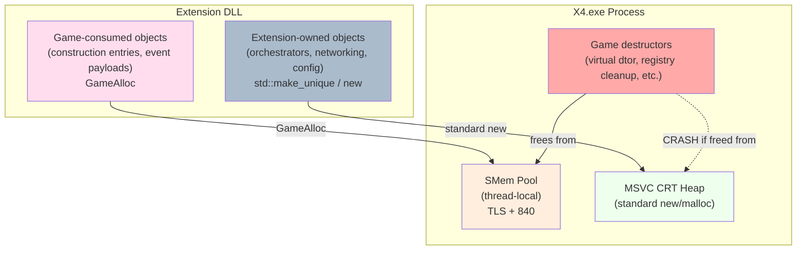
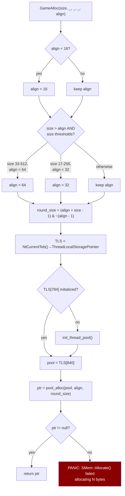
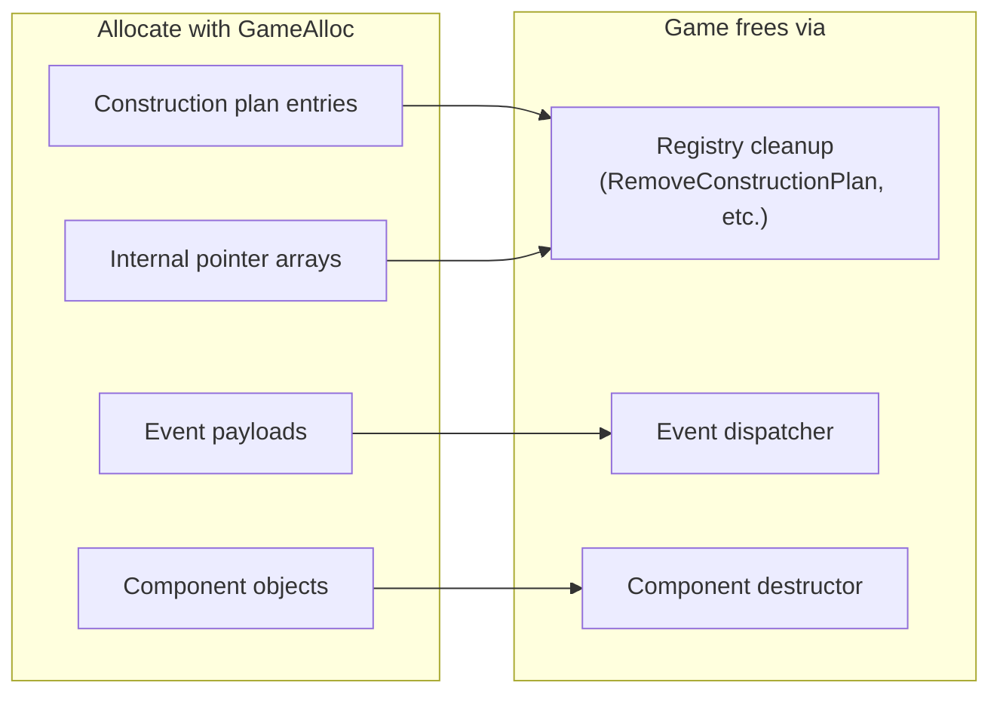

# X4 Memory Subsystem — Reverse Engineering Notes

> **Binary:** X4.exe v9.00 · **Date:** 2026-03-23
>
> All RVAs are relative to imagebase `0x140000000`.

---

## 1. Overview

X4 uses a custom thread-local pool allocator called **SMem** instead of the standard C++ heap. All game objects — components, plan entries, events, strings — are allocated through this system. Extensions that create objects consumed by the game engine **must** use `GameAlloc` to ensure the game's deallocation paths work correctly.



**Rule:** If the game will ever free the memory (via destructors, registry cleanup, etc.), allocate with `GameAlloc`. If the memory is owned and freed by the extension only, use standard C++ allocation.

---

## 2. GameAlloc — `sub_14145CB90`

**RVA:** `0x0145CB90` · **SDK name:** `GameAlloc`

### Signature

```cpp
void* GameAlloc(size_t size, int _unused1, int _unused2, int _unused3, int alignment);
```

- `size` — byte count to allocate
- `_unused1`–`_unused3` — register passthrough noise from calling convention (ignored)
- `alignment` — minimum alignment (clamped to 16 minimum, may be bumped to 32 or 64)
- **Returns:** allocated pointer, or `nullptr` on failure (triggers PANIC log)

### Internal Flow



### Alignment Bucketing

The allocator automatically bumps alignment based on size to optimize cache behavior:

| Size range | Minimum alignment |
|-----------|------------------|
| ≤ 16 bytes | 16 |
| 17–256 bytes | 32 |
| 33–512 bytes (with 64-byte alignment pattern) | 64 |
| > 512 bytes | requested (min 16) |

### Thread-Local Pool (SMem)

Each thread has its own memory pool at **TLS offset 840**. Pool initialization is lazy — triggered on first allocation per thread via `sub_1414824B0`.

The pool is a slab-style allocator optimized for game objects:
- Fast allocation (no global lock for same-thread alloc)
- Deallocation must happen from the same pool (same thread, or the pool must be shared)
- UI thread allocations (where all game API calls run) use the UI thread's pool

### Error Behavior

On allocation failure, `GameAlloc` logs:
```
PANIC: SMem::Allocate() failed allocating N bytes - error: <errno description>
```
This error can be triggered by passing corrupted size values — for example, when a Debug-ABI `std::string` pointer is misinterpreted as Release-ABI, the size field reads as garbage (e.g., multi-exabyte values).

---

## 3. When to Use GameAlloc

### Must use GameAlloc

Any object that will be **freed by game code**:



### Standard allocation is fine

Objects owned entirely by the extension:

- Extension-internal objects (managers, handlers, state trackers)
- I/O and communication objects (sockets, file handles, threads)
- Containers and buffers used within extension logic
- Anything not passed to game destructors

---

## 4. SDK Usage

The SDK provides typed wrappers in `x4n::memory::` (header: `x4n_memory.h`, also included by `x4native.h`):

```cpp
#include <x4n_memory.h>  // or <x4native.h>

// Typed single-object allocation (preferred)
auto* entry = x4n::memory::game_alloc<X4PlanEntry>();

// Typed array allocation
auto* arr = x4n::memory::game_alloc_array<X4PlanEntry*>(count);

// Raw allocation (low-level, same underlying call)
auto* g = x4n::game();
void* ptr = g->GameAlloc(528, 0, 0, 0, 16);

// Do NOT manually free — let the game's lifecycle management handle it.
// Game destructors (virtual dtor with flag 1 = "delete after destruct")
// will return the memory to the SMem pool.
```

### No corresponding GameFree

There is no exported `GameFree` function. Deallocation happens implicitly through game object destructors (virtual dtor with flag `1` = "delete after destruct"). Extensions should never manually free game-allocated memory — let the game's lifecycle management handle it.

---

## 5. ABI Constraint

`GameAlloc` itself has no ABI issues. However, many internal functions that receive game-allocated objects also take `std::string*` parameters. MSVC Debug builds add an 8-byte `_Container_proxy*` prefix to `std::string` (40 bytes vs 32 bytes in Release), causing field misalignment.

**Extensions calling internal game functions must build with `RelWithDebInfo` or `Release`.**

See `x4_internal_func_list.inc` for affected function signatures.
