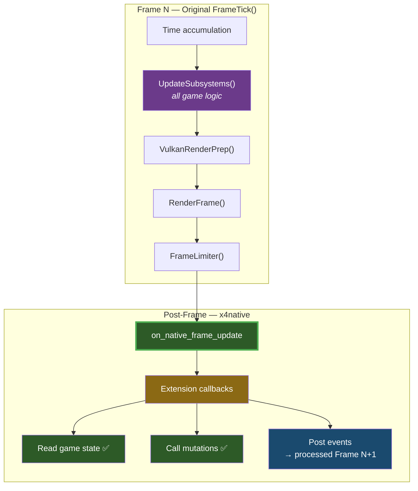
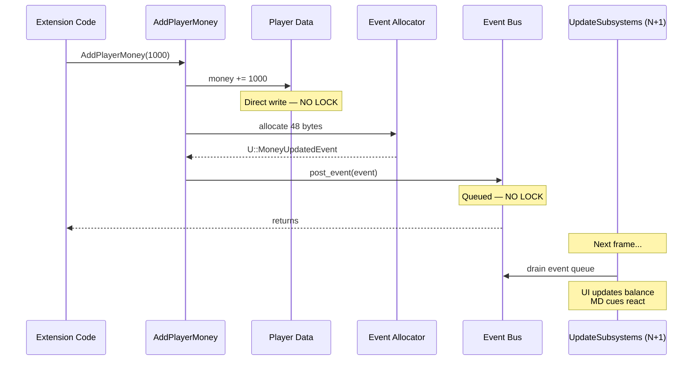
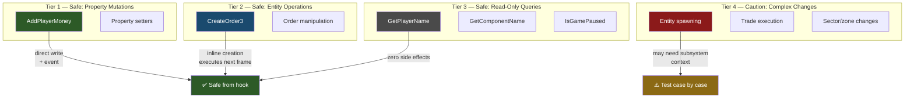
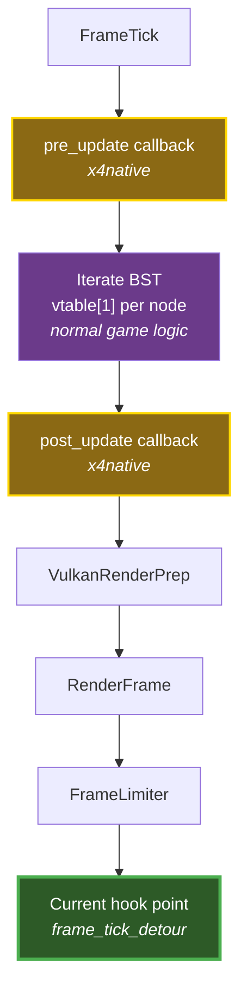

# X4 State Mutation Safety — Reverse Engineering Notes

> **Binary:** X4.exe v9.00 · **Date:** 2026-03

---

## 1. Summary

Exported game API functions are **safe to call from our frame tick hook**. They use no locking, assume main-thread context (which our hook provides), and either modify state directly or post events to the engine's event bus for next-frame processing.

---

## 2. Calling Context

Our `frame_tick_detour` wraps the original `FrameTick` call. After the original returns:

- All subsystems have completed their frame update
- All events for this frame have been dispatched
- Rendering is complete
- Game state is fully consistent and quiescent



---

## 3. Decompiled Function Analysis

### AddPlayerMoney — Direct State Mutation



**Exported wrapper:** `AddPlayerMoney` at `0x14013D5E0` (RVA `0x13D5E0`)

```c
// Thin wrapper — validates amount, delegates to inner function
void __fastcall AddPlayerMoney(__int64 amount) {
    if (amount)
        sub_140994350(qword_146C6B940, amount);  // inner implementation
}
```

**Inner implementation:** `sub_140994350` (RVA `0x994350`)

```c
void __fastcall AddPlayerMoney_Inner(ComponentSystem* sys, __int64 amount) {
    // 1. Direct state modification — NO LOCKING
    *(int64*)(player_data + offset) += amount;

    // 2. Allocate event (48 bytes, stack-like allocator)
    void* event = allocate_event(48);

    // 3. Set vtable → U::MoneyUpdatedEvent
    *(void**)event = &U_MoneyUpdatedEvent_vtable;

    // 4. Fill event payload
    event->player_id = get_player_id();
    event->old_amount = old;
    event->new_amount = old + amount;

    // 5. Post to event bus (sub_140953650)
    post_event(event_bus, event);
}
```

**Key observations:**
- **No CriticalSection, no mutex, no atomic operations** — pure sequential code
- Modifies player money directly in memory
- Creates a `U::MoneyUpdatedEvent` and posts it to the event bus
- The event will be processed in the next frame's `UpdateSubsystems` pass
- **Safe from our hook:** Yes — main thread, post-frame timing

### CreateOrder3 — Entity + Order Creation

**Exported wrapper:** `CreateOrder3` at `0x1401B9060` (RVA `0x1B9060`)

```c
// Creates an order for a controllable entity
uint32_t __fastcall CreateOrder3(UniverseID controllableid, const char* orderid,
                                 bool defaultorder, bool isoverride, bool istemp) {
    // 1. Look up entity via component system (qword_146C6B940)
    void* entity = lookup_component(controllableid);
    if (!entity) return 0;

    // 2. Validate player ownership — blocks NPC faction orders!
    if (!is_player_owned(entity)) return 0;

    // 3. Create order object — NO LOCKING
    void* order = sub_140423EA0(entity, orderid, defaultorder, isoverride, istemp);

    // 4. Returns 1-based order index
    return get_order_index(order);
}
```

**Key observations:**
- Component lookup via global `qword_146C6B940` — no synchronization
- Direct entity manipulation
- Order created inline, no deferred processing
- **Player-ownership check blocks NPC orders** — use `CreateOrderInternal` instead
- **Safe from our hook:** Yes — but the order won't be executed until next frame's AI update

**Internal function:** `CreateOrderInternal` at `0x140424A90` (RVA `0x424A90`)

Bypasses the player-ownership check. Used by X4Strategos for NPC faction orders.

```c
// a1 = X4Component* entity, a2 = AlignedStringView* order_id, a3 = mode, a4 = override
void* __fastcall CreateOrderInternal(void* entity, void* string_view, int mode, char override) {
    // Look up order definition from order_id string
    void* order_def = resolve_order_definition(string_view);
    if (!order_def) { log("Unknown order definition ID '%s'"); return NULL; }

    // Allocate AIOrder object (112 bytes)
    AIOrder* order = new AIOrder(order_def, mode == 3);  // is_default flag

    if (mode == 3) {
        // DEFAULT: destroy existing default order, replace
        if (entity[160]) destroy(entity[160]);
        entity[160] = order;
    } else {
        // QUEUE: push to order vector at entity[150..152]
        entity_order_vector_push(entity + 150, order);
        order[40] = (mode != 1);  // is_temp: true for mode 0/2, false for mode 1
        order[43] = override;     // is_override flag
    }
}
```

**Order modes** (verified via decompilation of CreateOrderInternal + removal at `0x141034E00`):

| Mode | Name | Storage | is_temp | Behavior |
|------|------|---------|---------|----------|
| 0 | Immediate | Queue | true | Fire-and-forget interrupt. Always destroyed on removal/completion. Previous behavior resumes. |
| 1 | Queue | Queue | false | Planned sequence step. Survives queue manipulation. On completion (state 8): reset via `0x14102EEE0` (can re-activate). |
| 2 | (unused) | Queue | true | Identical to mode 0 (game checks `==3` and `==1` only). |
| 3 | Default | entity[160] | n/a | Standing order. Loops when queue empty. Only one active. |

**AIOrder object layout** (from constructor at `0x14102B640`):

| Offset | Type | Field | Set By |
|--------|------|-------|--------|
| +0 | ptr | vtable (`AI::AIOrder::vftable`) | constructor |
| +16 | ptr | order_definition | constructor |
| +24 | ptr | entity | CreateOrderInternal |
| +32 | i32 | state (init=2, then 3→4→...→8) | lifecycle |
| +36 | byte | is_default | constructor (mode==3) |
| +37 | byte | is_active | queue manager |
| +38 | byte | activation_state | sub_14102FC30 |
| +40 | byte | **is_temp** | CreateOrderInternal (mode!=1) |
| +43 | byte | is_override | CreateOrderInternal (a4) |
| +44 | i32 | priority (default=4096) | constructor |

**Order states** (from lifecycle analysis):
- 2: Created (initial)
- 3: Params initialized (after sub_14102B990)
- 4+: Ready/running (triggers AIOrderReadyEvent via sub_14102FC90)
- 5-7: Completing states
- 8: Completed — mode 0 orders destroyed, mode 1 orders reset

---

## 4. Event Bus Architecture

### Event Posting (sub\_140953650)

All state mutations that need to notify other systems use the event bus:

```c
void post_event(EventBus* bus, Event* event) {
    // Append to event queue — NO LOCKING
    bus->queue[bus->count++] = event;
}
```

Events are typed C++ objects with vtables. Known event types from RTTI:

| Event Class | Namespace | Trigger |
|-------------|-----------|---------|
| `MoneyUpdatedEvent` | `U::` | `AddPlayerMoney` |
| `UpdateTradeOffersEvent` | `U::` | Trade system changes |
| `UpdateBuildEvent` | `U::` | Construction updates |
| `UpdateZoneEvent` | `U::` | Zone state changes |
| `UnitDestroyedEvent` | `U::` | Entity destruction |
| `UniverseGeneratedEvent` | `U::` | Universe creation |

### Event Timing

Events posted from our hook follow this lifecycle:

```mermaid
sequenceDiagram
    participant EXT as Extension (post-frame)
    participant MEM as Game Memory
    participant BUS as Event Bus
    participant SU as UpdateSubsystems
    participant UI as UI / MD / AI

    rect rgb(45, 90, 39)
    Note over EXT,BUS: Frame N (post-frame)
    EXT->>MEM: AddPlayerMoney(1000)
    Note over MEM: money modified immediately
    EXT->>BUS: U::MoneyUpdatedEvent queued
    end

    rect rgb(30, 74, 110)
    Note over SU,UI: Frame N+1
    SU->>BUS: drain event queue
    BUS->>UI: MoneyUpdatedEvent dispatched
    Note over UI: UI shows new balance<br/>MD cues react<br/>Other subsystems notified
    end
```



The 1-frame delay for event processing is invisible to the player and matches the engine's own event timing model.

---

## 5. Safety Classification



### Tier 1 — Safe: Simple Property Mutations

Functions that directly modify a value and optionally post an event. No ordering dependencies.

| Function | What It Does | Post-Frame Safe |
|----------|-------------|-----------------|
| `AddPlayerMoney(amount)` | Modifies money, posts MoneyUpdatedEvent | **Yes** |
| Property setters (general) | Write to entity fields | **Yes** |

### Tier 2 — Safe: Entity Operations

Functions that create/modify game objects. Results take effect next frame.

| Function | What It Does | Post-Frame Safe |
|----------|-------------|-----------------|
| `CreateOrder3(controllable, order, default, override, temp)` | Creates AI order for entity | **Yes** (executes next frame) |
| Order manipulation functions | Modify order queue | **Yes** |

### Tier 3 — Safe With Care: Read-Only Queries

Functions that read game state. Always safe, no side effects.

| Function | What It Does | Notes |
|----------|-------------|-------|
| `GetPlayerName()` | Returns player name | Zero side effects |
| `GetPlayerFactionName(flag)` | Returns faction name | Zero side effects |
| `GetPlayerControlledShipID()` | Returns ship component ID | Zero side effects |
| `GetComponentName(id)` | Returns entity name | Zero side effects |
| `IsGamePaused()` | Returns pause state | Zero side effects |

### Tier 4 — Caution: Complex State Changes

Functions that trigger cascading updates or depend on specific subsystem state. Should work from post-frame but may need testing.

| Category | Concern |
|----------|---------|
| Entity spawning | May assume subsystem context for initialization |
| Trade execution | Complex multi-entity state changes |
| Sector/zone changes | May trigger subsystem-level recalculation |
| Save/load triggers | Assumes specific lifecycle state |

### Entity Spawning — Zone Auto-Creation

All entity spawn functions that accept a `sectorid` parameter auto-create a **tempzone** at the target position if no zone exists there. This is confirmed by the `common.xsd` MD action schema documentation:

> `create_station` sector attribute: "Creates a tempzone if a zone does not exist at the coordinates"

This applies to all entity creation paths:
- C++: `SpawnStationAtPos(macro, sectorid, offset, planid, owner)` → auto-creates tempzone
- C++: `SpawnObjectAtPos2(macro, sectorid, offset, owner)` → auto-creates tempzone
- MD: `create_station sector=...`, `create_ship sector=...`, `create_object sector=...` → auto-creates tempzone

When using the `zone=` parameter instead, the entity is placed in the specified existing zone (takes precedence over sector).

`GetZoneAt(sectorid, &offset)` can be used to check whether a zone exists at a given position before spawning.

---

## 6. Why No Locking?

The absence of synchronization in exported functions is **by design**, not an oversight:

1. **Single-threaded game logic** — all simulation runs on the main thread (see [THREADING.md](THREADING.md))
2. **Lua calling context** — these functions are called from Lua scripts, which run within the subsystem update on the main thread
3. **No concurrent access** — physics (Jolt) and rendering (Vulkan) are isolated; they never call game API functions
4. **Event bus is single-producer** — only main-thread code posts events

Our hook maintains this invariant: we run on the main thread, between frames, with no concurrent game code executing.

---

## 7. Future Work: In-Simulation Timing

For extensions that need to run **within** the simulation update (same timing as MD cues), a future hook on `UpdateSubsystems` (RVA `0xE999D0`) could provide pre/post callbacks:



This would give code execution inside the frame's logical phase rather than post-frame. Most use cases don't need this — post-frame is sufficient and safer.

---

## 8. Position & Rotation API — Units and Internals

### Critical: Angle Unit Mismatch

`GetObjectPositionInSector` and `SetObjectSectorPos` use **different angle units**.

| Function | Angle Unit | Evidence |
|----------|-----------|---------|
| `GetObjectPositionInSector` | **Radians** | Uses `atan2f` / `asinf` internally to extract Euler angles from rotation matrix |
| `SetObjectSectorPos` | **Degrees** | Multiplies input angles by `dword_142C40EE4` = `0x3c8efa35` = **π/180** before matrix construction |

**Consequence:** Passing radians from `GetObjectPositionInSector` directly into `SetObjectSectorPos` causes rotation ≈ 57× too small — effectively invisible (a ship rotated "1 degree" when we intended "57 degrees").

**Fix:**
```cpp
// Read position (returns radians for yaw/pitch/roll)
UIPosRot pos = game->GetObjectPositionInSector(entity_id);

// Convert angles to degrees before sending or applying
constexpr float RAD_TO_DEG = 180.0f / 3.14159265f;
pos.yaw   *= RAD_TO_DEG;
pos.pitch *= RAD_TO_DEG;
pos.roll  *= RAD_TO_DEG;

// Now safe to pass to SetObjectSectorPos
game->SetObjectSectorPos(proxy_id, sector_id, pos);
```

### SetObjectSectorPos — What It Actually Does

`SetObjectSectorPos` (`0x14017e850`, RVA `0x17e850`):
1. Loads x, y, z from `UIPosRot` + all three angles (yaw, pitch, roll)
2. Multiplies angles by π/180 (degrees→radians conversion) via xmm registers
3. Calls `sub_14030D010` — builds a full 4×4 rotation matrix from yaw/pitch/roll using SIMD sin/cos
4. Applies position + rotation matrix via vtable call on the entity's transform component

All three rotation axes are applied. The rotation is **not** yaw-only — it's full 6DOF.

### Sector Enumeration — Lua-Only

`GetClusters` and `GetSectors` are **Lua-registered functions** (not PE exports, not FFI cdef). They appear as strings in `.rdata` (`0x142a0c858`, `0x1429d4d20`) but cannot be called directly from C++.

**Strategy for sector enumeration from C++:** Use x4native's Lua bridge at `on_game_loaded` (or `on_game_started` if you need gamestart effects like known-sector flags to be visible). Inject a Lua snippet that iterates `GetClusters(true)` → `GetSectors(cluster)` and forwards each sector ID to C++ via `raise_lua_event`.

```cpp
// In on_game_loaded:
x4n::raise_lua("x4online.enumerate_sectors", "");  // trigger Lua enumeration

// In extension Lua (ui/x4online.lua):
-- function OnEnumerateSectors()
--   for _, cluster in ipairs(GetClusters(true)) do
--     for _, sector in ipairs(GetSectors(cluster)) do
--       RaiseLuaEvent("x4online.sector_found", tostring(sector))
--     end
--   end
-- end

// In C++:
x4n::on("x4online.sector_found", [](const char* id_str) {
    uint64_t sector_id = strtoull(id_str, nullptr, 10);
    registry.register_sector(sector_id);
});
```

### Component Macro Name — Lua-Only

There is no `GetComponentMacro` function in the PE exports, FFI cdef, or anywhere in the C++ API surface. To retrieve a component's macro name (e.g. a sector's `cluster_01_sector001_macro`), use the Lua bridge:

```lua
-- In extension Lua:
local macro = GetComponentData(component_id, "macro")
```

`GetComponentData` is a Lua-only variadic function that returns named properties. The `"macro"` key returns the component's macro name string. This is the only way to get macro names from C++ — bridge through Lua via `raise_lua_event`.

Note: `GetComponentName(id)` returns the **display name** (e.g. "Argon Prime"), not the macro name. For macro-based identity (used in sector mapping, gamestart configuration, etc.), `GetComponentData` via Lua is required.

### Ships in Sector — No Direct API

There is no `GetShipsInSector` or `GetComponentsByClass` export. Available approaches:

1. **`GetAllFactionShips(result, resultlen, factionid)`** — enumerate by faction. Call for all known factions to seed the registry at session start.
2. **Spawn/destroy hooks** — hook `SpawnObjectAtPos2` (after) and MD `event_object_destroyed` for incremental tracking.

The hook-based approach is the primary strategy for Phase 1.

---

## 9. Game Pause Mechanism

### Summary

There is **no exported `SetGamePaused` or `PauseGame` function**. The game pause system is a reference-counted internal mechanism. The only exported read-only probe is `IsGamePaused` (thunk → `IsGamePaused_0`). To set or clear pause state from C++, you must call the internal `TimerBase` functions or trigger the Lua global `Pause()` / `Unpause()` via the Lua bridge.

### Pause State Storage

| Global | Address | Type | Role |
|--------|---------|------|------|
| `qword_146ADB61C` | `0x146ADB61C` | `uint32_t` (lo-DWORD of qword) | **Pause refcount** — non-zero = paused |
| `qword_146ADB610` | `0x146ADB610` | `double` | **Current game speed** — 0.0 when paused, 1.0 normal |
| `qword_146ADB628` | `0x146ADB628` | `double` | **Saved pre-pause speed** — restored on unpause |
| `stru_146ADB5C0` | `0x146ADB5C0` | `CRITICAL_SECTION` | Lock protecting all three globals |

The refcount design means multiple callers can independently pause the game; the game only unpauses when all of them release. `IsGamePaused_0` returns `true` if the refcount is non-zero.

### Key Functions

| Name (RE) | Address | RVA | Signature | Role |
|------------|---------|-----|-----------|------|
| `IsGamePaused` | `0x140178A50` | `0x178A50` | `bool ()` | **Exported PE thunk** — callable via `x4n::game()->IsGamePaused()` |
| `TimerBase_IsGamePaused` | `0x14145A020` | `0x145A020` | `bool ()` | Internal implementation — reads refcount under lock |
| `TimerBase_TB_Pause` | `0x1411C83B0` | `0x11C83B0` | `void (__int64 game_client)` | **Increments** refcount, zeros game speed, fires side effects |
| `TimerBase_TB_UnPause` | `0x14145A090` | `0x145A090` | `bool ()` | **Decrements** refcount, restores game speed |
| `Lua_Pause` | `0x14027E920` | `0x27E920` | Lua: `Pause(bool pause, bool permanent?)` | Lua FFI — registered as global `Pause()` |
| `Lua_Unpause` | `0x14027EAC0` | `0x27EAC0` | Lua: `Unpause(bool permanent?)` | Lua FFI — registered as global `Unpause()` |
| `FireEvent_gamePaused` | `0x140AEF7A0` | `0xAEF7A0` | Internal | Fires `"gamePaused"` Lua event, updates infobar4 |
| `FireEvent_gameUnpaused` | `0x140AEFC90` | `0xAEFC90` | Internal | Fires `"gameUnpaused"` Lua event |

### `TimerBase_TB_Pause` — What It Does

```c
// sub_1411C83B0(__int64 game_client_ptr)
// Gate: byte_14386FDCA must be 0 (re-entrancy guard)
byte_14386FDCA = 1;
EnterCriticalSection(&stru_146ADB5C0);
LODWORD(qword_146ADB61C) += 1;           // increment refcount
if (qword_146ADB610 > 0.0)
    qword_146ADB628 = qword_146ADB610;   // save current speed
qword_146ADB610 = 0.0;                  // zero game speed
LeaveCriticalSection(&stru_146ADB5C0);
sub_1400DD650(qword_146C6B9B8, 0);      // cursor clip update
```

### `TimerBase_TB_UnPause` — What It Does

```c
// sub_14145A090()
EnterCriticalSection(&stru_146ADB5C0);
if (LODWORD(qword_146ADB61C) == 0) {
    log_error("TB_UnPause: not paused");  // guard against over-decrement
    goto done;
}
LODWORD(qword_146ADB61C) -= 1;
if (!IsGamePaused_0()) {
    // refcount hit zero — restore speed
    if (byte_146ADB618)
        qword_146ADB610 = 1.0;           // reduced-speed mode: restore to 1x
    else
        qword_146ADB610 = qword_146ADB628; // restore saved speed
}
done:
LeaveCriticalSection(&stru_146ADB5C0);
```

### `Lua_Pause` — Signature and Semantics

```lua
-- arg1 (bool): true = pause, false = "soft pause" (uses alternate code path
--              that sets byte_14386FDC1 flag — same pause counter increment)
-- arg2 (bool): optional, if true marks as "permanent" (sets byte_14386FDC4)
Pause(true)         -- standard game pause
Pause(false)        -- "soft pause" via alternate flag path
Pause(false, true)  -- permanent soft pause
Unpause()           -- standard unpause (calls TB_UnPause via sub_1411C8490)
Unpause(true)       -- also calls TB_UnPause (via sub_1411C8490 path)
```

The game UI calls `Pause()` and `Unpause()` from menu Lua scripts (gameoptions, detailmonitor, onlineupdate, etc.) when entering/leaving menus that freeze gameplay.

### Lua Events Fired

When pause state changes, the engine fires these Lua events (subscribable via `registerForEvent`):

| Event | Fired when |
|-------|-----------|
| `"gamePaused"` | refcount goes from 0 → 1 (first pause) |
| `"gameUnpaused"` | refcount goes to 0 (last release) |

### How to Pause/Unpause from C++

**Option A — Lua bridge (recommended, matches game pattern):**
```cpp
// In on_game_loaded or on_frame_update:
x4n::raise_lua("Pause", "true");    // pause
x4n::raise_lua("Unpause", "");      // unpause
```

**Option B — Direct internal call via hook or function pointer:**

`TimerBase_TB_Pause` takes `game_client_ptr` (the `qword_146C6B960` global). It is NOT in the exported function table and NOT in `X4GameFunctions`, so it cannot be called via `x4n::game()`. It requires a bare function pointer call:

```cpp
// NOT available via x4n::game() — internal only
// Address: 0x1411C83B0 (RVA 0x11C83B0)
// Calling this directly is fragile across game updates.
// Use Option A instead.
```

**Option C — Read-only query (already in SDK):**
```cpp
bool paused = x4n::game()->IsGamePaused();  // safe, exported
```

### Threading

`TimerBase_TB_Pause` and `TimerBase_TB_UnPause` are **safe to call from any thread** — they take `stru_146ADB5C0` (`CRITICAL_SECTION`) before touching the refcount. However, the side effects (cursor clipping via `PostMessageW`, Lua event firing) are UI-thread operations. Always call from the UI thread (our frame hook or `on_game_loaded`).

### Classification

| Operation | Safety | Notes |
|-----------|--------|-------|
| `IsGamePaused()` | Tier 3 — Safe read | Exported, no side effects |
| `Pause()` via Lua bridge | Tier 1 — Safe | Triggers `gamePaused` event, cursor update |
| `Unpause()` via Lua bridge | Tier 1 — Safe | Triggers `gameUnpaused` event |
| Direct `TimerBase_TB_Pause` call | Tier 4 — Caution | Not exported, not in game func table, fragile |

---

## 10. Function Reference

| Name | Address | RVA | Category |
|------|---------|-----|----------|
| `AddPlayerMoney` | `0x14013D5E0` | `0x13D5E0` | Tier 1 mutation |
| `AddPlayerMoney` (inner) | `0x140994350` | `0x994350` | Direct money modification |
| `CreateOrder3` | `0x1401B9060` | `0x1B9060` | Tier 2 entity operation |
| `GetObjectPositionInSector` | `0x1401685A0` | `0x1685A0` | Reads pos (m) + angles (**radians**) |
| `SetObjectSectorPos` | `0x14017e850` | `0x17e850` | Sets pos (m) + angles (**degrees**) |
| `GetAllFactionShips` | `0x14014D1D0` | `0x14D1D0` | Enumerate ships by faction |
| Event bus post | `0x140953650` | `0x953650` | Event dispatch (no lock) |
| Component lookup | via `0x146C6B940` | — | Entity resolution (no lock) |
| `IsGamePaused` (thunk) | `0x140178A50` | `0x178A50` | Exported read-only query |
| `TimerBase_IsGamePaused` | `0x14145A020` | `0x145A020` | Internal pause read (refcount) |
| `TimerBase_TB_Pause` | `0x1411C83B0` | `0x11C83B0` | Internal pause set (increment) |
| `TimerBase_TB_UnPause` | `0x14145A090` | `0x145A090` | Internal pause clear (decrement) |
| `Lua_Pause` | `0x14027E920` | `0x27E920` | Lua global `Pause()` FFI binding |
| `Lua_Unpause` | `0x14027EAC0` | `0x27EAC0` | Lua global `Unpause()` FFI binding |
| `FireEvent_gamePaused` | `0x140AEF7A0` | `0xAEF7A0` | Fires `"gamePaused"` Lua event |
| `FireEvent_gameUnpaused` | `0x140AEFC90` | `0xAEFC90` | Fires `"gameUnpaused"` Lua event |
| Rotation matrix builder | `0x14030D010` | `0x30D010` | sin/cos → 4×4 matrix (internal) |
| Deg-to-rad constant | `0x142C40EE4` | — | `0x3c8efa35` = π/180 |
| `GetPositionalOffset` | `0x14016BBB0` | `0x16BBB0` | Room-local position read (class 76, spaceid=0) |
| `SetPositionalOffset` | `0x140180550` | `0x180550` | Room-local position write (class 76, parent-relative) |
| `Entity_AttachToParent` | `0x140397C50` | `0x397C50` | Core hierarchy reparent (26 callers, NOT exported) |
| `ClassName_StringToID` | `0x1402D4130` | `0x2D4130` | Maps class name string to numeric ID |

---

## 11. Player State API — Runtime Behavior (v9.00)

Runtime testing of player state query functions across on-foot scenarios. Tested 2026-03-20.

### Test Scenario

Player docked at station. Transitions: pilot seat → ship interior (elevator) → station (elevator → crew quarters) → back to ship → pilot seat → leave seat.

### Function Return Values by State

| Function | Pilot Seat | Ship Interior (on-foot) | Station (on-foot) | Notes |
|----------|-----------|------------------------|-------------------|-------|
| `GetPlayerOccupiedShipID()` | ship_id (93546) | 0 | 0 | Non-zero ONLY when sitting in pilot seat |
| `GetPlayerControlledShipID()` | ship_id (93546) | 0 | 0 | Same as occupied for pilot seat |
| `GetPlayerShipID()` | ship_id (93546) | ship_id (93546) | 0 | Non-zero when inside own ship (even on-foot), 0 on station |
| `GetPlayerContainerID()` | ship_id (93546) | ship_id (93546) | station_id (94053) | Always the containing entity |
| `GetPlayerObjectID()` | ship_id (93546) | ship_id (93546) | station_id (94053) | **Returns container, NOT avatar** (static analysis was wrong) |
| `GetEnvironmentObject()` | 0 | 0 | 0 | **Always 0** — contradicts static analysis (expected room ID) |
| `GetPlayerID()` | 93553 | 93553 | 93553 | Unique stable entity across all states |
| `IsPlayerOccupiedShipDocked()` | true (1) | false (0) | false (0) | Only true when piloting a docked ship |
| `GetPlayerZoneID()` | 93474 | 93474 | 93474 | Stable zone ID across all on-foot states and pilot seat |

### Key Findings

1. **`GetPlayerObjectID()` ≠ avatar.** Despite decompilation showing a class-71 parent walk, at runtime it returns the same value as `GetPlayerContainerID()`. The "avatar entity" does not appear as a distinct game object accessible via these APIs.

2. **`GetEnvironmentObject()` = 0 always.** Decompilation shows it reads `player->data[+29496]`. Either this field is never populated in normal gameplay, or it requires conditions not met in testing (e.g., specific room types, or the player must have entered via a specific path). Needs further investigation.

3. **On-foot detection formula:** `GetPlayerOccupiedShipID() == 0 && GetPlayerContainerID() != 0`. Reliable across ship interior and station on-foot states.

4. **`GetPlayerShipID()` distinguishes location.** Non-zero when on own ship (even on-foot), zero when on station. Useful for determining whether player is in ship or station.

5. **`event_player_changed_activity` unreliable for on-foot.** Only fires for in-ship activities (travel, scan, seta). Does NOT fire for cockpit → on-foot transition. Replaced with 100ms polling.

6. **`GetPlayerID()` is the only unique entity** but **unusable for position.** `GetObjectPositionInSector(GetPlayerID())` returns [0,0,0]. The player entity (93653) has no sector-space position. Only the container (ship/station) has a valid position.

7. **`GetPlayerZoneID()` works.** Returns a stable zone ID (93474) across all states including pilot seat. Consistent even when container changes (ship→station→ship).

8. **Room-local walking position: `GetPositionalOffset(GetPlayerID(), 0)`.** `GetObjectPositionInSector(container)` gives the ship/station's sector position, not the player's position within the interior. However, the player entity from `GetPlayerID()` is a "positional" (class 76) whose parent is the room component. `GetPositionalOffset(playerEntityId, 0)` returns a `UIPosRot` with the entity's position relative to its direct parent — i.e., the room-local walking coordinates. This is the same data that MD scripts access as `player.entity.position`. See Section 12 for full details.

---

## 12. Room-Local Player Walking Position (R-Walk12)

> **Research date:** 2026-03-20

### Problem

When the player walks on foot inside a station or ship interior, `GetObjectPositionInSector(GetPlayerObjectID())` returns the **container's** sector-space position (the station or ship), not the player's actual walking coordinates within the interior. `GetObjectPositionInSector(GetPlayerID())` returns `[0,0,0]` — the player entity has no sector-space position.

### Solution: `GetPositionalOffset(GetPlayerID(), 0)`

The player actor entity (returned by `GetPlayerID()`) is a **positional** component (class 76 in the component hierarchy). When the player is on foot, this entity is parented to the **room** component inside the station/ship.

`GetPositionalOffset(positionalid, spaceid)` computes the transform of a positional relative to a space component. When `spaceid == 0`, it returns the position relative to the **direct parent** — which for the player entity is the room.

```cpp
// Get room-local walking position
UIPosRot walk_pos = x4n::game()->GetPositionalOffset(
    x4n::game()->GetPlayerID(),  // player actor entity
    0                             // 0 = relative to parent (room)
);
// walk_pos.x, .y, .z = room-local coordinates in meters
// walk_pos.yaw, .pitch, .roll = rotation (radians, same as GetObjectPositionInSector)
```

This matches the MD script expression `player.entity.position` which is used extensively in game scripts for:
- Distance checks: `player.entity.distanceto.{$TransporterSlot} lt 3m`
- Position saves: `$FPWalkStartPos = player.entity.position`
- Position sets: `<set_player_entity_position>` (MD action, sets room-local pos)

### How It Works Internally

| Address | Function | Role |
|---------|----------|------|
| `0x14016BBB0` | `GetPositionalOffset` | Exported API — checks class 76, calls `GetRelativeTransform` |
| `0x14039C3F0` | `GetRelativeTransform` | Core transform function (380 callers) — computes 4x4 matrix relative to parent |
| `0x14016B040` | `GetPlayerID` | Returns `player_slot[0][+8]` — the player actor entity game_id |

`GetPositionalOffset` flow:
1. Looks up the entity via `sub_1400CE6B0` (component system lookup)
2. Checks entity is class 76 (positional) — player entity qualifies
3. If `spaceid == 0`, `space_ptr` is NULL
4. Calls `GetRelativeTransform(entity, &outMatrix, ?, space_ptr, 0)` — with NULL space, computes relative to direct parent
5. Extracts position (x,y,z) and rotation (yaw,pitch,roll via atan2f/asinf) from the 4x4 matrix
6. Returns as `UIPosRot` (same struct as `GetObjectPositionInSector`)

### First-Person Controller Details

When the player is on foot, the game creates a `U::FirstPersonController` (960 bytes) stored in the movement controller chain at `player_slot[0][+512]` (type 22).

| Offset | Type | Content |
|--------|------|---------|
| 0 | vtable* | `U::FirstPersonController::vftable` @ `0x142BCBCB8` |
| 32-95 | float[4][4] | Primary transform matrix |
| 128-130 | byte[3] | Status flags |
| 144-156 | float[3] | Position (x,y,z) from connection data |
| 256-319 | float[4][4] | Position transform matrix (set from connection type 440) |
| 272-319 | float[3][4] | Rotation matrix (identity at init) |
| 672-735 | float[4][4] | Additional transform (type 166) |
| 752 | vtable* | `Math::BezierSpline::vftable` |
| 896-920 | ptr[4] | Reference pointers |
| 952 | vtable* | `XLib::ValueSourceInterface<Math::PosRot>::vftable` — provides PosRot to other systems |

The `ValueSourceInterface<Math::PosRot>` at offset 952 is how the camera and other systems read the controller's position. The controller is found at runtime via `GetPlayerMovementController` (`0x1409B5470`) which walks the `player_slot[0][+512]` linked list for type 22.

### Key Addresses

| Name | Address | RVA |
|------|---------|-----|
| `GetPositionalOffset` | `0x14016BBB0` | `0x16BBB0` |
| `GetPlayerID` | `0x14016B040` | `0x16B040` |
| `GetRelativeTransform` | `0x14039C3F0` | `0x39C3F0` |
| `GetPlayerMovementController` | `0x1409B5470` | `0x9B5470` |
| `FirstPersonController_ctor` | `0x140D2E070` | `0xD2E070` |
| `CreateFirstPersonController` | `0x1406CEDD0` | `0x6CEDD0` |
| `FirstPersonController vtable` | `0x142BCBCB8` | — |
| Player slot global | `0x143C9FA58` | — |
| Player slot fallback | `0x143C9B4A8` | — |

### Related MD Actions and Properties

| MD Expression | C++ Equivalent |
|--------------|----------------|
| `player.entity.position` | `GetPositionalOffset(GetPlayerID(), 0)` |
| `player.entity.position.x` | `.x` field of above |
| `player.entity.rotation` | `.yaw`, `.pitch`, `.roll` fields of above |
| `<set_player_entity_position>` | No direct C++ equivalent — use MD cue |
| `player.room` | No exported C++ function — room is implicit parent |

### Usage for X4Online Walk Replication

```cpp
void tick_walk_update() {
    if (!is_on_foot()) return;

    UIPosRot walk_pos = x4n::game()->GetPositionalOffset(
        x4n::game()->GetPlayerID(), 0
    );

    // walk_pos now contains room-local coordinates
    // Broadcast to clients via WalkUpdate message
    send_walk_update(walk_pos.x, walk_pos.y, walk_pos.z,
                     walk_pos.yaw, walk_pos.pitch, walk_pos.roll);
}
```

### What GetFollowCameraBasePos Actually Is

`GetFollowCameraBasePos` (`0x140155BB0`) is **NOT** the walk position. It reads from the camera controller object at `playerMgr+976`, offset 1824. This is the **external follow camera position offset** used in `menu_followcamera.lua` for adjusting the external camera view. The coordinates are relative to the ship's size, not room-local.

---

## 13. Positional Offset APIs and Entity Hierarchy

> **Research date:** 2026-03

### Entity Hierarchy Model

Every entity has a parent pointer at object offset 14 (byte offset `0x70`). Position is stored as a 4x4 transform relative to the parent. The hierarchy determines coordinate space:

| Context | Parent | Position meaning |
|---------|--------|-----------------|
| Inside room (on foot) | Room component (class 83) | Room-local coordinates |
| In sector (ship/station) | Zone (class 108) | Zone-relative coordinates |
| Free space | Zone (class 108) | Zone-relative coordinates |

**`Entity_AttachToParent`** at `0x140397C50` is the core reparenting function. It is NOT exported — internal to the engine, called from MD action handlers (26 callers).

```cpp
// Reconstructed signature (from decompilation):
// char Entity_AttachToParent(entity*, ?, connection, parent*, slot, transform)
// Steps:
//   1. Check attachability via vtable+4960
//   2. Set positional offset via vtable+5184
//   3. Execute reparent via vtable+4944
//   4. Update visibility + attention level
```

### GetPositionalOffset — Full Signature

**Address:** `0x14016BBB0` (RVA `0x16BBB0`)

```cpp
UIPosRot GetPositionalOffset(UniverseID positionalid, UniverseID spaceid);
```

- Entity must be class 76 ("positional")
- `spaceid == 0`: returns position relative to **direct parent component** (room-local for entities inside rooms)
- `spaceid != 0`: computes relative transform between entity and that space via `GetRelativeTransform` (`0x14039C3F0`)
- Returns `UIPosRot` (x, y, z, yaw, pitch, roll) — rotation from Euler decomposition of 4x4 matrix

**Tier 3 — Safe read.** No side effects.

### SetPositionalOffset — Full Signature

**Address:** `0x140180550` (RVA `0x180550`)

```cpp
void SetPositionalOffset(UniverseID positionalid, UIPosRot offset);
```

- Entity must be class 76 ("positional")
- Converts `UIPosRot` to 4x4 transform matrix, calls vtable+5184 (SetTransform)
- Always operates relative to **current parent** (no `spaceid` parameter — there is only one coordinate space: the parent's)
- Works for ANY class-75 entity (NPCs, player, objects inside rooms)

**Tier 1 — Safe mutation.** Direct transform write + no event posted.

### SetObjectSectorPos — Sector-Only Constraint

**Address:** `0x14017F630` (inner impl, PE thunk `0x14017E850`)

`SetObjectSectorPos` explicitly calls `SectorRegistry_Find` which checks class 87 (sector). Passing a room ID or any non-sector component as the space parameter will fail with `"Failed to retrieve sector with ID"`. It cannot be used for room-local positioning.

**Use `SetPositionalOffset` instead** for positioning entities inside rooms (e.g., NPC proxies walking inside station interiors).

### API Comparison

| API | Coordinate space | Entity class required | Use case |
|-----|-----------------|----------------------|----------|
| `GetObjectPositionInSector` | Sector-relative | Class 71 (object) | Ship/station world position |
| `SetObjectSectorPos` | Sector-relative | Class 71 (object) | Move ship/station in sector |
| `GetPositionalOffset(id, 0)` | Parent-relative | Class 75 (positional) | Room-local walk position |
| `SetPositionalOffset(id, pos)` | Parent-relative | Class 75 (positional) | Set position inside room |

### ClassName_StringToID

**Address:** `0x1402D4130`

Maps class name strings (e.g., `"positional"`, `"sector"`, `"room"`) to numeric IDs at runtime. Lookup table at `0x1438D2568` (BSS, populated at startup). This is the same function referenced in SUBSYSTEMS.md Section 13.1. The complete class ID table is in SUBSYSTEMS.md Section 13.2.

---

## 14. Lua Bridge Safety — Component Lifetime Hazards

### Problem: `GetComponentData` on destroyed components

Game functions accessed via `x4n::raise_lua()` execute Lua code that calls game APIs (e.g., `GetComponentData(id, "macro")`). If the component ID refers to a destroyed or stale entity, the game engine throws a **C++ exception** that propagates up through the Lua/C boundary and crashes the `onUpdate` handler.

**Crash pattern:**
```
[=ERROR=] Error while executing onUpdate script.
Errormessage: C++ exception
```

### Why this happens in practice

Entity snapshots are read from the game in one phase (e.g., `tick_positions`), then processed in a later phase (e.g., `broadcast_state`). Between these phases, entities can become stale (leave sector, dock, get destroyed). The snapshot still holds the old `host_id` and `sector_id`, but the game component no longer exists.

If the processing phase calls `x4n::raise_lua()` to look up data about the stale component (macro name, sector macro, etc.), the Lua handler calls `GetComponentData(dead_id, "macro")` which throws.

### Safe pattern: cache-only reads

Pre-warm macro caches during entity enumeration (one-time). In per-frame loops, only read from the cache via `std::unordered_map::find()` — never trigger new Lua lookups. If a cache miss occurs, skip the entity; it will be handled when properly enumerated.

```cpp
// UNSAFE — triggers Lua for uncached IDs, can crash on stale entities:
e.macro = get_component_macro(e.host_id);

// SAFE — cache-only read, returns empty string on miss:
auto it = component_macro_cache_.find(e.host_id);
if (it != component_macro_cache_.end() && !it->second.empty())
    e.macro = it->second;
```

### Rule

**Never call `x4n::raise_lua()` or any function that triggers Lua inside a per-frame entity iteration loop.** The loop may contain stale IDs. Use pre-warmed caches and cache-only reads.
