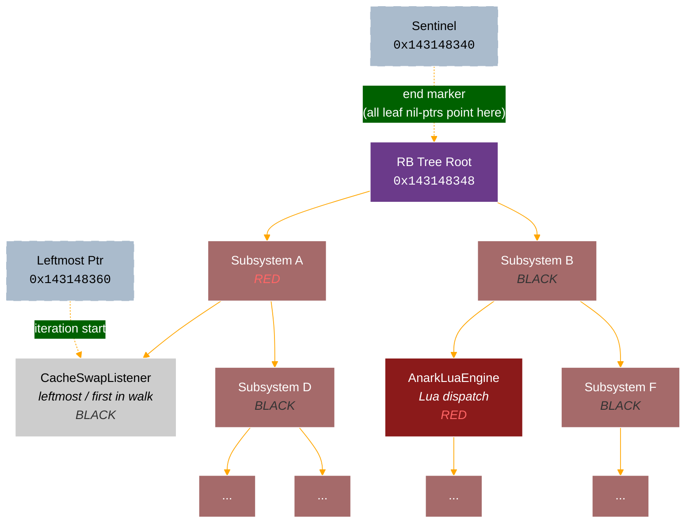
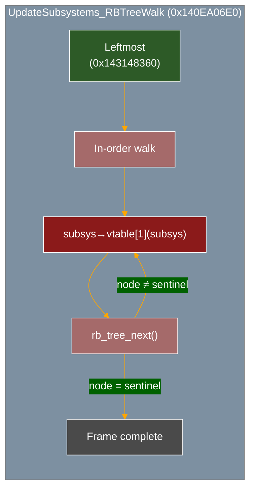
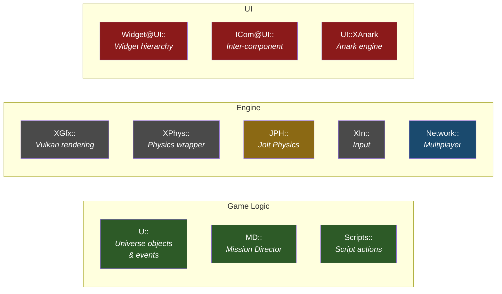
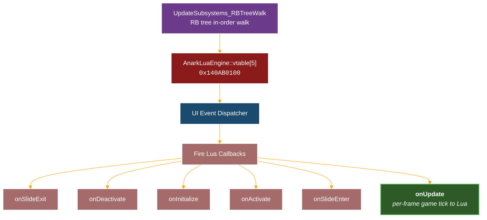
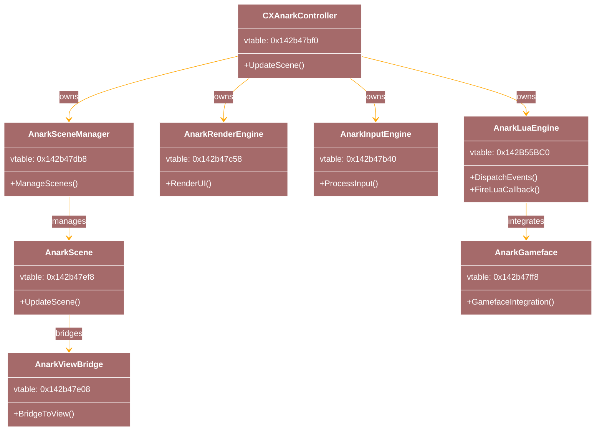
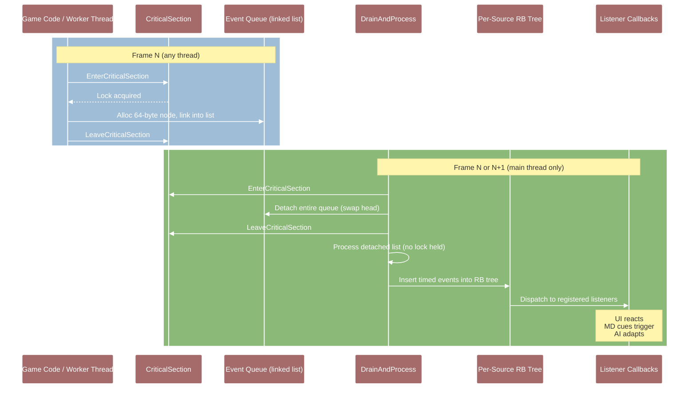
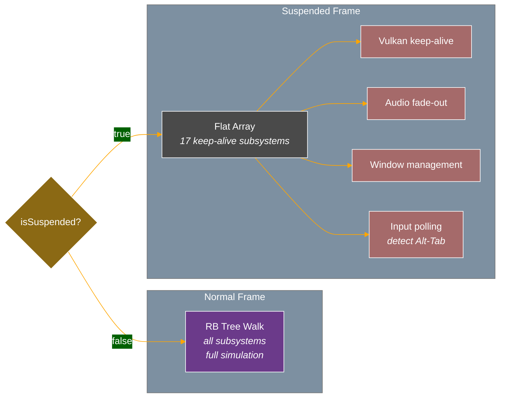
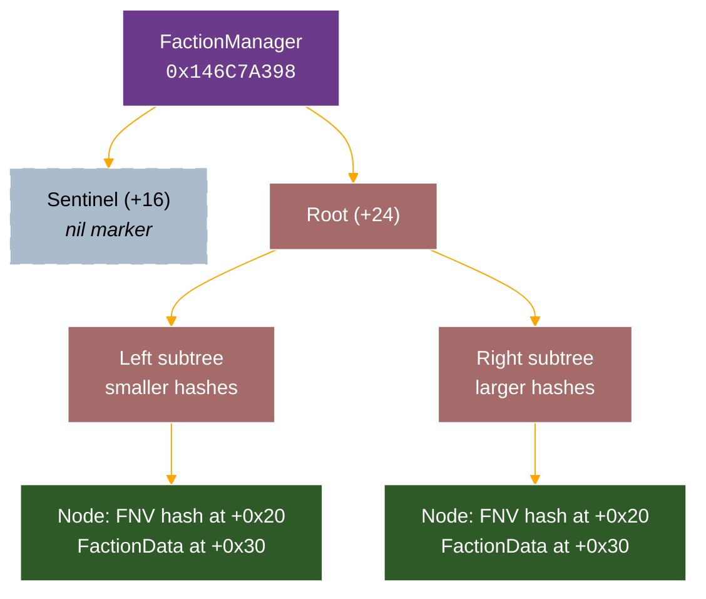

# X4 Subsystem Architecture — Reverse Engineering Notes

> **Binary:** X4.exe v9.00 · **Date:** 2026-03
>
> All addresses are absolute (imagebase `0x140000000`). Subtract imagebase to get RVA.

---

## 1. Summary

X4's simulation is driven by an **Egosoft custom red-black tree of subsystem objects**. Each frame, `UpdateSubsystems_RBTreeWalk` (`0x140EA06E0`) walks this tree in-order and calls each subsystem's virtual update method. This single mechanism powers all game logic — MD cues, AI, UI, events, trade, combat — everything.

> **Terminology note:** Previous versions of this document called the data structure a "BST" (Binary Search Tree). Binary re-analysis (2026-03-28) confirmed it is a **self-balancing red-black tree** — Probably Egosoft's own implementation, NOT `std::map`/`std::set`. The same RB tree implementation is used pervasively throughout the binary (690+ insertion sites share a universal `RBTree_InsertFixup` at `0x1400B2EA0`).

---

## 2. Red-Black Tree Structure



> The tree structure above is illustrative — actual node ordering depends on registration order and key comparisons. The walk is in-order (left → node → right), starting from the **leftmost** node (minimum key).

### Globals

| Address | Purpose |
|---------|---------|
| `0x143148340` | RB tree sentinel node (nil marker — all leaf pointers point here) |
| `0x143148348` | RB tree root pointer |
| `0x143148360` | RB tree leftmost pointer (iteration start — minimum key node) |
| `0x143148368` | RB tree node count |

### Egosoft RB Tree Node Layout

All red-black trees in the binary share this common node layout. This is **NOT** MSVC `std::map` — the field order differs (Parent/Left/Right vs MSVC's Left/Parent/Right), color is a DWORD (not a byte), and there is no `_Isnil` flag (sentinel detected by pointer comparison instead).

```c
struct EgoRBTreeNode {
    EgoRBTreeNode* parent;    // +0x00
    EgoRBTreeNode* left;      // +0x08
    EgoRBTreeNode* right;     // +0x10
    uint32_t       color;     // +0x18 (0 = RED, 1 = BLACK)
    uint32_t       _pad;      // +0x1C
    // --- key starts at +0x20 (type varies: QWORD hash, pointer, etc.) ---
    // --- value follows key (alignment-dependent) ---
};
```

| Offset | Field | MSVC `std::map` equivalent | Difference |
|--------|-------|---------------------------|------------|
| +0x00 | **Parent** | `_Left` (+0x00) | **Swapped** — MSVC puts Left first |
| +0x08 | **Left** | `_Parent` (+0x08) | **Swapped** — MSVC puts Parent second |
| +0x10 | Right | `_Right` (+0x10) | Same position |
| +0x18 | Color (DWORD: 0/1) | `_Color` (char) + `_Isnil` (char) | Wider type, no `_Isnil` flag |

> **Coexistence note:** Both Egosoft's custom RB trees and MSVC `std::map`/`std::set` RB trees exist in the binary. They have **different node layouts** (Parent/Left/Right vs Left/Parent/Right) and different sentinel patterns. The `*(WORD*)(node+24) = 0x0101` pattern seen at 100+ sites belongs to **MSVC STL** sentinel initialization (`{_Color=BLACK, _Isnil=TRUE}`), NOT to Egosoft's trees. Egosoft's sentinel is detected by pointer comparison only — its color field is never read. Verified 2026-03-28 via decompilation of `RBTree_InsertFixup`, `RBTree_DeleteFixup`, `RBTree_RotateLeft`, `RBTree_RotateRight`.

For subsystem nodes, the key at +0x20 is a pointer to the subsystem object. Update dispatch reads this pointer and calls through the subsystem's vtable:

```c
subsys = node->key;           // node + 0x20 = subsystem object pointer
subsys->vtable[1](subsys);    // offset +8 in vtable
```

### Universal Rebalance Functions

These two functions are the smoking gun proving Egosoft uses red-black trees — they contain textbook Cormen/CLRS rebalancing logic (uncle color checks, recoloring, left/right rotations):

| Function | Address | Callers | Purpose |
|----------|---------|---------|---------|
| `RBTree_InsertFixup` | `0x1400B2EA0` | **690** | Post-insertion rebalance (fix red-red violations) |
| `RBTree_DeleteFixup` | `0x1400B28B0` | **241** | Post-deletion rebalance (fix black-height violations) |

### Known Subsystem — CacheSwapListener

The first subsystem registered into the tree is `CacheSwapListener` (identified via RTTI at `0x140EA0540`). This is a low-level cache management subsystem that runs before any game logic. Its destructor (`0x140EA0600`) performs RB tree node removal with rebalancing.

---

## 3. Update Dispatch (`UpdateSubsystems_RBTreeWalk`)

### Function: UpdateSubsystems_RBTreeWalk

**Address:** `0x140EA06E0`

This is the entire game simulation in a single function call:

```c
void UpdateSubsystems_RBTreeWalk() {
    // Thread safety check
    if (*(DWORD*)(TLS + 0x314)) {         // main thread flag (decimal offset 788)
        // Normal path: walk RB tree in-order, call each subsystem
        EgoRBTreeNode* node = g_SubsysTree_Leftmost;  // 0x143148360 — minimum key
        while (node != &g_SubsysTree_Sentinel) {       // 0x143148340
            void* subsys = node->key;                   // node + 0x20
            subsys->vtable[1](subsys);                  // subsystem update dispatch
            node = rb_tree_next(node);                  // in-order successor
        }
    } else {
        // Cross-thread path (should never happen in practice)
        EnterCriticalSection(&cs);
        signal_main_thread();
        WaitForSingleObject(event, INFINITE);
        LeaveCriticalSection(&cs);
    }
}
```

> **TLS offset note:** The main-thread check reads `TLS + 0x314` (decimal 788). Previous versions of this doc wrote `TLS + 0x788` which is incorrect — `0x788` is 1928 decimal, not 788.



### Normal Frame vs Suspended Frame

| Mode | Update Mechanism | What Runs |
|------|-----------------|-----------|
| **Normal** (`!isSuspended`) | Full RB tree walk via `UpdateSubsystems_RBTreeWalk` | All subsystems — game logic, AI, MD, UI, events |
| **Suspended** (`isSuspended`) | Flat array of 17 subsystems at `qword_146C6B9A0 + 136` | Keep-alive only — minimal rendering, no simulation |

The suspended-mode array is a separate data structure from the RB tree. It contains only the subsystems needed to keep the Vulkan renderer alive when the game is minimized or lost focus.

### Key Subsystem Tree Functions

| Function | Address | Purpose |
|----------|---------|---------|
| `UpdateSubsystems_RBTreeWalk` | `0x140EA06E0` | Per-frame in-order walk + vtable dispatch |
| `SubsysRBTree_Insert` | `0x140EE06A0` | Insert subsystem into tree (calls `RBTree_InsertFixup`) |
| `SubsysRBTree_AllocNode` | `0x140EE0C10` | Allocate 48-byte tree node from pool |
| `CacheSwapListener_ctor` | `0x140EA0540` | First subsystem registered |
| `CacheSwapListener_dtor_RBTreeRemove` | `0x140EA0600` | Remove + rebalance on destruction |

---

## 4. RTTI Namespace Map

RTTI type information strings recovered from the binary reveal the engine's namespace organization:



### Game Logic Namespaces

| Namespace | Purpose | Examples |
|-----------|---------|----------|
| `U::` | **Game universe objects and events** | `U::MoneyUpdatedEvent`, `U::UnitDestroyedEvent`, `U::UniverseGeneratedEvent`, `U::UpdateTradeOffersEvent`, `U::UpdateBuildEvent`, `U::UpdateZoneEvent` |
| `MD::` | **Mission Director** | MD cue processing, condition evaluation, script actions |
| `Scripts::` | **Script actions** | Implementations of MD/AI script commands |

### Engine Namespaces

| Namespace | Purpose | Examples |
|-----------|---------|----------|
| `XGfx::` | **Graphics / rendering** | Vulkan pipeline, shader management |
| `XPhys::` | **Physics** | Physics simulation wrapper | 
| `JPH::` | **Jolt Physics** | `JobSystem@JPH@@` — physics thread pool |
| `XIn::` | **Input** | Keyboard, mouse, gamepad handling |
| `Network::` | **Networking** | Multiplayer, Venture online |

### UI Namespaces

| Namespace | Purpose | Key Classes |
|-----------|---------|-------------|
| `Widget@UI::` | **UI widgets** | Widget hierarchy, layout |
| `ICom@UI::` | **UI communication** | Inter-component messaging |
| `UI::XAnark` | **Anark UI engine** | See class hierarchy below |

---

## 4b. Universe Hierarchy — Zones and Entity Containment

X4's spatial hierarchy for the game universe:

```
Galaxy (xu_ep2_universe_macro)
  └── Cluster (cluster_01, cluster_02, ...)
        └── Sector (cluster_01_sector001_macro, ...)
              └── Zone (zone001_cluster_01_sector001_macro, ...)
                    └── Entity (station, ship, asteroid, ...)
```

### Static vs Dynamic Zones

**Static zones** are pre-defined in the base game universe data. Each sector contains one or more named zones following the pattern `zone{NNN}_cluster_{NN}_sector{NNN}_macro`. These are referenced in `libraries/god.xml` as spawn locations for factions.

**Tempzones** are created dynamically by the engine when an entity is spawned into a sector at a position with no existing zone. All entity creation APIs (`create_station`, `create_ship`, `create_object` in MD; `SpawnStationAtPos`, `SpawnObjectAtPos2` in C++) auto-create tempzones when given a sector + position.

From `common.xsd` (MD action schema), the `sector=` attribute documentation:
> "Sector to create the station in using position in the sector space. **Creates a tempzone if a zone does not exist at the coordinates**"

This pattern is consistent across all entity creation actions.

### Zone API Functions

| Function | Signature | Use |
|----------|-----------|-----|
| `GetZoneAt` | `(UniverseID sectorid, UIPosRot* uioffset) → UniverseID` | Find zone at a position (0 if none) |
| `GetPlayerZoneID` | `() → UniverseID` | Current player zone |
| `IsZone` | `(UniverseID componentid) → bool` | Type check |
| `GetContextByClass` | `(UniverseID componentid, const char* classname, bool includeself) → UniverseID` | Navigate hierarchy: `GetContextByClass(entity, "zone", false)` |

### DLC Cluster Ranges

All DLCs add clusters into the same `xu_ep2_universe_macro` galaxy. Cluster numbering by DLC:

| DLC | Cluster Range | Notes |
|-----|--------------|-------|
| Base game | 01–49 | Core sectors (Argon, Paranid, Holy Order, etc.) |
| Cradle of Humanity (Terran) | 100–115 | Terran, Segaris, Sol system |
| Split Vendetta | 400–414 | Zyarth, Free Families space |
| Tides of Avarice (Pirate) | 500–502 | Pirate, Vigor space |
| Kingdom End (Boron) | 600–609 | Boron space |
| Timelines | 700–703 | Timeline-specific sectors |

If a host and client have different DLCs installed, sectors from missing DLCs will not exist on the client side. The sector macro names exist but the macro data (from DLC files) is required to instantiate them. `AddCluster`/`AddSector` APIs exist for runtime creation but require the DLC data files to be installed.

### Zone Creation Rules

- No explicit `CreateZone` or `SpawnZone` API exists (checked all 2,051 exported functions)
- Zone creation is exclusively implicit — triggered by entity spawn into a zoneless sector position
- The `zone=` attribute on spawn actions "takes precedence from sector" — use it to place entities in a specific existing zone
- Component class IDs: sector=87, zone=108, station=97, ship=116

---

## 5. AnarkLuaEngine — The Lua Bridge Subsystem

The Anark UI engine is the subsystem responsible for all Lua execution. It sits within the RB tree and is called each frame as part of the subsystem walk.

### Vtable: `0x142B55BC0`

> **Address correction (2026-03-28):** Previous doc claimed `0x142B47F88` — that address is actually the string `"online_save"` in the binary. The real vtable was found via RTTI: `.?AVAnarkLuaEngine@XAnark@UI@@` at `0x1431C5E00` → CompleteObjectLocator → vtable.

| Index | Address | Purpose |
|-------|---------|---------|
| `[0]` | `0x140AAF730` | Destructor or base method |
| `[5]` | `0x140AB0100` | **Event dispatcher** — fires onUpdate etc. to Lua |

### Dispatch Chain



### How AnarkLuaEngine Is Called

The engine is NOT called directly from code — it's called **only via vtable dispatch** from the RB tree walk. vtable[5] (`0x140AB0100`) has zero direct `call` instruction cross-references — confirming it's purely a virtual dispatch target.

### Lua Global Function Registration Table

**Address:** `sub_140236710` — 15,705 bytes (0x3D59), the largest function in the Lua registration path.

This function registers ALL bare Lua globals (`GetPlayerRoom`, `SetOrderParam`, etc.) by mapping them to native C handler functions. The repeating pattern:

```asm
lea rdx, sub_XXXXXXXX       ; native C handler function pointer
xor r8d, r8d                ; upvalue count = 0
call lua_pushcclosure        ; push C closure onto Lua stack
mov rcx, cs:qword_1438731E0 ; Lua state global
lea r8, aFunctionName       ; "FunctionName" string literal
mov edx, 0FFFFD8EEh         ; stack index (relative)
call lua_setfield            ; register as global in Lua state
```

**Lua state global:** `qword_1438731E0` — pointer to the Lua VM state.

**How to find any Lua global's native handler:**
1. Search for the function name string (e.g., `find string "GetPlayerRoom"`)
2. Get the string address
3. Find xrefs to that string — should be in `sub_140236710`
4. Look 2 instructions before the `lua_setfield` call for `lea rdx, sub_XXXXXXXX` — that's the native handler

**Known mappings discovered via this table:**

| Lua Name | Native Handler | Notes |
|----------|---------------|-------|
| `GetPlayerRoom` | `sub_14024D880` | Class 83 parent chain walk |
| `SetOrderParam` | `sub_1402885C0` | 298 insns, Lua-only (no C++ callers) |
| `RemoveOrderListParam` | `sub_140288A40` | Order parameter removal |
| `TransferPlayerMoneyTo` | `sub_14024D950` | Money transfer handler |

### Ownership



---

## 6. Event System — Typed C++ Events

Game state changes are communicated via typed event objects posted to a global event queue.

> **Verified 2026-03-28.** The event queue is protected by a CriticalSection and supports
> multi-threaded posting.

### Event Queue Structure

The global event queue is a **doubly-linked list** of 64-byte nodes, protected by a
Win32 CriticalSection. It is NOT a simple array.

| Global | Address | Purpose |
|--------|---------|---------|
| `g_EventQueue_CriticalSection` | `0x1439137E8` | Win32 CRITICAL_SECTION protecting queue |
| `g_EventQueue_Head` | `0x14391D488` | Head of doubly-linked list |
| `g_EventQueue_HasPending` | `0x14391D498` | Atomic flag: 1=pending, 0=empty (fast-path) |

Each 64-byte queue node carries: operation type (subscribe/unsubscribe/timed_event/cancel),
source component ID, event object pointer, event type ID, and timestamp.

### Event Posting (CriticalSection-Protected)

All 50 posting sites follow the same pattern:

```c
// EventQueue_PostTimedEvent_Locked @ 0x140956E80 (50+ callers)
void post_timed_event(EventSource* source, Event* event, double time) {
    // ... validate EventSource state with InterlockedCompareExchange ...
    EnterCriticalSection(&g_EventQueue_CriticalSection);
    InterlockedExchange(&g_EventQueue_HasPending, 1);
    Node* node = EventQueue_AllocNode(&g_EventQueue_Head);  // 0x140954B90
    node->type = TIMED_EVENT;  // type 3
    node->source_id = source->id;
    node->event = event;
    node->timestamp = time;
    LeaveCriticalSection(&g_EventQueue_CriticalSection);
}
```

**Multi-threaded posting is confirmed:** Collision/physics worker threads
(`CollisionWorker_PostEvents_Locked` at `0x140E5C5E0`) post events from a thread pool,
dispatched by `SceneGraph_ProcessCollisions_ThreadPooled` at `0x140E5BE40`.

### Key Posting Functions

| Function | Address | Callers | Purpose |
|----------|---------|---------|---------|
| `EventQueue_PostTimedEvent_Locked` | `0x140956E80` | 50+ | Primary single-event poster |
| `EventQueue_PostBatch_Locked` | `0x140957280` | 3 | Batch-post: splices local list into global queue |
| `EventQueue_PostCancelEvent_Locked` | `0x1409571F0` | 9 | Posts cancel/remove-listener event |
| `EventQueue_DrainAndProcess_Locked` | `0x140957340` | internal | Drain under lock, process lock-free |
| `EventSource_DispatchEvent` | `0x140956B50` | 595 | Dispatch entry: calls drain, then RB-tree insert |
| `EventSource_DispatchToListeners` | `0x140958BD0` | internal | Delivers event to registered callbacks |
| `EventBuilder_SwitchDispatch` | `0x140959210` | 8 | Factory: constructs typed events and dispatches |

### Known Event Types (from RTTI)

| Event Class | Size | Description |
|-------------|------|-------------|
| `U::MoneyUpdatedEvent` | 48 bytes | Player money changed |
| `U::UpdateTradeOffersEvent` | -- | Trade offers recalculated |
| `U::UpdateBuildEvent` | -- | Construction state changed |
| `U::UpdateZoneEvent` | -- | Zone ownership/state changed |
| `U::UnitDestroyedEvent` | -- | Entity destroyed |
| `U::UniverseGeneratedEvent` | -- | Universe generation complete |

### Event Lifecycle



**Threading rule:** Posting is multi-producer (any thread). Draining and dispatch are
main-thread-only. The drain-and-process pattern minimizes lock hold time by detaching
the queue atomically and processing the detached list without holding the lock.

### Three Separate Event Systems

X4 has three distinct event systems that do **not** cross-talk automatically:

| System | Consumers | Event Names | Transport |
|--------|-----------|-------------|-----------|
| **C++ Typed Events** | Subsystem update callbacks | RTTI class names (`U::MoneyUpdatedEvent`, `U::UnitDestroyedEvent`) | Global queue → RB-tree per-source dispatch |
| **MD Cue Events** | MD XML cue listeners (`<event_object_destroyed>`) | Integer type IDs (e.g., 0x4A7 for `event_object_destroyed`) | Property change dispatcher jump table (`PropertyChangeDispatcher_JumpTable` at `0x14095AA50`, 15KB, 500+ cases) → `EventQueue_InsertOrDispatch` (`0x140958390`) → priority queue by game time → `EventQueue_ImmediateDispatch` (`0x14095A410`) iterates cue listener array |
| **Lua UI Events** | `RegisterEvent("eventName", callback)` in Lua addons | String names (`"gameSaved"`, `"playerUndock"`) | Engine queues into buffer (CritSec-protected at object+912) → `UIEventSystem_ProcessGenericEventQueue` (`0x140AF3000`) drains per UI frame → `"genericEvent"` contract → `widgetSystem.onEvent` → `CallEventScripts` |

**Key architectural fact:** MD cue event names (e.g., `event_object_destroyed`) are **never** dispatched
through the Lua UI event path. The only bridge is the MD action `<raise_lua_event>`, which is a
one-way explicit push from MD to Lua (used sparingly for UI notifications like `info_updatePeople`).
Lua's `RegisterEvent` cannot subscribe to MD game events.

To intercept MD-level game events from C++, the options are:
1. **MinHook detour** on individual `*_BuildEvent` functions (per-event, version-sensitive)
2. **MD script bridge** — MD cue listener calls `<raise_lua_event>` which can then be captured via X4Native's `bridge_lua_event()` mechanism

---

## 7. Suspended-Mode Subsystems

When `isSuspended == true`, the RB tree walk is skipped. Instead, a flat array of 17 subsystems is iterated:



**Location:** `qword_146C6B9A0 + 136`

These subsystems keep the engine alive without running game logic:
- Vulkan keep-alive (prevent device lost)
- Audio fade-out
- Window management
- Input polling (to detect Alt-Tab back)

The exact identity of all 17 subsystems has not been determined — runtime analysis would be needed to enumerate them.

---

## 8. Component System

> **Full documentation:** [COMPONENT_SYSTEM.md](COMPONENT_SYSTEM.md) — base struct layout, registry, class hierarchy, vtable slots, child container, player slot, galaxy enumeration.

Entity lookup uses a global component registry at RVA `0x06C866C0`. O(1) page-based indexing (no hash map). See COMPONENT_SYSTEM.md §5 for details.

---

## 9. Function Reference

| Name | Address | Purpose |
|------|---------|---------|
| **Subsystem Tree** | | |
| UpdateSubsystems_RBTreeWalk | `0x140EA06E0` | RB tree in-order walk — entire game simulation |
| SubsysRBTree_Insert | `0x140EE06A0` | Insert subsystem into RB tree |
| SubsysRBTree_AllocNode | `0x140EE0C10` | 48-byte node pool allocator |
| CacheSwapListener_ctor | `0x140EA0540` | First subsystem registered |
| CacheSwapListener_dtor | `0x140EA0600` | Remove + RB tree rebalance |
| RBTree_InsertFixup | `0x1400B2EA0` | Universal RB insert rebalance (690 callers) |
| RBTree_DeleteFixup | `0x1400B28B0` | Universal RB delete rebalance (241 callers) |
| g_SubsysTree_Sentinel | `0x143148340` | RB tree sentinel node |
| g_SubsysTree_Root | `0x143148348` | RB tree root pointer |
| g_SubsysTree_Leftmost | `0x143148360` | RB tree leftmost (iteration start) |
| g_SubsysTree_Count | `0x143148368` | RB tree node count |
| **Lua Engine** | | |
| AnarkLuaEngine vtable | `0x142B55BC0` | RTTI-confirmed vtable |
| AnarkLuaEngine dispatch | `0x140AB0100` | Vtable[5] — Lua event dispatch |
| **Events & Init** | | |
| Event bus post | `0x140953650` | Post event (no lock) |
| sub_1409A4830 | `0x1409A4830` | NewGame world init (called by U::NewGameAction) |
| GameStartDB::Import | `0x1409D39B0` | Parses gamestart XML, reads `nosave` tag from `tags` attribute |
| sub_14088D4B0 | `0x14088D4B0` | Galaxy creation from gamestart XML |
| Suspended array | `0x146C6B9A0 + 136` | 17 keep-alive subsystems |
| Component system | `0x146C6B940` | Entity lookup table |
| IsNewGame sentinel | `0x143C97650` | Global: 0 = new game, non-zero = save ID |
| U::NewGameAction RTTI | `0x1431c50b8` | RTTI for the new-game action object |
| nosave string | `0x142b37f68` | Literal "nosave" parsed by GameStartDB::Import |
| Entity_AttachToParent | `0x140397C50` | Core hierarchy reparent (26 callers, NOT exported) |
| **Class System** | | |
| ClassNameStringToID | `0x1402D51D0` | Maps class name string to numeric ID; sorted array + binary search at `0x1438D95F0` |
| RBTree_FlattenInOrder | `0x1402D7910` | RB tree → flat sorted array |

---

## 10. World Initialization — NewGame vs. Load

X4 has exactly two paths that initialize a live game world. Both end at the same point (`U::UniverseGeneratedEvent` → `on_game_loaded`) and are indistinguishable to code running after that event fires. Note: `on_game_loaded` fires when the world is structurally ready (entity IDs valid, game functions safe), but gamestart MD cues (e.g., `set_known`, faction setup) have NOT yet completed. The later `on_game_started` event (triggered by `event_game_started`) fires after all gamestart MD cues have run.

### Global: `qword_143C97650` — IsNewGame Sentinel

**Address:** `0x143C97650`

This global is the single bit the engine uses to distinguish new games from loaded saves:

```c
bool IsNewGame() {
    return qword_143C97650 == 0;
}
```

- Set to **`0`** by `NewGame()` path (new session)
- Set to **non-zero** (the save ID) by `GameClass::Load()` path

`NotifyUniverseGenerated` checks this to decide whether to run new-game post-init logic vs. load-game restore logic.

### Path A — NewGame (sub_1409A4830)

Called via `NewGame(modulename, numparams, params)` (exported from X4.exe):

```
NewGame("x4online_client", 0, nullptr)
  → U::NewGameAction posted to engine action queue
  → Next frame: sub_1409A4830 runs
    → GUID allocated for session
    → qword_143C97650 = 0          // IsNewGame() = true
    → Physics subsystem reset
    → Galaxy created from gamestart XML (sub_14088D4B0)
    → MD starts, fires event_universe_generated
  → U::UniverseGeneratedEvent posted
  → AnarkLuaEngine processes event
  → X4Native fires on_game_loaded
  → Gamestart MD cues run (set_known, faction setup, etc.)
  → event_game_started fires
  → X4Native fires on_game_started
```

**`U::NewGameAction` RTTI:** `0x1431c50b8`

### Path B — GameClass::Load

Called via `Load(filename)` to deserialize an existing save (`.xml.gz` or `.xml`):

```
GameClass::Load("save01.xml.gz")
  → UniverseClass::Import() — reads XML tree
  → qword_143C97650 = save_id    // IsNewGame() = false
  → Player, entities, economy, factions all restored from file
  → U::UniverseGeneratedEvent posted
  → on_game_loaded fires
  → Gamestart MD cues complete
  → on_game_started fires
```

### Gamestart XML — nosave Tag

A gamestart definition in `libraries/gamestarts/*.xml` drives Path A. Autosave is suppressed by including `nosave` as a space-separated value in the `tags` attribute — **not** as a standalone `nosave="1"` attribute:

```xml
<gamestart id="my_gamestart" tags="nosave" ...>
```

This is confirmed in both the binary and the game files:
- **String address:** `0x142b37f68` — the literal `"nosave"` string, parsed by `GameStartDB::Import`
- **Parsed by:** `GameStartDB::Import` at `0x1409D39B0`
- **Game file evidence:** Every tutorial and workshop gamestart in `libraries/gamestarts.xml` uses `tags="tutorial nosave"` or `tags="stationdesigner nosave"` — no standalone `nosave` attribute exists anywhere in the schema

Extensions place custom gamestarts in `extension/libraries/gamestarts/` — X4 auto-scans all active extensions' `libraries/` directories. Additional recognized tag values include `tutorial`, `customeditor`, `stationdesigner`.

### SetCustomGameStartPlayerPropertySectorAndOffset

Before calling `NewGame`, the starting sector and position can be pre-configured:

```cpp
SetCustomGameStartPlayerPropertySectorAndOffset(
    gamestart_id,    // e.g. "x4online_client"
    property_name,   // e.g. "player"
    entry_id,        // e.g. "entry0"
    sector_macro,    // MACRO NAME string — NOT a UniverseID
                     // e.g. "cluster_01_sector001_macro" (Argon Prime area)
                     //      "cluster_14_sector001_macro" (Second Contact / Holy Vision)
                     // Real names confirmed in gamestarts.xml: all lowercase, no universe prefix
    pos              // UIPosRot
);
```

Note: takes the sector **macro name** string, not a `UniverseID`. Sector macro naming convention: `cluster_NN_sectorNNN_macro` (confirmed from `libraries/gamestarts.xml` v9.00). Use `GetComponentName(sector_universe_id)` on the host to retrieve the macro name for an arbitrary sector.

### 10.1 X4Component Base Struct & Galaxy Enumeration

> **Full documentation moved to:** [COMPONENT_SYSTEM.md](COMPONENT_SYSTEM.md)
> - §2: X4Component base struct (11 confirmed fields + vtable slots)
> - §3: Child container internals (group-indexed partition array — NOT a hash map)
> - §5: Component registry (UniverseID decomposition)
> - §6-7: Entity hierarchy, class ID table (120 entries)
> - §8: Player slot layout + key functions
> - §9: Galaxy enumeration (FFI-safe + direct child walk)
> - §10: Proxy NPC spawning
>
> SDK type: `X4Component` in `x4_manual_types.h`. SDK helpers: `x4n_entity.h`, `x4n_galaxy.h`.

(Legacy content below retained for reference but canonical source is COMPONENT_SYSTEM.md)

> Reverse-engineered from 15+ decompiled functions. All offsets verified v9.00 build 603098.
> C struct definition: `x4_manual_types.h` → `typedef struct X4Component`.

All game entities (sectors, clusters, stations, ships, NPCs, zones) share this base layout. Subclass-specific fields (visibility bytes, hull/shield, faction) begin at higher offsets.

```
Offset  Size  Type              Field              Source Functions
------  ----  ----              -----              ----------------
+0x00   8     void*             vtable             All (~800+ slots, see vtable section)
+0x08   8     uint64_t          id                 GetClusters_Lua, GetParentComponent,
                                (UniverseID)       RemoveComponent, ChildComponent_Enumerate
                                                   NOTE: same field as raw generation seed
+0x10   32    ?                 (unresolved)       No function observed accessing +0x10..+0x2F
+0x30   8     void*             definition         GetComponentName (vtable[3] = GetName)
                                                   GetComponentData "macro" (vtable[4] = GetMacroName)
                                                   Embedded sub-object — this ptr = component+0x30
+0x38   8     void*             ctrl_vtable        AddSector: shared_ptr control block vtable
+0x40   4     int32_t (atomic)  ref_count          AddSector: lock xadd [rdi+40h]
+0x44   4     int32_t (atomic)  weak_count         AddSector: lock cmpxchg [rdi+44h] (states 1/2/3)
+0x48   32    ?                 (unresolved)       +0x48..+0x67
+0x68   4     int32_t           class_id           ChildComponent_Enumerate: 1 << *(DWORD*)(child+0x68)
                                                   Values: X4_CLASS_CLUSTER=15, X4_CLASS_SECTOR=87, etc.
                                                   NOT a validity flag (was previously misidentified)
+0x6C   4     ?                 (padding)
+0x70   8     X4Component*      parent             GetParentComponent, GetContextByClass,
                                                   Component_ComputeWorldTransform (parent chain walk)
+0x78   48    ?                 (unresolved)       +0x78..+0xA7
+0xA8   8     void*             children_ptr       GetClusters_Lua, GetSectors_Lua, GetStationModules
                                (ChildContainer*)                     POINTER to group-indexed partition array (32-byte
                                                                     buckets, see §10.1.3). NOT a hash map.
+0xD1   1     uint8_t           exists             GetSectors_Lua: cmp byte ptr [rax+0D1h], 0
                                                   0=destroyed, nonzero=alive
+0x3C0  8     int64_t           combined_seed      raw_seed + session_seed (= MD $Station.seed)
```

#### 10.1.1 Definition Interface (+0x30)

The field at +0x30 is an **embedded sub-object** (not a pointer to an external object). Its vtable pointer lives at +0x30, and `this` for virtual calls is `component + 0x30`.

| Vtable Slot | Byte Offset | Function | Returns |
|-------------|-------------|----------|---------|
| 3 | +0x18 | `GetName()` | `std::string*` (display name) |
| 4 | +0x20 | `GetMacroName()` | `std::string*` (macro identifier) |

```asm
; GetComponentName (0x140151B60):
mov     rax, [rbx+30h]       ; load definition vtable
lea     rcx, [rbx+30h]       ; this = component+0x30
call    qword ptr [rax+18h]  ; vtable[3] = GetName()
```

The returned `std::string*` follows MSVC x64 SSO layout: if `capacity` (at str+24) < 16, the string data is inline at str+0; otherwise, str+0 is a heap pointer.

SDK helper: `x4n::entity::get_component_macro(component)`.

#### 10.1.2 Main Vtable Slots

The main vtable at +0x00 has ~800+ entries. Key slots (byte offsets into vtable):

| Slot | Byte Offset | Function | Confirmed By |
|------|-------------|----------|-------------|
| 17 | +136 | `GetClassType() -> uint` | Multiple functions |
| 565 | +4528 | `GetClassID() -> uint` (120=sentinel) | `GetComponentClass` |
| 566 | +4536 | `IsClassID(classid) -> bool` | `GetStationModules`, `ChildComponent_Enumerate` |
| 567 | +4544 | `IsOrDerivedFromClassID(classid) -> bool` | `GetContextByClass`, `IsComponentClass` |
| 594 | +4760 | `GetIDCode() -> std::string*` | `GetObjectIDCode` |
| 642 | +5144 | `SetWorldTransform(...)` | `Component_ComputeWorldTransform` |
| 647 | +5184 | `SetPosition(transform*)` | `SetObjectSectorPos` |
| 675 | +5408 | `Destroy(reason, flags)` | `RemoveComponent` |
| 700 | +5608 | `GetFactionID() -> int` | `GetAllFactionStations` |

#### 10.1.3 Child Container (+0xA8)

> **Corrected 2026-03-28.** Previously described as "bucketed hash map" — this was wrong. No hash function exists. The structure is a group-indexed partition array. Canonical source: [COMPONENT_SYSTEM.md](COMPONENT_SYSTEM.md) §3.

The child container is a **group-indexed partition array** — a fixed-size array of vectors, one per entity group. `component+0xA8` stores a POINTER to the container object.

```
Container object (pointed to by component+0xA8):
  +0x00: ???                 (not accessed by enumerator)
  +0x08: bucket_array_begin  (pointer to array of 32-byte buckets)
  +0x10: bucket_array_end
  +0x20: total_child_count   (DWORD)

Each bucket (32 bytes):
  +0x00: child_ptr_begin     (pointer to X4Component*[])
  +0x08: child_ptr_end
  +0x10: capacity_end        (std::vector-style)
  +0x18: count               (DWORD)
```

Bucket lookup is direct array indexing: `base + (group_index - 1) * 32`. No hash function. Multiple class IDs share the same group bucket (e.g., clusters and sectors both live in group 2). Callers apply vtable post-filters to select exact classes.

**Do NOT walk manually.** Group assignment is opaque. Use `ChildComponent_Enumerate` (`0x1402F9B80`, 61 callers) or the safe FFI approach.

| Function | Address | Purpose |
|----------|---------|---------|
| `ChildComponent_Enumerate` | `0x1402F9B80` | Iterate children by group index with optional filters |
| `ChildComponent_Iterator_Init` | `0x1402FF740` | Initialize bucket iterator |
| `ChildComponent_Iterator_Next` | `0x1402F9AA0` | Advance to next matching child |
| `ChildComponent_GetBucketCount` | `0x1402E5120` | Read child count (total or per-bucket) |

#### 10.1.4 ComponentID Decomposition

`ComponentRegistry_Find` (`0x1400CE890`) decomposes a UniverseID:
- Bits 0-24: slot index (1-based)
- Bits 25-40: generation counter

The registry has up to 32 pages, ~1M entries per page, 3 entries packed per 32-byte block. The third parameter to `ComponentRegistry_Find` is a class mask (4 = general component lookup).

### 10.2 Galaxy Tree Enumeration

`GetClusters` (`0x140264060`) and `GetSectors` (`0x1402642C0`) are **Lua globals only** — NOT available as C FFI. The X4Native SDK provides `x4n::galaxy::rebuild_cache()` which enumerates sectors via `GetSectorsByOwner` (C FFI) + `x4n::entity::get_component_macro()` (offset-based).

For direct child tree walking (bypasses known-to filtering):
1. Galaxy: `GetPlayerGalaxyID()` (C FFI) → `find_component()` → object pointer
2. Clusters: walk `galaxy + 0xA8` child container, filter class 15
3. Sectors: walk `cluster + 0xA8` child container, filter class 87
4. ID: `component + 0x08`, macro: `component + 0x30` vtable[4]

**`g_GameUniverse`** at RVA `0x03CAEE68` (build 603098). Safer entry: `GetPlayerGalaxyID()`.

---

## 12. Faction System

### 12.1 Overview

Factions are static data loaded from `libraries/factions.xml` at game start. There is no
runtime `CreateFaction` API — confirmed absent from all 2,359 PE exports, Lua FFI, and
the binary string table.

### 12.2 Runtime Layout

**Global**: `0x146C7A398` — pointer to `FactionManager` object (20+ xrefs confirmed).

> **Address correction (2026-03-28):** Previous doc claimed `0x146C6BB88`. Verified via xrefs from `IsOwnedByFaction`, `CreateBlacklist`, `GenerateFactionRelationText`, etc.

**Faction lookup** — Egosoft custom red-black tree (NOT `std::map`):
- `FactionManager + 16` — RB tree sentinel node (begin/end marker)
- `FactionManager + 24` — RB tree root node pointer (`nullptr` if empty)
- Hash key: **FNV-1** 32-bit hash of faction ID string (seed `0x811C9DC5` / `2166136261`, multiplier `0x01000193` / `16777619`)
- Tree walk: `if (node->key < hash) → right child (node+0x10)`, else `left (node+0x08)`
- Faction data: at `tree_node + 0x30` (FactionData is inline in the tree node)

> **FNV-1, not FNV-1a (confirmed 2026-03-28).** Verified at 5 independent call sites via raw disassembly: `imul r9, 1000193h` (multiply) THEN `xor r9, rcx` (XOR). FNV-1a would XOR first, then multiply. Same constants, different algorithm, different output. Non-standard variant — 32-bit offset basis (`0x811C9DC5`) in a 64-bit register. Our SDK's `x4n::math::fnv1a_lower()` is **misnamed but correct** — C operator precedence in `c ^ (prime * hash)` evaluates multiplication first, producing FNV-1. Function should be renamed to `fnv1_lower`.



**RB tree node layout** for faction lookup (same `EgoRBTreeNode` base, see §2):

| Offset | Field | Evidence |
|--------|-------|---------|
| +0x00 | Parent | Walk-up in `RBTree_FlattenInOrder` |
| +0x08 | Left child | `mov rax, [rax+8]` in search path |
| +0x10 | Right child | `mov rax, [rax+10h]` in search path |
| +0x18 | Color/pad | Sentinel init: `*(WORD*)(node+24) = 257` |
| +0x20 | Key (FNV hash) | `cmp [rax+20h], r9` in `GetFactionDetails` |
| +0x30 | FactionData (inline) | `lea r14, [rcx+30h]` in `GetFactionDetails` |

**`FactionData` struct** (offsets from `tree_node + 0x30`):
```
+0    vtable*                 virtual: isHidden() at slot 13 (vtable+104)
+16   faction_id std::string  SSO: inline buffer if size < 16; heap ptr at +16 if size >= 16
+560  numeric_faction_index   DWORD — integer slot ID used in galaxy entity arrays
+640  sub-object*             localization/name data; display name string at sub+1304
```

**Iteration** (`GetAllFactions`, `GetNumAllFactions`): calls `RBTree_FlattenInOrder` (`0x1402D7910`) which builds an ordered flat array from the RB tree for sequential traversal.

### 12.3 Galaxy Entity Arrays (Faction-Indexed)

Ships and stations for a faction are not stored inside `FactionData`. They live in a
**pre-allocated flat array** inside the galaxy object:

```
galaxy = *(qword_143C97858 + 552)         // galaxy object
ships  = galaxy[23]                        // = *(galaxy + 184), the ship-list manager
slot   = faction_numeric_index * step + 1  // index into ships array
```

Array stride: 6 qwords (48 bytes) per slot. Confirmed in `sub_14045DC90` (the faction
ship iterator): `v5 += 6 * a3 - 6` where `a3 = faction_numeric_index * step + 1`.

The array is sized at XML load time based on the number of factions in the XML. There
is no resize/grow path.

### 12.4 Runtime Faction Activation (Pre-Defined Factions Only)

The game has a native mechanism for toggling factions at runtime. DLC extensions use this
to unlock factions when content is purchased.

**`SetFactionActiveAction::Execute`** (`0x140B96DE0`) — MD action `set_faction_active`:

> **Address correction (2026-03-28):** Previous doc had `0x140B92AB0`. Re-verified via
> RTTI vtable lookup: `??_7SetFactionActiveAction@Scripts@@6B@` at `0x142B9FBE0`,
> execute method is vtable slot 10 → `0x140B96DE0`.

```
FactionData + 640 + 744  = active boolean (byte)
FactionManager::UpdateFactionActiveState (0x14099A5D0)
  → adds faction to each space's active-faction list (when activating)
  → removes faction from each space's active-faction list (when deactivating)
→ fires U::FactionActivatedEvent / U::FactionDeactivatedEvent via EventSource::DispatchEvent
```

**Full decompiled logic:**
1. Resolve faction from MD expression (type check: must be type 73 = faction)
2. Evaluate `active` attribute as boolean via `EvalConditionToBool`
3. Compare with current value at `*(faction_data + 744)`
4. If changed: write new value, call `UpdateFactionActiveState`, dispatch event
5. If unchanged: no-op (no event, no side effects)

**`SetFactionIdentityAction::Execute`** (`0x140B91D80`) — MD action opcode `0x886`:
```
FactionData + 640 + {952, 984, 1016, 1048, ...}  = name/shortname/icon std::string fields
→ patches strings in-place; no event fired
```

Both are MD script actions triggerable from an MD cue. The galaxy entity array bounds
check in `sub_14045DC90` returns a null iterator (not a crash) for out-of-range indices —
pre-defined XML factions have their index slot allocated at load time, so activation is safe.

**Inactive factions** (`active="0"` in XML): zero overhead — not in any space's
faction list, ignored by AI/economy/diplomacy until activated.

### 12.5 Why Runtime Creation of a Brand-New Faction Is Infeasible

To inject a faction not present in any loaded XML at runtime:

1. RB tree insert: allocate `FactionData` + insert node — mechanically possible but risky
2. **Numeric faction index**: must be `N+1` where N = number of XML-loaded factions.
   The galaxy entity array was sized for N at load time; index N+1 exceeds bounds in
   every pre-allocated faction-indexed table. No resize path exists.

Extensions that need additional factions at runtime should pre-define them as inactive
slots in a `libraries/factions.xml` diff patch (same pattern as split/boron/terran DLCs),
then activate via the MD action path in §12.4.

### 12.6 Extension Pattern: Pre-Defined Inactive Slots

Define placeholder factions in an `extension/libraries/factions.xml` diff patch. They
are fully registered at game start (numeric index allocated, RB tree node inserted) but
invisible to AI/economy until activated via §12.4.

```xml
<!-- extension/libraries/factions.xml -->
<diff>
  <add sel="/factions">
    <faction id="my_ext_faction1" name="[Placeholder 1]" active="0"
             behaviourset="default" tags="claimspace" />
  </add>
</diff>
```

`isplayerowned` is an XML attribute baked into `FactionData` at load time — it is NOT a
hardcoded `strcmp(id, "player")` check. Any faction can receive `isplayerowned="1"` by
setting the attribute in its XML definition.

**Renaming at runtime** — `set_faction_identity` full parameter set (all except `faction`
are optional; confirmed from DLC boron/split usage):

```xml
<set_faction_identity
  faction="faction.my_ext_faction1"
  name="'My Group Name'"
  shortname="'MGN'"
  prefixname="'MGN'"
  description="'Description text'"
  spacename="'My Space'"
  homespacename="'My Home Space'"
  icon="'faction_player'" />
```

Name values are MD expressions — literal strings use single quotes (`'text'`), localization
keys use `'{pageid,textid}'`, and cue-local variables use `$varname`. Dynamic runtime names
(e.g. player-provided strings passed via signal param) use `event.param` or a variable set

### 12.7 Sector Ownership Recalculation (Engine-Automatic)

> **Date:** 2026-03-27 | **Source:** Decompilation + `factionlogic.xml` analysis

Sector ownership in X4 is **engine-computed**, not manually set. The game automatically recalculates which faction owns a sector based on **which faction has the most `canclaimownership` stations** in that sector.

**Mechanism:**
1. `SpawnStationAtPos` (@ `0x1401B8530`) sets owner on the station entity only (via vtable+5720). It does NOT directly set sector ownership.
2. The engine monitors station creation/destruction events and recalculates sector ownership automatically.
3. `GetSectorsByOwner` (@ `0x14016EC20`) reads from a per-faction sector registry (tree map at `qword_146C7A398`), which is updated by this recalculation.
4. The `claimspace` faction tag (see §12.6) controls which factions participate in sector claims. All major NPC factions and the player faction have this tag.
5. `CanClaimOwnership` (C FFI) checks if a station macro has the claim property (vtable+7648).
6. `factionlogic.xml` monitors `event_object_changed_owner` on sectors and `event_contained_sector_changed_owner` for galaxy-wide tracking.

**Key implication:** Spawning a player-owned station in an NPC sector will flip sector ownership to "player" if there are no other claim-capable stations. `SetComponentOwner(station, npc_faction)` fixes the station but the engine recalculation may have already fired.

**Map display:** The map reads sector ownership via `GetOwnerDetails(sector_id)` / `GetComponentData(sector, "owner")`. This returns the sector entity's own owner field, which is set by the engine recalculation. `SetComponentOwner(sector_id, faction_id)` can override it (same API used by the map editor).
before the action fires.

Typical MD cue pattern for extension-controlled activation:

```xml
<cue name="MyExt_ActivateFaction" instantiate="true">
  <conditions>
    <event_cue_signalled />
  </conditions>
  <actions>
    <!-- Caller passes faction_id via event.param3, display name via event.param2 -->
    <set_faction_identity faction="event.param3"
                         name="event.param2"
                         shortname="event.param" />
    <set_faction_active   faction="event.param3" active="true" />
  </actions>
</cue>
```

Signal from C++ via `x4n::raise_lua("MyExt_ActivateFaction_signal", ...)` or from MD via
`<signal_cue cue="MyExt_ActivateFaction" param="..." param2="..." param3="..." />`.

### 12.7 Key Addresses

| Address | Symbol | Notes |
|---------|--------|-------|
| `0x146C7A398` | `g_faction_manager` | FactionManager global pointer (corrected from `0x146C6BB88`) |
| `0x143C97858` | `g_galaxy_ptr` | Galaxy object indirect pointer (`+552` = galaxy) |
| `0x140AB4DC0` | `GetFactionDetails` | FNV hash RB tree lookup; returns name/icon strings (corrected from `0x140AB10F0`) |
| `0x1402D7910` | `RBTree_FlattenInOrder` | Builds ordered flat array from RB tree (corrected from `0x1402D5CF0`) |
| `0x1401_4D0D0` | `GetAllFactions` | Iterates via `RBTree_FlattenInOrder` |
| `0x1401_5E9F0` | `GetNumAllFactions` | Same iteration, count only |
| `0x1401_4D1D0` | `GetAllFactionShips` | Uses `FactionData+560` numeric index |
| `0x140154EE0` | `GetFactionRepresentative` | Looks up faction agent in galaxy |
| `0x14045DC90` | `sub_FactionShipIterInit` | Iterator init; bounds-checks numeric index (safe) |
| `0x140B91D80` | `SetFactionIdentityAction::Execute` | Patches name/shortname/icon strings at runtime |
| `0x140B92AB0` | `SetFactionActiveAction::Execute` | Toggles active bool; calls `sub_140996B00`; fires events |
| `0x140996B00` | `sub_FactionActivationNotify` | Adds/removes faction from per-space faction lists |

---

## 13. Entity Class System — On-Foot / Player Entity Layout

> **Canonical documentation:** [COMPONENT_SYSTEM.md](COMPONENT_SYSTEM.md) §4-8.
> Content below retained for reference.

### 13.1 Virtual Class Check

X4's entity component system uses a virtual function at two vtable offsets for hierarchical class membership testing:

| Vtable Offset | Used by | Semantics |
|--------------|---------|-----------|
| `+4536` (index 566) | Lookup on registered entity (from ID registry) | Exact / self-class check |
| `+4544` (index 567) | Walk on physics sub-object `entity[+112]` | Parent-chain class check |

Both return `bool` (non-zero = is member of that class). The class system uses numeric IDs resolved from string names via a **sorted array with binary search**.

**`ClassNameStringToID`** at `0x1402D51D0` — maps class name strings to numeric IDs at runtime. Uses a sorted array at `0x1438D95F0` (BSS, populated at startup) with 24-byte elements `{char* string_ptr, uint64_t length, uint32_t class_id}`. Lookup is classic binary search (`memcmp` comparison, halving search space). Returns 120 (sentinel) when the input string is not found.

> **Address correction (2026-03-28):** Previous doc claimed `0x1402D4130` with a "BST" at `0x1438D2568`. The claimed address is mid-function in a notification category init routine. The real function was found by tracing from the `IsComponentClass` Lua handler. The data structure is a sorted array, not a tree — though an RB tree may exist for the registration/insertion path, the runtime lookup uses binary search on the flattened array.

> **Note:** A parallel RB tree may also exist for this data (used during class registration at startup, then flattened). The runtime lookup path confirmed via decompilation uses the sorted array.

### 13.1b Entity Hierarchy and Scene Graph

Every entity has a parent pointer at object offset 14 (byte offset `0x70`). Position is stored as a 4x4 transform relative to the parent.

```
Galaxy
  +-- Cluster
        +-- Sector (class 87)
              +-- Zone (class 108) — parent for ships/stations
                    +-- Station (class 97)
                          +-- WalkableModule (class 119)
                                +-- Room (class 83) — parent for on-foot entities
                                      +-- Actor/NPC (class 71/76)
```

**`Entity_AttachToParent`** at `0x140397C50`:
- Core hierarchy reparenting function — NOT exported, internal to engine
- 26 callers including `CreateNPCFromPerson`, `AddActorToRoom_RoomSlot`, MD action handlers
- Reconstructed signature: `char Entity_AttachToParent(entity*, ?, connection, parent*, slot, transform)`
- Steps: check attachability (vtable+4968) -> set positional offset (vtable+5184) -> execute reparent (vtable+4952) -> update visibility + attention level

### 13.2 Complete Class ID Table

Source: `GetComponentClassMatrix()` runtime dump via `x4native_class_dump` example extension.
IDs confirmed against decompile constants (previously known IDs all match).

**Note on ID 120:** Not a registered class. `ClassNameStringToID` (`0x1402D51D0`) returns 120 as an out-of-range sentinel when the input string is not found. Do not pass 120 to any class-check function.

**Registration order note:** IDs 0–108 are concrete/leaf classes registered in the first pass. IDs 109–119 are abstract hierarchy classes (the ones most commonly used with `GetContextByClass`) registered in a second pass.

Classes used in our code or findings are **bold**.

| ID | Name | Notes |
|----|------|-------|
| 0 | `accessory` | |
| 1 | `adsign` | |
| 2 | `adsignobject` | |
| 3 | `anomaly` | |
| 4 | `asteroid` | |
| 5 | `attachment` | |
| 6 | `bomb` | |
| 7 | `bomblauncher` | |
| 8 | `buildstorage` | |
| 9 | `buildmodule` | |
| 10 | `buildprocessor` | |
| 11 | `bullet` | |
| 12 | `cargobay` | |
| 13 | `celestialbody` | |
| 14 | `checkpoint` | |
| **15** | **`cluster`** | **Galaxy subdivision — created by AddCluster, validated in AddSector. Parent of sectors.** |
| 16 | `cockpit` | |
| 17 | `collectableshieldrestore` | |
| 18 | `collectableammo` | |
| 19 | `collectableblueprints` | |
| 20 | `collectablewares` | |
| 21 | `component` | Base component type |
| 22 | `computer` | |
| 23 | `connectionmodule` | |
| 24 | `controlroom` | |
| 25 | `countermeasure` | |
| 26 | `crate` | |
| 27 | `crate_l` | |
| 28 | `crate_m` | |
| 29 | `crate_s` | |
| 30 | `crystal` | |
| 31 | `cutsceneanchor` | |
| 32 | `datavault` | |
| 33 | `defencemodule` | |
| 34 | `defensible` | Has hull/shields. Checked via vtable+4536. Hull reader: `sub_14011BBF0` (21 callers). Shield reader: `sub_1404E0990` (9 callers). Read by `GetComponentDetails` @ `0x140AB1E80` (hull_pct at result+8, shield_pct at result+12). No SetHull/SetShield API exists. |
| 35 | `destructible` | Can be destroyed |
| 36 | `detector` | |
| 37 | `dismantleprocessor` | |
| 38 | `dockarea` | |
| 39 | `dockingbay` | |
| 40 | `drop` | |
| 41 | `effectobject` | |
| 42 | `engine` | |
| 43 | `entity` | |
| 44 | `forceemitter` | |
| 45 | `fogvolume` | |
| 46 | `galaxy` | |
| 47 | `gate` | |
| 48 | `habitation` | |
| 49 | `hackerprobe` | |
| 50 | `highway` | |
| 51 | `highwayblocker` | |
| 52 | `highwaybooster` | |
| 53 | `highwayentrygate` | |
| 54 | `highwayexitgate` | |
| 55 | `highwayscene` | |
| 56 | `highwaytrigger` | |
| 57 | `holomap` | |
| 58 | `influenceobject` | |
| 59 | `lensflare` | |
| 60 | `lock` | |
| 61 | `lockbox` | |
| 62 | `mine` | |
| 63 | `miningnode` | |
| 64 | `missile` | |
| 65 | `missilelauncher` | |
| 66 | `missileturret` | |
| 67 | `moon` | |
| 68 | `navbeacon` | |
| 69 | `navcontext` | |
| 70 | `navcontext` | (inserted build 603098 — shifted all IDs ≥70) |
| **71** | **`npc`** | **On-foot NPC character (SpawnObjectAtPos2 proxy target)** |
| **72** | **`object`** | **Base class for all placed 3D entities — required by GetObjectPositionInSector and SetObjectSectorPos** |
| 73 | `pier` | |
| 74 | `planet` | |
| 75 | `player` | |
| **76** | **`positional`** | |
| 77 | `processingmodule` | |
| 78 | `production` | |
| 79 | `radar` | |
| 80 | `recyclable` | |
| 81 | `region` | |
| 82 | `resourceprobe` | |
| **83** | **`room`** | **Walkable interior room — used in GetEnvironmentObject / WalkUpdate** |
| 84 | `satellite` | |
| 85 | `scanner` | |
| 86 | `scene` | |
| **87** | **`sector`** | **Sector — target of GetContextByClass for position resolution** |
| 88 | `shieldgenerator` | |
| 89 | `ship_xs` | Extra-small ship subclass |
| 90 | `ship_s` | Small ship subclass |
| 91 | `ship_m` | Medium ship subclass |
| 92 | `ship_l` | Large ship subclass |
| 93 | `ship_xl` | Extra-large ship subclass |
| 94 | `signalleak` | |
| 95 | `spacesuit` | |
| 96 | `stardust` | |
| **97** | **`station`** | **Station entity — previously unknown; confirmed here** |
| 98 | `storage` | |
| 99 | `sun` | |
| 100 | `switchable` | |
| 101 | `targetpoint` | |
| 102 | `textdisplay` | |
| 103 | `turret` | |
| 104 | `uielement` | |
| 105 | `ventureplatform` | |
| 106 | `weapon` | |
| 107 | `welfaremodule` | |
| **108** | **`zone`** | **Physics zone / movable space subdivision — walked by SetObjectSectorPos** |
| 109 | `collectable` | Abstract: collectables |
| **110** | **`container`** | **Abstract: stations and ships that contain other entities** |
| **111** | **`controllable`** | **Abstract: entities that accept orders / can be piloted** |
| 112 | `explosive` | Abstract: bombs, missiles |
| 113 | `launcher` | Abstract: weapon launchers |
| 114 | `module` | Abstract: station modules |
| 115 | `nonplayer` | Abstract: non-player entities |
| **116** | **`ship`** | **Abstract ship class** |
| 117 | `space` | Abstract: space containers |
| 118 | `triggerobject` | Abstract: trigger volumes |
| **119** | **`walkablemodule`** | **Abstract: station modules with walkable interiors** |
| _(120)_ | _(sentinel)_ | Not registered — returned by `ClassNameStringToID` when class name not found |

### 13.3 Player Slot Layout

The player slot is the per-player data structure accessed via `qword_143C9FA58 + 560`:

| Offset | Contents | Access function |
|--------|----------|----------------|
| `+0` | Player slot pointer (qword) | — |
| `+8` | Player actor game_id (uint64) | `GetPlayerID()` |
| `+112` | Ptr to current physical entity (ship in cockpit, avatar on-foot) | `GetPlayerObjectID()`, `GetPlayerContainerID()`, `GetPlayerZoneID()` |
| `+27316` | Ship activity enum (int): 1=travel, 2=longrangescan, 3=scan, 4=seta; 0 when on-foot | `GetPlayerActivity()` Lua wrapper |
| `+29496` | Cached room entity pointer | `GetEnvironmentObject()` |

### 13.4 Key Player Functions

| Function | Address | Method |
|----------|---------|--------|
| `GetPlayerID` | `0x14016b040` | Returns `player_slot[+8]` — player actor ID |
| `GetPlayerObjectID` | `0x14016b400` | Walks `player_slot[+112]` for class 72 — use for `GetObjectPositionInSector` |
| `GetPlayerContainerID` | `0x14016ae60` | Walks `player_slot[+112]` for class 110 (container) |
| `GetPlayerZoneID` | `0x14016bb40` | Walks `player_slot[+112]` for class 108 (zone) |
| `GetPlayerOccupiedShipID` | `0x140abb7b0` | Calls helper to find class 116 (ship) in chain |
| `GetEnvironmentObject` | `0x140ab2e10` | Returns `player->data[+29496]` (cached room entity) |
| `GetObjectPositionInSector` | `0x1401691c0` | Inner impl (PE thunk: `0x1401685A0`). Requires class 72; walks `entity[+112]` for class 87 (sector) |
| `SetObjectSectorPos` | `0x14017f630` | Inner impl (PE thunk: `0x14017e850`). Requires class 72; walks `entity[+112]` for class 108 (zone) |
| `GetContextByClass` | `0x1401519e0` | Generic parent-chain walk. With `includeSelf=false`: skips entity, starts at `entity[+112]` |

### 13.5 On-Foot Detection Pattern

```cpp
// Correct on-foot detection:
bool is_on_foot = (g->GetPlayerOccupiedShipID() == 0) &&  // not in cockpit
                  (g->GetPlayerContainerID() != 0);         // inside container

// Correct on-foot position read:
UniverseID avatar = g->GetPlayerObjectID();  // NOT GetPlayerID() — GetPlayerObjectID ensures class 72
UIPosRot pos = g->GetObjectPositionInSector(avatar);  // returns sector-space coordinates

// Room identification:
// NOTE: GetEnvironmentObject() returns 0 in all tested scenarios (pilot seat,
// ship interior, station on-foot). The player->data[+29496] field appears to
// never be populated in normal gameplay. See STATE_MUTATION.md §11 for details.
// UniverseID room = g->GetEnvironmentObject();  // unreliable — always returns 0 at runtime
```

### 13.6 Proxy NPC Spawning

`CreateNPCFromPerson` (@ `0x1401b99e0`) CANNOT be used for arbitrary proxy NPC spawning — it requires a pre-existing `NPCSeed` in the target controllable's person list (`controllable->person_list[135..136]`).

**Correct approach:** `SpawnObjectAtPos2(macro, sector, pos, owner_faction)`:
- Works with any character macro: `character_default_macro`, `character_npc_player_*_macro` (from `character_macros.xml`)
- Created entity has class 72 (base object) — compatible with `SetObjectSectorPos`
- Entity registered in global component system — visible to all entity queries
- `SetObjectSectorPos` then drives per-frame position updates (class 72 check passes, zone walk succeeds)

---

## 14. Runtime Galaxy Topology — AddCluster / AddSector

> Source: decompilation (2026-03-23). Both functions are Lua/FFI-only — zero internal game callers.

### AddCluster (`0x14013CB60`)

```cpp
void AddCluster(const char* macroname, UIPosRot offset);
```

Creates a cluster component under the galaxy. Steps:
1. Null-checks `macroname`, logs error if null
2. `MacroRegistry_Lookup` (`0x1409E72B0`) — FNV-1a hash + binary search in `g_MacroRegistry`. Can lazy-load from XML.
3. `UIPosRot_ToTransformMatrix` (`0x14030D9C0`) — converts offset to 4x4 transform matrix
4. Reads galaxy from `g_GameUniverse + 552`
5. Connection resolution: `cluster_defaults + 1136` (child slot) pairs with `galaxy_defaults + 1136` (parent slot)
6. Abstract check: `component_defaults + 401` — if non-zero, macro is abstract/disabled, returns silently
7. `ComponentFactory_Create` (`0x14089A400`) — 17-parameter factory call, creates the component
8. Result validated as class 15 (cluster)

**Does NOT return the created cluster's UniverseID.** Discover via before/after `GetClusters()` diff or hook `ComponentFactory_Create`.

### AddSector (`0x14013D550`)

```cpp
void AddSector(UniverseID clusterid, const char* macroname, UIPosRot offset);
```

Creates a sector component under an existing cluster. Steps:
1. `ComponentRegistry_Find(g_ComponentRegistry, clusterid, 4)` — validates cluster exists (g_ComponentRegistry @ RVA `0x06C866C0`)
2. Validates cluster is class 15
3. Same macro lookup + transform + abstract check as AddCluster
4. Connection resolution: `sector_defaults + 1136` (child slot) pairs with `cluster_defaults + 1144` (parent slot). Note: **offset 1144 not 1136** — clusters have separate connection slots for galaxy attachment (+1136) and sector acceptance (+1144).
5. `ComponentFactory_Create` with cluster as parent
6. Result validated as class 87 (sector)

**Does NOT return the created sector's UniverseID.** Same discovery approach needed.

### Connection Offset Table

| Defaults Class | Offset | Connection Type |
|---------------|--------|-----------------|
| Galaxy defaults + 1136 (0x470) | Parent conn | Where clusters attach to galaxy |
| Cluster defaults + 1136 (0x470) | Child conn | Cluster's "attach to parent" slot |
| Cluster defaults + 1144 (0x478) | Parent conn | Where sectors attach to cluster |
| Sector defaults + 1136 (0x470) | Child conn | Sector's "attach to parent" slot |

### MacroRegistry

Fully loaded at boot from all installed extension XML index files — includes ALL DLC macros regardless of which gamestart is used. Macros not in the initial index can be lazy-loaded from disk. This means `AddCluster("cluster_01_macro", ...)` works on any game instance as long as the DLC files are installed.

### Key Functions

| Address | Name | Purpose |
|---------|------|---------|
| `0x14013CB60` | `AddCluster` | Creates cluster under galaxy |
| `0x14013D550` | `AddSector` | Creates sector under cluster |
| `0x14030D9C0` | `UIPosRot_ToTransformMatrix` | UIPosRot → 4x4 matrix (uses SSE sincos) |
| `0x1409E72B0` | `MacroRegistry_Lookup` | Macro name → data pointer (FNV-1a, lazy-load) |
| `0x14089A400` | `ComponentFactory_Create` | Core factory (2389 insns, creates any component) |
| `0x1409A6540` | `GameInit_LoadUniverse` | Full universe init (sets g_GameUniverse) |
| `0x140A68C80` | `GameStartOrLoad` | NewGame/LoadGame entry point |
| `0x14088E4C0` | `GameUniverse_Create` | Allocates GameUniverse (1216 bytes) |
| `0x1406432C0` | `Galaxy_CreateCluster` | Internal cluster creation (used during galaxy load) |

### NewGame Galaxy Loading

`GameStartOrLoad` (`0x140A68C80`) for NewGame:
1. Finds gamestart definition by ID (stride 14608 bytes)
2. `GameInit_LoadUniverse` creates `GameUniverse` (1216 bytes), sets `g_GameUniverse`, creates galaxy from map macro
3. Back in GameStartOrLoad: reads `"cluster"` key → `MacroRegistry_Lookup` → `Galaxy_CreateCluster`
4. Reads `"sectors"` key (comma-separated) → adds each to cluster tree
5. Calls sector position finalizer (`sub_14037A550`)
6. Creates player entity, fires `GameStartedEvent`

**Key insight:** Only the gamestart's cluster/sectors are instantiated. The macro database has ALL macros, but `ComponentRegistry` only has what was created. This explains why the client's `GetClusters(true)` returns only 1 cluster.

### 10.3 Component "Known" System

Components have a per-faction "known" flag tracked via vtable methods:

| Vtable Offset | Purpose |
|---------------|---------|
| +0x1768 (5992) | `isKnownTo(factionCtx)` — returns bool |
| +0x1780 (6016) | `setKnownTo(factionCtx, known)` — sets flag |
| +0x18C8 (6344) | `isVisited(int)` — separate "explored" flag |

**`g_PlayerFactionContext`** (`0x1438776C8`) holds the player's faction context object pointer at runtime (863 references across the binary). This is used as the comparison value in all "known to player" checks.

**Critical behavior:** `GetClusters` (Lua global at `0x140262FC0`) and `GetSectors` (at `0x140263220`) **always** filter by "known to player faction", even when called with `false`. The boolean parameter only controls an additional "visited/explored" filter. Components created by `AddCluster`/`AddSector` are NOT automatically marked as "known" — that step is performed separately by `setup_gamestarts.xml` via `<set_known object="$Cluster" known="true"/>` during normal game initialization.

**`SetKnownTo`** (export at `0x14017F0D0`): `void SetKnownTo(UniverseID componentid, const char* factionid)`. Use `"player"` as factionid. Must be called on dynamically created clusters/sectors to make them visible to `GetClusters`/`GetSectors`.

---

## 15. Object Known System — Visibility and Discovery

> **Moved to dedicated document.** See **[VISIBILITY.md](VISIBILITY.md)** for the full reference on X4's visibility, fog of war, radar, known-state, and discovery systems.
>
> Covers: component known-to system, radar visibility (+1024/+1025 flags), forced radar visibility, map UI filter rule, GetComponentData dispatch, encyclopedia/faction discovery, ownership vs known asymmetry, batch enumeration, all addresses and vtable offsets.

---

## 11. Dynamic Interior System

> Added 2025-03-25. Source: decompilation of `Controllable__CreateDynamicInterior`.

### Overview

Dynamic interiors are walkable rooms (bar, manager office, security, etc.) created at runtime inside station modules. Each interior consists of a corridor + room pair attached to a station module via connection points ("doors").

### Creation Flow

The MD action `create_dynamic_interior` dispatches to `Controllable::CreateDynamicInterior` at `0x1404153a0` (3839 bytes).

**Parameters**: station, output, corridor_macro, door_connection, room_macro, roomtype, name, module, seed, persistent, private, unknown, name2.

**Algorithm**:
1. If `door_connection == NULL`: auto-select from corridor macro's room connections
   - `MacroData_GetRoomDefaults(corridor_macro)` returns MacroDefaults for "room" class
   - Connection pointer array at MacroDefaults+1112 (begin) / +1120 (end)
   - If `seed != 0`: `door_index = seeded_random(&seed, count)` -- **deterministic**
   - If `seed == 0`: `door_index = tls_random(count)` -- **unpredictable**
2. Get first connection from room macro (room only has one door typically)
3. Create nav context entity (virtual_navcontext_macro)
4. Create room entity via `GameUniverse_CreateRoom`
5. Set `room.roomtype` at offset +0x2C0
6. Find window connections on station module (or entire station if module==NULL)
   - Second `seeded_random` call selects which window to attach corridor to
7. Call `Entity_EstablishConnection` to link corridor door to station window
8. Compute corridor+room transforms relative to station
9. Set persistent/private flags at offsets +1032, +1033, +928

### Seeded Random (LCG)

`seeded_random` at `0x1414839F0`:
```
next = ROR64(seed * 0x5851F42D4C957F2D + 0x14057B7EF767814F, 30)
*seed = next
return next % count
```

Identical to `x4n::math::advance_seed()` (`x4n_math.h`). Standard rooms use `seed = station.seed + roomtype_index`.

### Connection Name Strings

Connection names (e.g., "connection_room01") are stored in `ConnectionEntry` structs at offset +16 as `std::string` (MSVC SSO layout). The `UIConstructionPlanEntry.connectionid` field is populated by reading this offset in `GetNumPlannedStationModules` (`0x14019ce00`).

### Door Selection for Standard Rooms

`npc_instantiation.xml` never passes a `door=` parameter. All standard rooms use seed-based auto-selection:
- Seed formula: `station.seed + lookup.roomtype.list.indexof.{roomtype}`
- Door index: `advance_seed(seed) % door_count`
- The `doors=` output of MD `get_room_definition` returns the same ordered connection list

### Key Addresses

| Address | Name | Size |
|---------|------|------|
| `0x1404153a0` | `Controllable__CreateDynamicInterior` | 3839 bytes |
| `0x1414839F0` | `seeded_random` | ~80 bytes |
| `0x14076bfd0` | `MacroData_GetRoomDefaults` | ~150 bytes |
| `0x140399580` | `Entity_EstablishConnection` | ~360 bytes |
| `0x140951D20` | `Connection::Create` (creates U::Connection, 72 bytes) | ~360 bytes |

---

## 12. Related Documents

| Document | Contents |
|----------|----------|
| [VISIBILITY.md](VISIBILITY.md) | Visibility, fog of war, radar, known-state, discovery systems |
| [GAME_LOOP.md](GAME_LOOP.md) | Frame tick, timing, render pipeline |
| [THREADING.md](THREADING.md) | Thread map, main-thread proof |
| [STATE_MUTATION.md](STATE_MUTATION.md) | API function safety analysis |
