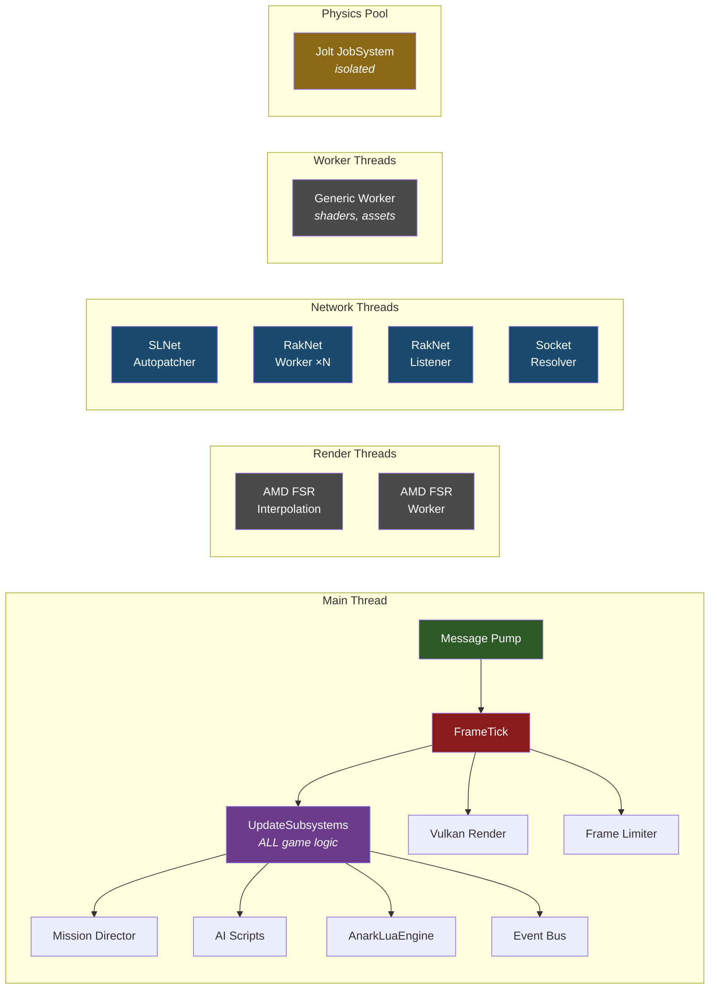
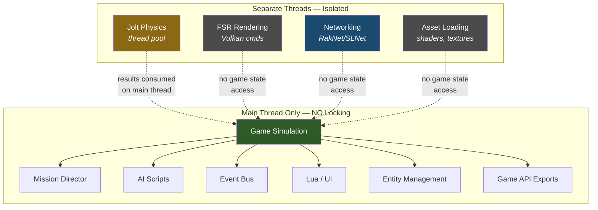
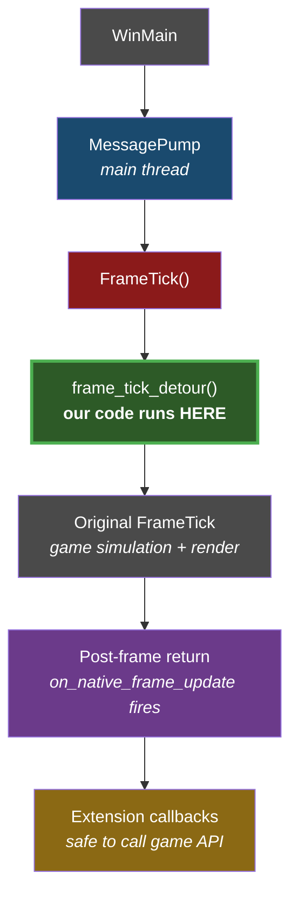

# X4 Threading Model — Reverse Engineering Notes

> **Binary:** X4.exe v9.00 · **Date:** 2026-03 
>
> All addresses are absolute (imagebase `0x140000000`). Subtract imagebase to get RVA.

---

## 1. Summary

X4's game logic is **100% main-thread**. The engine creates a small number of auxiliary threads for rendering, networking, and asset loading — none of which touch game simulation state. This makes the main thread the only safe (and necessary) context for state mutation.



---

## 2. Thread Creation Sites

X4.exe imports `CreateThread` (KERNEL32) at `0x141b642d8` and wraps it via `_beginthreadex` at `0x1419bd36c`. Every call site was traced:

### Direct CreateThread Callers

| Function | Address | Thread Purpose | Evidence |
|----------|---------|----------------|----------|
| `sub_141715C10` | `0x141715f16` | **AMD FSR Interpolation** | `SetThreadDescription(L"AMD FSR Interpolation Thread")`, priority `THREAD_PRIORITY_ABOVE_NORMAL` (+2) |
| `sub_141712960` | `0x1417129ce` | **AMD FSR Worker** | Thread proc for FSR frame generation, called from `sub_141715C10` |

Both FSR threads are pure rendering — they touch Vulkan command buffers (`vkEndCommandBuffer`) and never interact with game state.

### \_beginthreadex Callers

| Function | Address | Thread Purpose | Evidence |
|----------|---------|----------------|----------|
| `sub_141458B70` | `0x141458be1` | **Generic worker** | Uses TLS slot (+800) for context, calls back via vtable. Used for shader compilation and asset loading. Error string: `"Unable to create a thread"` |
| `sub_1414C2B60` | `0x1414c2cc3` | **SLNet Autopatcher** | `SLNet::AutopatcherClientCallback` RTTI. Network I/O for mod auto-updating. Stack size 2MB. |
| `sub_1414FBA90` | `0x1414fbaaf` | **Socket resolver** | Thin wrapper spawning `sub_1414DEAE0` which does DNS resolution via Winsock (`WSAGetLastError`, `send`). |
| `sub_141512370` | `0x1415125ac` | **RakNet peer workers** (N threads) | Per-connection network threads. Stack size 2MB. Handles packet send/receive. |
| `sub_141512370` | `0x1415129b1` | **RakNet listener** | Accept loop for incoming connections. Same function, second `_beginthreadex` site. |

### Thread Description Strings Found

| Thread | Description |
|--------|-------------|
| `AMD FSR Interpolation Thread` | FSR frame interpolation (rendering only) |

No other `SetThreadDescription` calls exist — the game does not name its network/worker threads.

---

## 3. What's NOT Threaded



These subsystems run exclusively on the main thread:

| System | Evidence |
|--------|----------|
| **Game simulation** | `UpdateSubsystems` (`sub_140E999D0`) has a TLS main-thread check — cross-thread calls use CriticalSection + signal |
| **Mission Director** | MD cue processing is a subsystem within the BST |
| **AI scripts** | AI behavior trees execute within the subsystem update |
| **Lua/UI** | `AnarkLuaEngine` dispatches via vtable within the subsystem tree |
| **Entity management** | Component system at `qword_146C6B940` — no locks on lookup functions |
| **Event bus** | Event posting (`sub_140953650`) uses no synchronization |
| **Game API exports** | `AddPlayerMoney`, `CreateOrder3`, etc. — zero locking, assume main thread |

---

## 4. Threading Proof — UpdateSubsystems

The subsystem update function (`sub_140E999D0`) explicitly checks for main-thread context:

```c
// Reconstructed from decompilation
void UpdateSubsystems() {
    if (is_main_thread()) {           // TLS + 0x788 check
        iterate_bst_directly();       // Inline BST walk, call vtable[1]
    } else {
        EnterCriticalSection(&cs);    // Cross-thread: signal main
        // ... WaitForSingleObject
        LeaveCriticalSection(&cs);
    }
}
```

The TLS check at offset `+0x788` is the definitive proof: the engine knows its own threading model and guards against off-thread subsystem updates.

---

## 5. Physics Threading (JPH / Jolt)

RTTI strings confirm Jolt Physics integration:

| RTTI Name | Purpose |
|-----------|---------|
| `JobSystem@JPH@@` | Jolt Physics job scheduler |
| `JobSystem@XPhys@@` | X4's physics job system wrapper |

Physics jobs run in a thread pool managed by Jolt, but this is completely isolated from game logic state. Physics results are consumed on the main thread during the subsystem update.

---

## 6. Implications for x4native

### Our Hook Runs on Main Thread

The frame tick detour (`frame_tick_detour` in `core.cpp`) is called from the message pump:



Since the message pump IS the main thread, our detour executes in the exact same thread context as all game logic. This means:

1. **No race conditions** with game state — simulation has finished for this frame
2. **No locking needed** for exported API calls — they're designed for main thread
3. **No thread affinity issues** — TLS checks in game code will pass

### Safe Calling Context

```mermaid
sequenceDiagram
    participant MP as Message Pump
    participant FT as FrameTick
    participant SU as UpdateSubsystems
    participant R as Render Pipeline
    participant X4N as x4native Hook
    participant FT2 as FrameTick (N+1)

    rect rgb(30, 74, 110)
    Note over MP,R: Frame N
    MP->>FT: call FrameTick()
    FT->>SU: UpdateSubsystems()
    Note over SU: MD cues, AI, events,<br/>Lua onUpdate
    SU-->>FT: return
    FT->>R: VulkanRenderPrep + Render + Limiter
    R-->>FT: return
    end

    rect rgb(45, 90, 39)
    Note over X4N: Post-Frame (OUR CODE)
    FT->>X4N: frame_tick_detour continues
    Note over X4N: ✅ Read game state<br/>✅ Call mutations<br/>✅ Post events
    X4N-->>MP: return
    end

    rect rgb(30, 74, 110)
    Note over MP,FT2: Frame N+1
    MP->>FT2: call FrameTick()
    Note over FT2: Events we posted<br/>processed here
    end
```



See [STATE_MUTATION.md](STATE_MUTATION.md) for detailed safety analysis of specific API functions.

---

## 7. Function Reference

| Name | Address | RVA | Role |
|------|---------|-----|------|
| `CreateThread` (import) | `0x141b642d8` | — | KERNEL32 import |
| `SetThreadDescription` (import) | `0x141b642d0` | — | KERNEL32 import |
| `_beginthreadex` (CRT) | `0x1419bd36c` | `0x19bd36c` | CRT wrapper for CreateThread |
| FSR thread creator | `0x141715C10` | `0x1715C10` | AMD FSR interpolation thread |
| FSR thread proc | `0x141712960` | `0x1712960` | FSR worker function |
| Generic worker launcher | `0x141458B70` | `0x1458B70` | TLS-based worker (shaders, assets) |
| SLNet autopatcher init | `0x1414C2B60` | `0x14C2B60` | Mod auto-update thread |
| Socket resolver | `0x1414FBA90` | `0x14FBA90` | DNS/connection thread |
| RakNet peer startup | `0x141512370` | `0x1512370` | Network worker + listener threads |
| UpdateSubsystems | `0x140E999D0` | `0xE999D0` | Main-thread-only BST walk |
