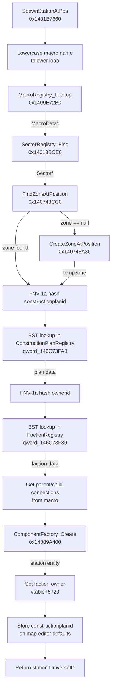
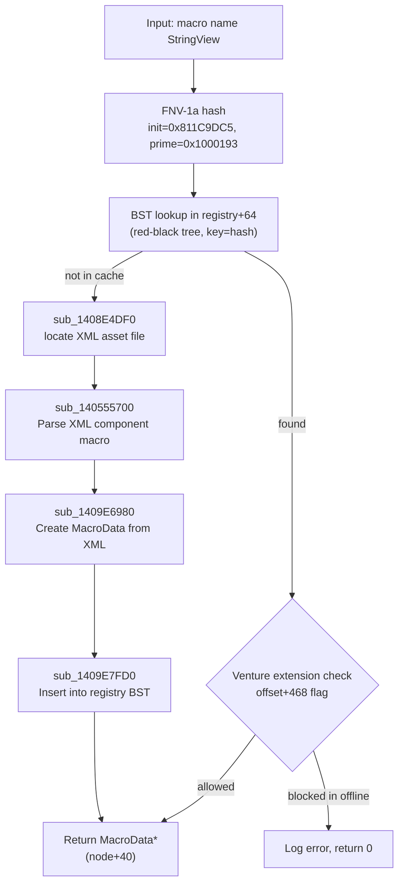
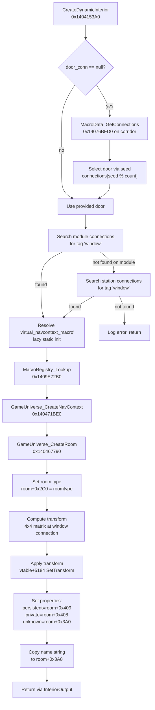
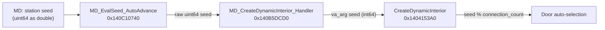
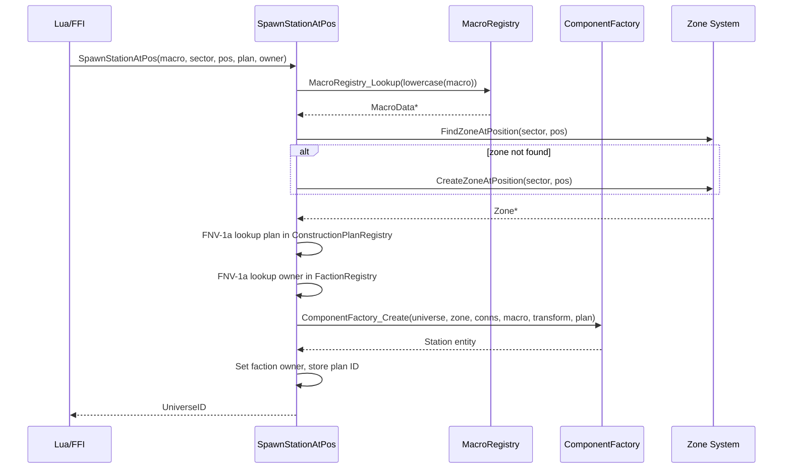
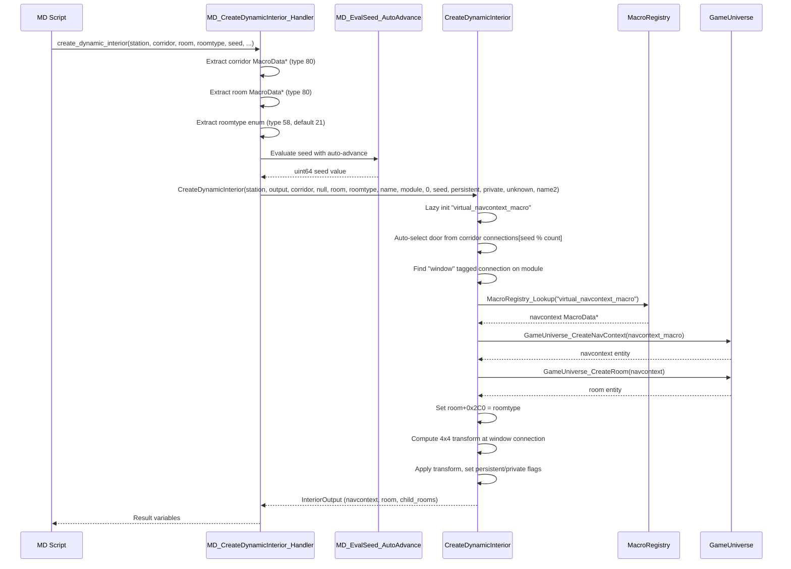
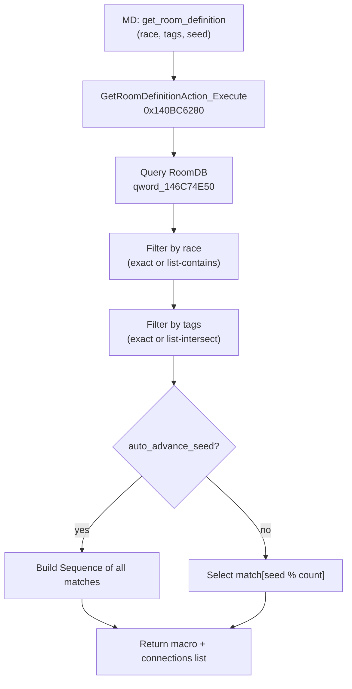

# X4 Walkable Interior System — Reverse Engineering Notes

> **Binary:** X4.exe v9.00 · **Date:** 2026-03
>
> All addresses are absolute (imagebase `0x140000000`). Subtract imagebase to get RVA.

---

## 1. Summary

X4 uses a **unified `WalkableModule` system** for all walkable interiors. Both station modules and capital ship modules inherit from the same `WalkableModule` C++ class. The engine makes no distinction between station interiors and ship interiors at the API level -- both are just containers with walkable rooms.

---

## 2. WalkableModule Class

**Vtable:** `0x143196708`

Shared by station and ship interiors. The `WalkableModule` class is the base for all walkable geometry in the game.

### Component Hierarchy

```
Container (station or capital ship)
  +-- WalkableModule (station module or ship module)
        +-- Room (class 83)
              +-- Actor entities (NPCs, player avatar)
```

### Component Class IDs

| Class ID | Name | Notes |
|----------|------|-------|
| 83 | Room | Walkable room entity |
| 109 | Container | Station or ship (docking container) |
| 118 | WalkableModule | Walkable module within a container |

---

## 3. Capital Ship Interiors

Capital ships (L-class and XL-class: `ShipLarge`, `ShipExtraLarge`) have walkable interiors. Confirmed by multiple binary analysis findings:

### Evidence

| Finding | Address | Detail |
|---------|---------|--------|
| Capital ship spawn fallback | `0x142b43b30` | String: `"No capital ship found to spawn player. Player will spawn in player ship!"` -- the engine explicitly tries to find a capital ship room |
| `crewquarters` room type | `0x1429baff8` | **20+ data xrefs** to ship component definitions -- these are ship macro entries defining crew quarter rooms |
| `ShipFilterByIsCapitalShip` RTTI | `0x1431a0560` | Dedicated capital-ship filter used in room/walkable queries |
| `lastdockwalkablearea` property | `0x14298f008` | **20+ data xrefs** -- tracks the walkable area entered after docking inside a capital ship |
| `iscapitalship` property | `0x1429b31b0` | Component property identifying capital ship class |

### Station vs Ship Interiors

Station interiors are **dynamic** -- loaded on demand via `create_dynamic_interior` MD action. Ship interiors may be **statically loaded** (always present on capital ships), but this is unconfirmed.

---

## 4. Room System

The engine has a full `RoomDB` and `RoomGroupDB` (RTTI confirmed). Rooms are **class 83** entities in the component hierarchy.

### Room Types

| Type | String Address | Notes |
|------|---------------|-------|
| `interiorcorridor` | `0x1429c5040` | Corridor room type |
| `interiordoor` | `0x1429c5058` | Door connecting rooms |
| `interiorroom` | `0x1429c5068` | Generic room type |
| `crewquarters` | `0x1429baff8` | Crew quarters (capital ships, 20+ xrefs) |

### Room Lifecycle (MD Signals)

Found in strings:
```
create_dynamic_interior
add_room_to_dynamic_interior
attach_component_to_interior
remove_dynamic_interior
set_dynamic_interior_private
set_dynamic_interior_persistent
```

---

## 5. FirstPersonController

The walk state is managed by a **FirstPersonController** object:

| Item | Address | Notes |
|------|---------|-------|
| Constructor | `0x140D2E070` | Allocates 960-byte walk controller |
| Vtable | `0x142BCBCB8` | Type 22 |
| Location | `player_slot[0][+512]` | Offset within player slot structure |

### Input Context

When the player is on foot, the game switches to first-person controller mode:

- Input context: `INPUT_CONTEXT_REQUESTER_FIRSTPERSONCONTROLLER`
- Input state: `INPUT_STATE_FP_WALK`
- Input range: `INPUT_RANGE_FP_WALK`
- Actions: `lock_firstperson_walk_input`, `start_actor_walk`, `stop_actor_walk`

---

## 6. Transporter System

Capital ships and large stations have **transporters** -- in-world teleporters that move characters between rooms:

| Function/Signal | Description |
|-----------------|-------------|
| `GetRoomForTransporter` | Returns the room a transporter leads to |
| `GetTransporterLocationName/Component` | Destination name and component |
| `GetValidTransporterTargets` / `GetValidTransporterTargets2` | List of reachable destinations |
| `activate_transporter` (MD signal) | Player uses a transporter |
| `performtransportertransition` (MD signal) | Transition executing |
| `find_player_transporter_slot` (MD signal) | Find entry point for player |

---

## 7. Component Properties

Properties queryable via `GetComponentData` for walkable interiors:

| Property | Description |
|----------|-------------|
| `isavatar` | True on the player's physical character entity when on foot |
| `avatarentity` | Reference to the player's avatar component |
| `walkable` | Component can be walked in |
| `walkablemodule` | A walkable module (station module OR capital ship module) |
| `haswalkableroom` | Component has at least one walkable room |
| `iscurrentlywalkable` | Currently loaded and active for walking |
| `iswalkable` | Static property -- supports walking at all |
| `enterable` | Room can be entered (may differ from walkable) |
| `dynamicinterior` | Interior that loads on demand (stations) |
| `interiortype` | Type classification of an interior |
| `iscapitalship` | Component property identifying capital ship class |
| `lastdockwalkablearea` | Last walkable area entered after docking (ship property) |

---

## 8. Function Reference

| Name | Address | RVA | Purpose |
|------|---------|-----|---------|
| WalkableModule vtable | `0x143196708` | -- | Shared by station and ship interiors |
| FirstPersonController ctor | `0x140D2E070` | `0xD2E070` | 960-byte walk controller allocation |
| FirstPersonController vtable | `0x142BCBCB8` | -- | Type 22 |
| `crewquarters` string | `0x1429baff8` | -- | 20+ ship macro data xrefs |
| `lastdockwalkablearea` string | `0x14298f008` | -- | 20+ ship component data xrefs |
| `iscapitalship` string | `0x1429b31b0` | -- | Capital ship property |
| Capital ship fallback string | `0x142b43b30` | -- | "No capital ship found..." |
| `ShipFilterByIsCapitalShip` RTTI | `0x1431a0560` | -- | Capital ship filter |
| `interiorcorridor` string | `0x1429c5040` | -- | Room type string |
| `interiordoor` string | `0x1429c5058` | -- | Room type string |
| `interiorroom` string | `0x1429c5068` | -- | Room type string |

---

## 9. Related Documents

| Document | Contents |
|----------|----------|
| [PLAYER_ENTITY_API.md](PLAYER_ENTITY_API.md) | Player identity functions, GetPlayerRoom, GetPositionalOffset |
| [SUBSYSTEMS.md](SUBSYSTEMS.md) | Component class IDs, universe hierarchy |
| [GAME_LOOP.md](GAME_LOOP.md) | Frame tick -- walk updates happen post-frame |

---

## 10. Station Creation Flow (SpawnStationAtPos)

`SpawnStationAtPos` at `0x1401B7660` is the primary Lua/FFI entry point for creating stations. It orchestrates macro resolution, zone finding/creation, construction plan lookup, faction assignment, and component factory invocation.

### Call Chain



### Parameter Table

| Param | Register | Type | Description |
|-------|----------|------|-------------|
| `macroname` | RCX (`a1`) | `const char*` | Station macro name (e.g. `"station_gen_factory_macro"`) |
| `sectorid` | RDX (`a2`) | `uint64` | Sector UniverseID |
| `position` | R8 (`a3`) | `float[3]*` | XYZ position in sector space |
| `constructionplanid` | R9 (`a4`) | `const char*` | Construction plan identifier string |
| `ownerid` | stack (`a5`) | `const char*` | Owner faction identifier string |

### Key Behaviors

1. **Macro name is lowercased** before lookup (character-by-character `tolower` loop).
2. **Zone auto-creation:** If `FindZoneAtPosition` returns null, `CreateZoneAtPosition` creates a tempzone. This is why no explicit zone management is needed.
3. **FNV-1a hashing** (init `0x811C9DC5`, prime `0x1000193`) is used for both construction plan and faction ID lookups in their respective BST registries.
4. **ComponentFactory_Create** is the universal component factory (10.5 KB, 70 callers, 2389 instructions). It handles all component types -- clusters, sectors, stations, ships, objects.
5. **Station seed** is not assigned in `SpawnStationAtPos` itself. The seed comes from the construction plan data at offset `+184` from the plan entry, passed as parameter `a10` to `ComponentFactory_Create`.

---

## 11. Global Registries

These global registry pointers are critical for the station/interior creation pipeline:

| Registry | Global Address | Purpose |
|----------|---------------|---------|
| MacroRegistry | `qword_146C73E30` | Maps macro name strings to `MacroData*` objects |
| ConstructionPlanRegistry | `qword_146C73FA0` | BST of construction plans, keyed by FNV-1a hash |
| FactionRegistry | `qword_146C73F80` | BST of factions, keyed by FNV-1a hash |
| GameUniverse | `g_GameUniverse` / `qword_143C9FA58` | Universe state, used for creating navcontexts and rooms |
| RoomDB | `qword_146C74E50` | Database of room definitions (race + tags + connections) |
| RoomType Enum Globals | `qword_146C74A88` | Pointer to initialized RoomType enum at `qword_1438C91C0` |

---

## 12. MacroRegistry_Lookup (Macro Resolution)

**Address:** `0x1409E72B0`

Converts a macro name string (e.g., `"room_gen_bar_01_macro"`) to an internal `MacroData*` pointer. This is the single function used by all systems that need to resolve macro names.

### Signature

```cpp
// Returns MacroData* (0 on failure)
MacroData* MacroRegistry_Lookup(
    MacroRegistry* registry,    // RCX — global at qword_146C73E30
    StringView* name,           // RDX — {const char* ptr, size_t len}
    uint8_t silent              // R8  — 1 = suppress error logging on failure
);
```

### Algorithm



### Key Details

- The **input string is NOT lowercased** inside this function. Callers must lowercase before calling. `SpawnStationAtPos` does this explicitly; `CreateDynamicInterior` receives already-resolved `MacroData*` pointers.
- The BST at `registry+64` uses FNV-1a hash as the key. Node layout: `node[4]` = hash, `node[5]` = MacroData pointer.
- On cache miss, the function loads the asset XML file from disk, parses it, creates the MacroData, and inserts it into the registry.
- Venture extension macros (DLC content) have a flag at `MacroData+468` that blocks access in offline mode.

---

## 13. ComponentFactory_Create

**Address:** `0x14089A400` — Size: 10,556 bytes (2,389 instructions, 528 basic blocks)

The universal component factory for all X4 entities. Has **70 callers** including `AddCluster`, `AddSector`, `SpawnStationAtPos`, and many internal spawn functions.

### Signature

```cpp
Component* ComponentFactory_Create(
    GameUniverse* universe,      // RCX (a1)  — g_GameUniverse
    Component** out_component,   // RDX (a2)  — output: created component
    Zone* parent_zone,           // R8  (a3)  — parent zone entity
    Connection* parent_conn,     // R9  (a4)  — parent connection point
    int64_t reserved,            // stack (a5) — usually 0
    Connection* child_conn,      // stack (a6) — child connection point
    MacroData* macro,            // stack (a7) — macro definition
    Transform4x4* transform,     // stack (a8) — position/rotation (null = identity)
    uint8_t activate,            // stack (a9) — 1 = activate immediately
    ConstructionPlanData* plan,  // stack (a10) — construction plan data (+184 offset)
    uint32_t flags1,             // stack (a11) — usually 0
    String* name1,               // stack (a12) — empty string
    String* name2,               // stack (a13) — empty string
    String* name3,               // stack (a14) — empty string
    void* extra,                 // stack (a15) — extra data pointer
    uint32_t flags2,             // stack (a16) — usually 0
    char final_flag              // stack (a17) — usually 1
);
```

### Role in Station Creation

`SpawnStationAtPos` calls `ComponentFactory_Create` with:
- `parent_zone` = the zone found/created at the position
- `parent_conn` = `MacroData_connections[zone_connection]` (offset +1368 from zone macro)
- `child_conn` = `MacroData_connections[station_connection]` (offset +1960 from station macro)
- `macro` = the resolved station macro
- `transform` = relative transform from sector to zone (null if at zone origin)
- `plan` = construction plan data at registry node offset +40, then +184

After creation, the station entity is activated via an interlocked state machine (`CAS 1->2` on `entity+68`), its faction owner is set via virtual call at vtable offset +5720, and a `DropSpawnSource` is allocated.

---

## 14. CreateDynamicInterior

**Address:** `0x1404153A0` — Size: 3,839 bytes (928 instructions, 172 basic blocks)

Creates a dynamic walkable interior (corridor + room) attached to a module on a station. This is the C++ implementation behind the MD `create_dynamic_interior` action.

### Signature

```cpp
void Controllable__CreateDynamicInterior(
    Object* station,           // RCX (a1)  — the station/controllable
    InteriorOutput* output,    // RDX (a2)  — output struct (see below)
    MacroData* corridor_macro, // R8  (a3)  — corridor macro (from MacroRegistry)
    MacroData* door_conn,      // R9  (a4)  — door connection (0 = auto-select via seed)
    MacroData* room_macro,     // stack (a5) — room macro (from MacroRegistry)
    int roomtype,              // stack (a6) — RoomType enum value (0-21)
    String* interior_name,     // stack (a7) — name string for the interior
    Object* module,            // stack (a8) — module within station (null = use station)
    // Variadic arguments (va_list):
    int64_t reserved,          // va[0] — always 0
    int64_t seed,              // va[1] — seed value (uint64, COERCE_DOUBLE from MD)
    uint8_t persistent,        // va[2] — persistent flag
    uint8_t private_flag,      // va[3] — private flag
    uint8_t unknown_flag,      // va[4] — unknown flag
    String* name2              // va[5] — secondary name string
);
```

### Output Structure

```cpp
struct InteriorOutput {
    Object* navcontext;       // [0] — navigation context entity
    Object* room;             // [1] — the created room entity
    Object** child_rooms;     // [2] — vector begin (additional child rooms)
    Object** child_rooms_end; // [3] — vector end
};
```

### Call Chain



### Key Behaviors

1. **Lazy static init** of `"virtual_navcontext_macro"` string (thread-safe, guarded by `dword_146C961E0`). This macro is used to create the navigation context for all dynamic interiors.
2. **Door auto-selection:** If `door_conn` is null (the common case from MD), the function gets the corridor macro's connections array at offset +1112/+1120 (begin/end pointers), then uses the seed to pick one: `connections[seed_mod(count)]`.
3. **Window connection matching:** The function searches the module's connections for one tagged `"window"`. If the module has no window connections, it falls back to searching the station itself. If neither has a window, it logs an error and aborts.
4. **Room property offsets:**
   - `room + 0x2C0` (704) = roomtype enum value (int32)
   - `room + 0x3A0` (928) = unknown flag (byte)
   - `room + 0x3A8` (936) = name string (std::string)
   - `room + 0x408` (1032) = private flag (byte)
   - `room + 0x409` (1033) = persistent flag (byte)
5. **Transform computation:** The room is positioned using a 4x4 matrix multiply chain: room window connection transform relative to corridor, composed with corridor-to-zone transform. Uses SSE intrinsics throughout.

### Byte Signature

```
Prologue (32 bytes):
48 8B C4 4C 89 48 20 4C 89 40 18 48 89 50 10 48
89 48 08 55 53 56 57 41 54 41 55 41 56 41 57 48
```

### Version DB Hints

- **Method:** String reference to `"Controllable::CreateDynamicInterior()"` in error messages
- **Callers:** MD action handler at `0x140B5DCD0`, and one internal function at `0x140A73470`
- **Unique strings:** `"virtual_navcontext_macro"` (lazy-init'd, only ref in this function)
- **Callees:** `MacroRegistry_Lookup`, `GameUniverse_CreateNavContext`, `GameUniverse_CreateRoom`, `GetRelativeTransform`

---

## 15. MD Action Handler: create_dynamic_interior

**Address:** `0x140B5DCD0` (renamed `MD_CreateDynamicInterior_Handler`)

This is the MD script action handler that bridges the XML `<create_dynamic_interior>` action to the C++ `CreateDynamicInterior` function. It parses MD script parameters and converts them to native types.

### Parameter Extraction

The handler extracts these MD parameters:

| MD Parameter | Handler Offset | Extraction | Native Type |
|--------------|---------------|------------|-------------|
| `object` (station) | a1+40 | `sub_140CD5150` | `Object*` (class 80 = macro slot) |
| `corridor` | a1+56 | `sub_140C7FDD0` | `MacroData*` |
| `room` | a1+72 | `sub_140C7E4D0` | `MacroData*` (type 80) |
| `door` | a1+104 | `sub_140C7E4D0` | `MacroData*` or connection name (type 80/string) |
| `name` | a1+120 | `sub_140C7FC30` | `std::string` |
| `roomtype` | a1+136 | `sub_140C7F290` | enum int (type 58, default 21 = none) |
| `module` | a1+56 output | parsed separately | `Object*` |
| `seed` | a1+216 | `MD_EvalSeed_AutoAdvance` | `int64` (via double bit reinterpret) |
| `persistent` | a1+184 | `sub_140C7F620` | `bool` |
| `private` | a1+168 | `sub_140C7F620` | `bool` |
| `unknown` | a1+152 | `sub_140C7F620` | `bool` |
| `name2` | a1+200 | `sub_140C7F790` | `std::string` |

### Door Parameter Handling

The door parameter supports three forms:
1. **Null (0):** Auto-select from corridor connections using seed
2. **Macro slot (type 90):** Direct MacroData pointer (connection object)
3. **String (type 84/85):** Connection name, resolved via FNV-1a hash lookup in the corridor macro's connection arrays

If the string form is used, the handler searches two connection arrays on the corridor macro: a primary array at `macro+96..+104` (152-byte entries) and a secondary at `macro+120..+128`, using binary search by FNV-1a hash. If neither matches, it falls back to `sub_140847850` for a third lookup path.

---

## 16. Seed System

### Seed Type and Representation

The seed is stored internally as a **uint64** but passed through the MD script system as a **double** via bit reinterpretation (`COERCE_DOUBLE`). This means the 64-bit pattern of the seed is stuffed into a double without any float conversion -- `memcpy(&double_val, &uint64_seed, 8)`.

### LCG Advancement Formula

**Address:** `0x140C10740` (renamed `MD_EvalSeed_AutoAdvance`)

When the MD system evaluates a seed with `AutoAdvanceSeed`, the seed is advanced using a Linear Congruential Generator followed by a rotation:

```
next_seed = ROR64(0x5851F42D4C957F2D * seed + 0x14057B7EF767814F, 30)
```

Where:
- `ROR64(x, 30)` = rotate right 64 bits by 30 positions
- Multiplier: `0x5851F42D4C957F2D` (SplitMix64-like constant)
- Addend: `0x14057B7EF767814F`
- The result is stored back as COERCE_DOUBLE(uint64) in MD variant type 3

### Seed Flow Through Interior Creation



The seed enters `CreateDynamicInterior` as `va[1]` (the second variadic argument). If no door connection is provided, the function uses the seed to select from the corridor's connection array:

```cpp
// Pseudo-code for door selection
connections = MacroData_GetConnections(corridor_macro);
count = (connections_end - connections_begin) / 8;
if (seed != 0)
    index = sub_1414839F0(seed, count);  // seed-based modular selection
else
    index = sub_141483CE0(count);         // random selection (no seed)
door = connections[index];
```

### Global Session Seed

**Address:** `g_SessionSeed` at `qword_143C9F9C0`

This is the master session seed initialized at game start. It is a uint64 formatted as `%llu` in string conversions. The MD script `npc_instantiation.xml` derives per-station seeds from this value combined with room type indices.

---

## 17. RoomType Enum

**Enum init function:** `0x1407521A0` (renamed `RoomType_Enum_Init`)
**Data table:** `0x1424794A0` (.rdata)
**Global enum object:** `qword_1438C91C0`

The RoomType enum has **22 entries** (0-21). Entry 21 is the empty/none value (default when no roomtype is specified in MD). The enum is initialized once via `RoomType_Enum_Init` and stored at the global pointer `qword_146C74A88`.

### Enum Values

| Value | Name | String Address |
|-------|------|---------------|
| 0 | `bar` | `0x1429c0b58` |
| 1 | `casino` | `0x1429c0b80` |
| 2 | `corridor` | `0x1429ac7c0` |
| 3 | `crewquarters` | `0x1429c0b70` |
| 4 | `embassy` | `0x1429c0b98` |
| 5 | `factionrep` | `0x1429c0b88` |
| 6 | `generatorroom` | `0x1429c0bb0` |
| 7 | `infrastructure` | `0x1429c0ba0` |
| 8 | `intelligenceoffice` | `0x1429c0bd0` |
| 9 | `livingroom` | `0x1429c0bc0` |
| 10 | `manager` | `0x142998e50` |
| 11 | `office` | `0x1429c0bf8` |
| 12 | `playeroffice` | `0x1429c0be8` |
| 13 | `prison` | `0x1429c0c0c` |
| 14 | `security` | `0x142995ef0` |
| 15 | `serverroom` | `0x1429c0c00` |
| 16 | `serviceroom` | `0x1429c0c30` |
| 17 | `shiptradercorner` | `0x1429c0c18` |
| 18 | `tradercorner` | `0x1429c0c50` |
| 19 | `trafficcontrol` | `0x1429c0c40` |
| 20 | `warroom` | `0x1429c0c70` |
| 21 | _(none/default)_ | `0x1429953F2` (empty string) |

### Data Table Layout

Each entry in the table at `0x1424794A0` is 16 bytes:

```cpp
struct RoomTypeEntry {
    const char* name;   // +0x00 — pointer to string
    uint32_t    id;     // +0x08 — enum integer value
    uint32_t    pad;    // +0x0C — padding
};
```

The initialization function processes entries in pairs (11 iterations, 2 entries per iteration = 22 total), populating three parallel arrays stored at:
- `0x1438C91E0` — primary enum entries (22 x 24 bytes)
- `0x1438C93F8` — secondary sorted array
- `0x1438C9610` — tertiary sorted array

---

## 18. get_room_definition (MD Action)

### Overview

`get_room_definition` is an MD action (handler ID `0x77A` = 1914) that selects a room macro from the RoomDB based on race, tags, and an optional seed. It is implemented as a C++ `Scripts::GetRoomDefinitionAction` class.

### Class Structure

**RTTI:** `.?AVGetRoomDefinitionAction@Scripts@@` at `0x1431c2f50`
**Vtable:** `0x142B97D00`
**Constructor:** `0x140BC5EE0` (renamed `GetRoomDefinitionAction_ctor`)
**Execute:** `0x140BC6280` (renamed `GetRoomDefinitionAction_Execute`)
**Object size:** 0xE0 (224 bytes)

### Constructor Parameter IDs

The constructor initializes these MD parameter slots:

| Offset | Param ID | Purpose |
|--------|----------|---------|
| +16 | 142 | Primary parameter (race/object) |
| +40 | 974 | Tags parameter |
| +56 | 741 | Additional filter |
| +72 | variadic | Seed/tags compound |
| +120 | 582 | Boolean flag (auto-advance seed?) |
| +128 | 529 | Output: macro result |
| +160 | 766 | Output: connection list |
| +192 | 272 | Output: secondary |

### Execute Logic

The execute method (`0x140BC6280`) performs these steps:

1. **Evaluate race/object parameter** (offset +40) -- resolves to a component reference
2. **Evaluate tags parameter** (offset +56) -- resolves to a tag set
3. **Evaluate seed** via `MD_EvalSeed_AutoAdvance` (offset +72) with auto-advance flag from +120
4. **Query RoomDB** at `qword_146C74E50`:
   - If `auto_advance_seed` flag is set: creates a `Scripts::Sequence` result set and iterates all matching rooms
   - Otherwise: uses `seed % matching_count` to select a single room
5. **Filter by race and tags**: iterates the RoomDB BST checking race match (MD type 83 = hash) and tag match (MD type 86 = list). The RoomDB entries have race at offset +24 and tags at offset +40.
6. **Build connection list** for the selected room from MacroData connections (offset +1112/+1120)
7. **Output results** via MD parameter writeback at offsets +128, +160, +192

### RoomDB Structure

The RoomDB at `qword_146C74E50` appears to be a red-black tree of room group entries. Each entry (at node+32) has:
- `+5` (byte) — enabled/valid flag
- `+24` — race identifier (MD variant)
- `+40` — tags (MD variant, can be a list)

When filtering, the execute method supports exact race match or list-contains-race for multi-race entries.

---

## 19. Station Creation to Interior: Complete Pipeline

This section documents the full end-to-end pipeline from station spawn to walkable interior creation.

### Phase 1: Station Spawn



### Phase 2: Interior Creation (MD-driven)

After the station exists, the MD script `npc_instantiation.xml` triggers interior creation:



### Phase 3: Room Definition Selection

Before `create_dynamic_interior`, the MD script typically calls `get_room_definition` to select the room macro:



---

## 20. Expanded Function Reference

| Name | Address | Size | Purpose |
|------|---------|------|---------|
| `SpawnStationAtPos` | `0x1401B7660` | 0x88C | Lua/FFI station spawn entry point |
| `MacroRegistry_Lookup` | `0x1409E72B0` | ~0x580 | Resolve macro name to MacroData* |
| `SectorRegistry_Find` | `0x14013BCE0` | -- | Find sector by UniverseID |
| `FindZoneAtPosition` | `0x140743CC0` | -- | Find existing zone at world position |
| `CreateZoneAtPosition` | `0x140745A30` | -- | Create tempzone at world position |
| `ComponentFactory_Create` | `0x14089A400` | 0x292C | Universal component factory (70 callers) |
| `CreateDynamicInterior` | `0x1404153A0` | 0xEFF | Create corridor+room interior on a module |
| `MD_CreateDynamicInterior_Handler` | `0x140B5DCD0` | 0xB49 | MD action handler bridge |
| `MD_EvalSeed_AutoAdvance` | `0x140C10740` | ~0x4A0 | Evaluate seed with LCG auto-advance |
| `GetRoomDefinitionAction_ctor` | `0x140BC5EE0` | -- | Constructor for MD get_room_definition |
| `GetRoomDefinitionAction_Execute` | `0x140BC6280` | ~0xC70 | Execute logic for get_room_definition |
| `RoomType_Enum_Init` | `0x1407521A0` | 0x87E | Initialize RoomType enum (22 entries) |
| `MacroData_GetConnections` | `0x14076BFD0` | -- | Get connections array from MacroData |
| `GameUniverse_CreateNavContext` | `0x140471BE0` | -- | Create navigation context entity |
| `GameUniverse_CreateRoom` | `0x140467790` | -- | Create room entity in universe |
| `GetRelativeTransform` | `0x14039C3F0` | -- | Compute relative 4x4 transform between entities |
| `AddActorToRoomAction_execute` | `0x140BA1620` | 0xBA1620 | MD action handler for `add_actor_to_room` |
| `AddActorToRoom_RoomSlot` | `0x140686B70` | 0x686B70 | NPC room placement (26 callers, slot-based path) |
| `AddActorToRoom_Controllable_NPC` | `0x140686520` | 0x686520 | NPC → controllable placement path |
| `AddActorToRoom_Controllable_NonNPC` | `0x14051C110` | 0x51C110 | Non-NPC → controllable (player character path) |
| `AddActorToRoom_DockPosition_NPC` | `0x140686950` | 0x686950 | NPC → dock position placement path |
| `Entity_AttachToParent` | `0x140397C50` | 0x397C50 | Core hierarchy reparent function (26 callers, NOT exported) |
| `SetPositionalOffset` | `0x140180550` | 0x180550 | Set entity position relative to parent (class 76 required) |

---

## 21. Byte Signatures for Version DB

### SpawnStationAtPos

```
Address: 0x1401B7660
Prologue: 48 89 5C 24 10 4C 89 44 24 18 55 56 57 41 54 41 55 41 56 41 57 48 8D 6C 24 80 48 81 EC 90 01 00 00
Find hints:
  - String: "SpawnStationAtPos" (18 refs in function error messages)
  - Callee: MacroRegistry_Lookup, ComponentFactory_Create
  - Pattern: FNV-1a constants 0x811C9DC5 and 0x1000193 (two instances)
```

### CreateDynamicInterior

```
Address: 0x1404153A0
Prologue: 48 8B C4 4C 89 48 20 4C 89 40 18 48 89 50 10 48 89 48 08 55 53 56 57 41 54 41 55 41 56 41 57 48
Find hints:
  - String: "virtual_navcontext_macro" (unique, lazy-init'd inside function)
  - String: "Controllable::CreateDynamicInterior()" (error messages)
  - String: "window" (connection tag search)
  - Callee: MacroRegistry_Lookup, GameUniverse_CreateNavContext, GameUniverse_CreateRoom
  - Callers: MD_CreateDynamicInterior_Handler (0x140B5DCD0), sub_140A73470
```

### MacroRegistry_Lookup

```
Address: 0x1409E72B0
Find hints:
  - String: "Cannot find XML file component macro '%s' in index '%s'"
  - String: "Attempting to access macro '%s' from venture extension"
  - String: "assets\\legacy" and "assets/legacy" (legacy path detection)
  - Pattern: FNV-1a hash with init 0x811C9DC5
  - Self-recursive: calls itself after loading XML asset
```

---

## 22. Room Property Offsets

Offsets within a Room entity (class 83) object, as written by `CreateDynamicInterior`:

| Offset | Decimal | Type | Property | Written At |
|--------|---------|------|----------|------------|
| `+0x120` | 288 | uint32 | Room definition ID | `sub_1407314F0` call |
| `+0x2C0` | 704 | int32 | RoomType enum value | `0x140415D2D` |
| `+0x3A0` | 928 | byte | Unknown flag | `0x140416107` |
| `+0x3A8` | 936 | std::string | Room name | `0x140416132` (via sub_140097170) |
| `+0x408` | 1032 | byte | Private flag | `0x1404160F6` |
| `+0x409` | 1033 | byte | Persistent flag | `0x1404160E5` |

---

## 23. CreateDynamicInterior: Randomness Analysis

Two seed-dependent random selections determine corridor layout:

### Door Selection (`0x140415440`)

Selects which door on the corridor macro connects the room.

```
if (door == NULL):
    connections = corridor_macro.connections[+0x458..+0x460]
    count = (end - begin) / 8
    if (seed != 0):
        index = seeded_random(seed, count)    // 0x1414839F0: LCG, deterministic
    else:
        index = tls_random(count)             // 0x141483CE0: TLS:792, unpredictable
    door = connections[index]
```

### Window Placement (`0x140415D2D`)

Selects which station "window" connection to attach the corridor to.

```
if (seed != 0):
    index = seeded_random(seed, window_count)
else:
    index = tls_random(window_count)
place_corridor_at(station_windows[index])
```

**Critical**: `window_count` depends on the `module` parameter's search scope. Different module = different window count = different modulus = different result even with the same seed.

### seeded_random (`0x1414839F0`)

Same LCG as `autoadvanceseed`:
```
next = ROR64(0x5851F42D4C957F2D * seed + 0x14057B7EF767814F, 30)
seed = next  // mutates in-place
return next % count
```

### tls_random (`0x141483CE0`)

Same LCG formula but reads/writes from TLS offset 792. Completely unpredictable between processes.

---

## 24. Room Creation Sources and Parameters

Not all rooms are created by `npc_instantiation.xml`. Different MD scripts use different parameters, which critically affects corridor layout replication.

### Source: npc_instantiation.xml (standard rooms)

Standard rooms use: `seed=station.seed+indexof(type)`, `module=NULL`, `door=NULL`.

| Room Type | Seed | Module | Door | Corridor |
|-----------|------|--------|------|----------|
| bar | seed+indexof(bar) | NULL | NULL | get_room_definition(seed) |
| manager | seed+indexof(manager) | NULL | NULL | get_room_definition(seed) |
| security | seed+indexof(security) | NULL | NULL | get_room_definition(seed) |
| infrastructure | seed+indexof(infra) | NULL | NULL | get_room_definition(seed) |
| casino/gambling | seed raw (no offset) | NULL | NULL | get_room_definition(seed) |
| crewquarters | seed+indexof(crew) | NULL | NULL | get_room_definition(seed) |
| prison | seed+indexof(prison) | NULL | NULL | get_room_definition(seed) |

### Source: x4ep1_mentor_subscription.xml (player HQ special rooms)

Special rooms use: `seed=NONE` (TLS random), `module=ResearchModule`, hardcoded corridors.

| Room Type | Seed | Module | Door | Corridor |
|-----------|------|--------|------|----------|
| playeroffice | NONE | ResearchModule | NULL | hardcoded `_05` |
| boron tank | NONE | ResearchModule | explicit `Doors.{1}` | get_room_def(no seed) |
| embassy | NONE | ResearchModule | NULL | hardcoded `_03` |
| mentor room | NONE | ResearchModule | explicit `Doors.{1}` | get_room_def(no seed) |

### Source: gamestarts (initial setup rooms)

All types: `seed=NONE`, `module=NULL`, `door=NULL`, corridor via get_room_definition(no seed).

### Key Observations

- **npc_instantiation rooms**: deterministic — `seed + roomtype_index` formula, `module=NULL`, `door=NULL`. Same inputs always produce same corridor layout.
- **Mentor/DLC rooms**: non-deterministic — use TLS random (`seed=NONE`) and/or explicit module scoping. Cannot be reproduced from room type alone. Require the actual `door` connection and `module` to be known.
- **Passing `door` explicitly** bypasses both random selection paths entirely (the `door != NULL` branch at `0x14041543B`). This is the only way to guarantee identical corridor placement across different game instances.

---

## 25. add_actor_to_room (MD Action)

### Overview

`add_actor_to_room` is an MD-only action -- there is NO C++ export. The C++ implementation is `AddActorToRoomAction::execute()` at `0x140BA1620`.

**RTTI:** `AddActorToRoomAction@Scripts`

### Dispatch Paths

The execute function dispatches to 4 internal functions based on the class of the actor and target:

| Path | Actor class | Target class | Internal function | Address |
|------|------------|-------------|-------------------|---------|
| A (slot-based) | NPC (70) | Room/slot | `AddActorToRoom_RoomSlot` | `0x140686B70` |
| B1 | NPC (70) | Controllable (110) | `AddActorToRoom_Controllable_NPC` | `0x140686520` |
| B2 | Non-NPC | Controllable (110) | `AddActorToRoom_Controllable_NonNPC` | `0x14051C110` |
| B3 | NPC (70) | Dock position (class not specified) | `AddActorToRoom_DockPosition_NPC` | `0x140686950` |

**Path B2** (`0x14051C110`) is the player character path -- used when the actor is not an NPC (e.g., the player entity).

### AddActorToRoom_RoomSlot (Path A)

**Address:** `0x140686B70` — Central NPC room placement function (26 callers including `CreateNPCFromPerson`).

This is the most commonly invoked path. When an NPC is placed into a specific room/slot:

1. Creates a `U::CrossConnectionMovementController` for animated transitions
2. Calls `Entity_AttachToParent` (`0x140397C50`) for scene graph attachment
3. Sets up NPC animation and attention level
4. The NPC becomes a child of the room component in the entity hierarchy

### Usage from MD

```xml
<add_actor_to_room actor="$npc" room="$room" />
<add_actor_to_room actor="$npc" object="$station" />
```

When `room=` is specified, Path A (slot-based) is used. When `object=` is specified with a controllable, Path B1 or B2 is used depending on the actor's class.

### Implications

- No C++ API exists for placing actors into rooms -- must use MD cues
- `Entity_AttachToParent` is the underlying mechanism that reparents the actor entity to the room component
- After placement, the actor's position (from `GetPositionalOffset(actorId, 0)`) is relative to the room
- `SetPositionalOffset` can then be used to move the actor within the room
